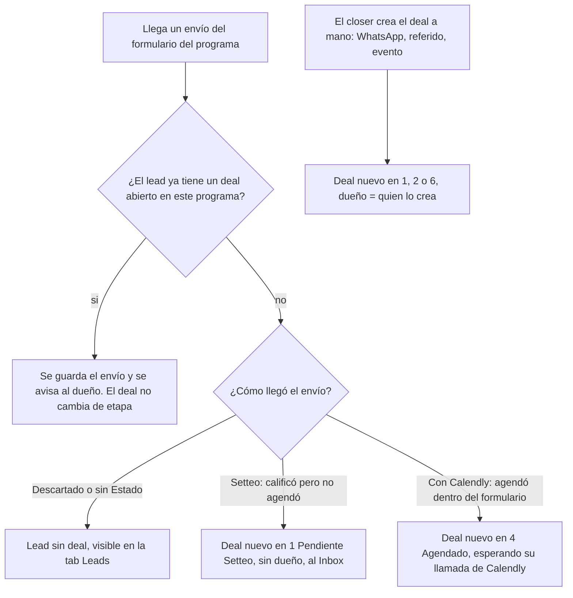
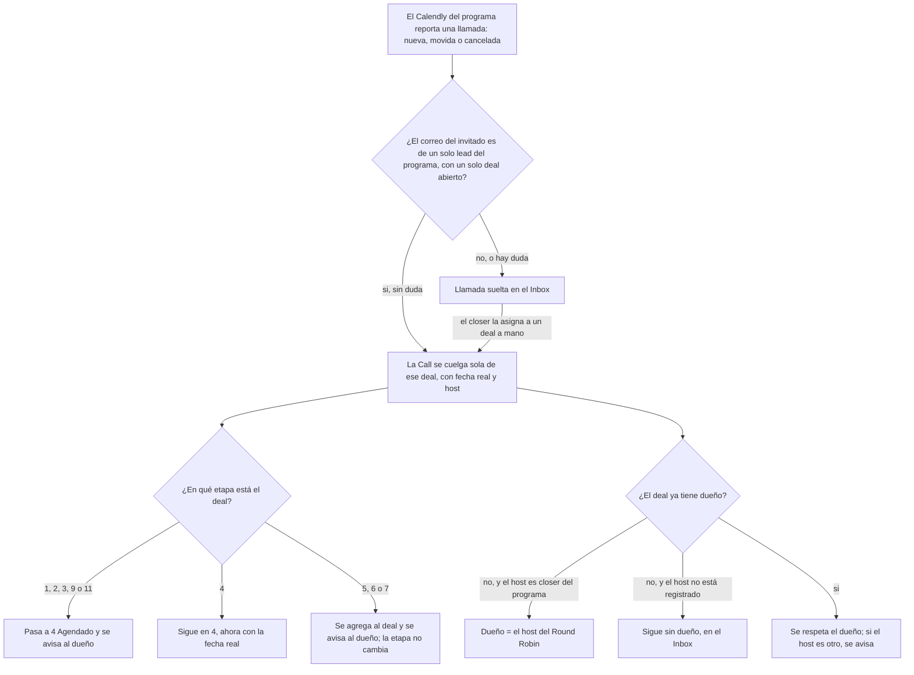
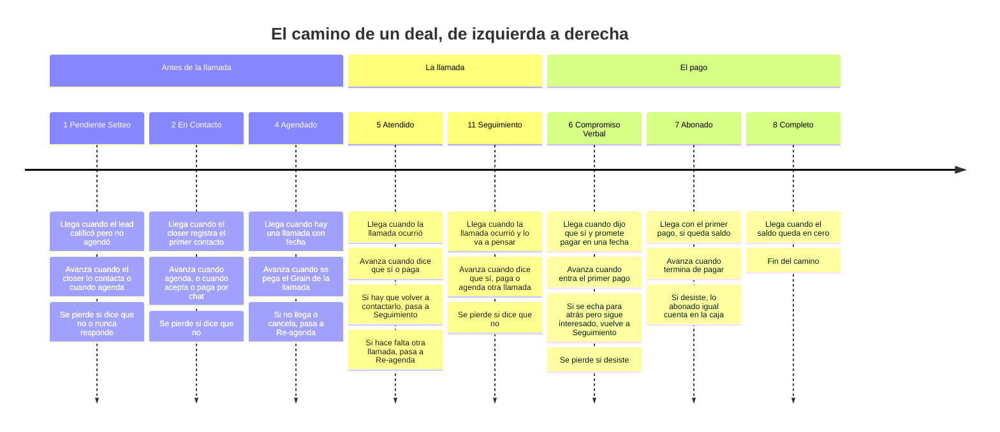
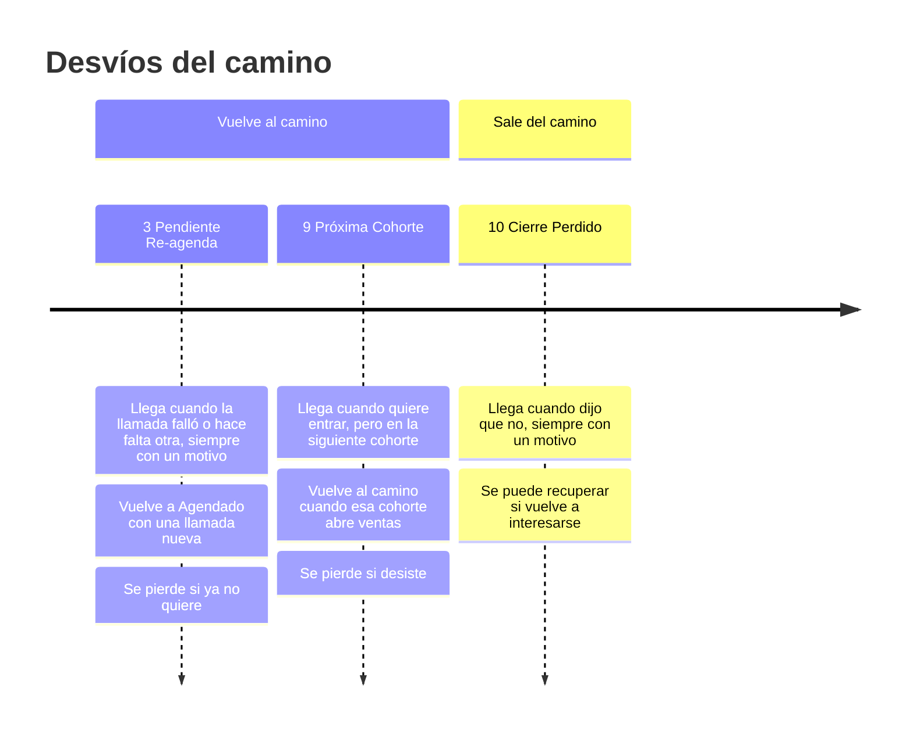
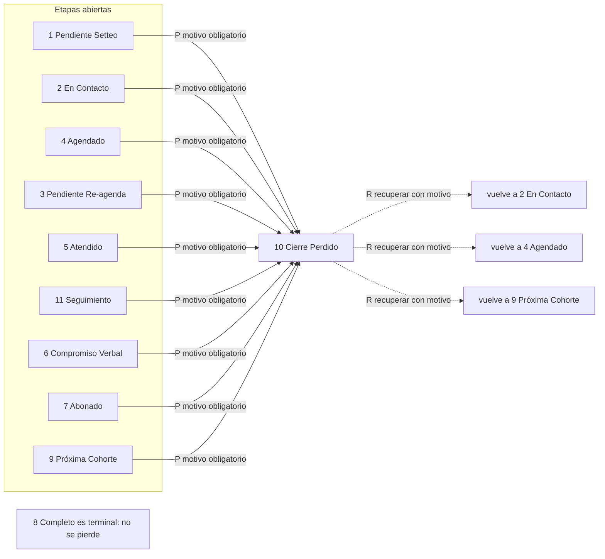
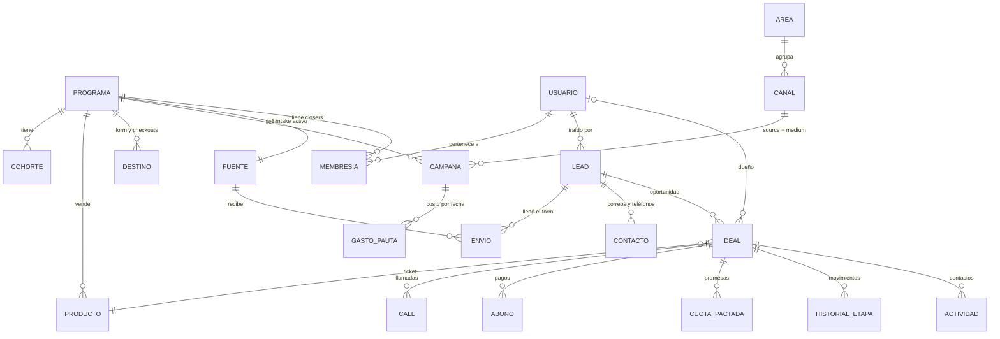

# CRM de Retia: paquete para la reunión con los closers

**Para qué es esto.** Llevar a la reunión con Comercial una propuesta clara y, sobre todo, salir
de ahí sabiendo cómo trabajan hoy, qué les duele y qué les ahorraría tiempo. El objetivo no es
hacer una demo: la app de hoy es la del modelo viejo y la nueva todavía no tiene pantallas.

**Cómo está armado.**

| Parte | Para quién | Qué tiene |
|---|---|---|
| 1. Resumen | todos | el CRM en una página |
| 2. Parte comercial | closers y gerentes | flujo de hoy y flujo propuesto, de cada rol |
| 3. Parte técnica | Mani (referencia) | modelo de datos, convención de UTM, builder, pantallas por rol |
| 4. Repo vs lo anotado | Mani | qué está construido, qué solo está escrito, qué falta decidir |
| 5. Decisiones del 24-sep | Mani | lo que se cerró hoy y que hay que bajar a los ADR |
| 6. Guía de la reunión | Mani | agenda y preguntas, en orden |
| 7. Preguntas para otros | Mani | Gerencia, Pauta, Michael, Media |

Leyenda: ✅ decidido · 🟡 propuesta, falta validar · 🔴 pendiente · ⚠️ contradicción o riesgo.

---

## 1. Resumen en una página

**Qué es.** El lugar donde vive la operación comercial de Retia: los leads, las llamadas, las
ventas y la plata cobrada, con las métricas calculándose solas encima. Reemplaza tres cosas que
hoy conviven mal: las hojas de Google Sheets, el grupo de WhatsApp donde se mandan los
comprobantes, y el PDF que Michael armaba a mano.

**Las dos cosas que tiene que trackear, sí o sí:**

1. **El flujo del lead.** Desde que llega con su información, se crea el Deal, hasta que se cierra
   (perdido) o se completa (pagado). Todo Deal carga lo relevante: programa, producto, cohorte,
   closer, llamadas, link de Grain, abonos, comprobantes, cuotas pactadas y su historial.
2. **El origen.** Todo lead llega con UTM estandarizado. Cruzado con lo que se invierte en pauta,
   eso dice qué canal, qué campaña y qué closer convierte en deals cerrados y cuál no.

**Por qué ahora.** Daniel Tovar lo dijo así: *"no sé si estoy perdiendo plata o no con la pauta"*.
Hoy la cadena se corta en tres puntos: el UTM entra con el lead pero no llega a la venta, el
comprobante nace en un chat, y el ROAS se dejó de calcular sin que nadie lo decidiera.

**Dónde estamos, sin maquillaje.**

- La base de datos del modelo nuevo (Lead, Envío, Deal, Calls, Abonos, Cuotas) ya existe.
- Hay **cero** deals, llamadas y abonos registrados en el CRM. Las closers siguen en Sheets.
- El motor que mueve los deals entre etapas todavía no existe. La interfaz nueva tampoco.
- Ese cero es bueno: cambiar el modelo hoy no mueve ni un dato real. Por eso esta reunión llega
  a tiempo: lo que digan las closers todavía cambia el diseño sin costo.

---

## 2. Parte comercial

### 2.1 Cómo trabaja hoy un closer (reconstruido, falta que ellas lo validen)

Esto salió de leer las dos hojas completas y los scripts de Apps Script (20-sep), no de
preguntarles. **Es la hipótesis que la reunión tiene que confirmar o corregir.**

```
Anuncio o contenido orgánico
  └─ Typeform del programa (uno por programa, trae 5 UTM)
       └─ Pestaña cruda del Sheet (una fila por envío)
            └─ Script cada 10 min escribe "Estado"
                 ├─ 🗑️ Descartado ............ no respondió pago o "no tengo recursos"
                 ├─ 📅 Con Calendly .......... agendó solo; queda en la hoja cruda
                 │     └─ llamada ─► el closer la anota a mano en "Registro de llamadas"
                 │          ├─ cierra ─► fila en "Estudiantes <cohorte>" ─► cartera si paga a cuotas
                 │          └─ no cierra ─► follow up / reagenda / rechazo / próxima cohorte
                 └─ 📞 Setteo No Calificado .. quiere pero no agendó
                       └─ un closer le escribe por WhatsApp (a veces vía Kapso)
                            └─ si agenda, entra al mismo camino de la llamada
```

| Paso | Qué hace el closer hoy | Dolor que se ve en los datos |
|---|---|---|
| Le llega un lead de Setteo | Un script lo reparte por turno fijo (Andrea, Dana, Sebastián, Alejo en Tactical). En ComunicArte el reparto es otro ("Closer asignado") | El reparto no mira carga ni si el closer está activo. Jero, Maru y Michael se asignan a mano. En Tactical 857 de 1.409 filas quedaron sin responsable |
| Contacta por WhatsApp | Anota en `Registro 1` a `Registro 5`, texto libre, sin fecha por nota | Solo la mitad de Setteo tiene algún registro. Hay ~50 notas tipo "ya había agendado": el sistema no avisa cuando alguien de la cola agenda por su cuenta |
| Se entera de una agenda de Calendly | 🔴 No sabemos cómo (¿calendario, Juanito, grupo?) | Solo el 53% de los Calendly de Tactical terminan con fila en el registro |
| Hace la llamada | Crea a mano una fila en `Registro de llamadas`: fecha, Show Sí/No, Cierre Sí/No, link, notas, categoría | Show y Cierre se escriben a mano (`Sí`, `si`, `no `): el que no escribe exactamente `Sí` no cuenta. Categorías casi no se usan (62 puestas, ~19 subcategorías) |
| Cierra | Manda el comprobante al grupo de WhatsApp (Ventas JP, Ventas ComunicArte) y se crea fila en `Estudiantes` | La verdad de "cuántas ventas" vive en Estudiantes, no en el registro: Tactical 29 cierres registrados vs 56 estudiantes; ComunicArte 51 vs 60. Jero tiene 10 estudiantes y 0 llamadas registradas |
| Cobra el resto | Lo que falta vive en 4 lugares sin dueño (columna Cartera, notas, `Cash collected` vs `Precio final`, pestaña de Hotmart) | Nada marca una cuota como pagada. No se sabe quién cobra la segunda cuota |
| Pide un link de pago o un brochure | Pregunta en el grupo | Tiempo perdido al colgar, que es su momento de mayor tensión |

Datos de referencia (20-sep): Tactical 184 llamadas registradas, show 55,4%, cierre 28,4% sobre
shows. ComunicArte 235 llamadas, show 43,8%, cierre 49,5%. **Andrea hace el 66% de las llamadas de
Tactical y el 76% de las de ComunicArte.**

### 2.2 Cómo trabaja hoy el gerente

| Quién | Qué hace hoy | Dolor |
|---|---|---|
| Michael (Ops, saliendo) | Revisa el grupo de WhatsApp de closers, cruza comprobantes contra el calendario compartido y el resumen que le mandan Andrea y Maru, lo pasa por su Claude y saca un PDF para Alejo y Daniel | La data queda en su Claude; nadie más la consulta. Todo manual |
| Michael + Pauta | Reporte diario de pauta: columnas azules (las llena Pauta desde Ads Manager) y amarillas (agendas, llamadas, ventas, % cierre, a mano) | Las amarillas son trabajo manual diario |
| Alejo / Daniel | Leen el PDF y el daily de pauta. Hay un semáforo `🚨 Urgencias` en la hoja que mide registros y agendas por canal, no ventas | Alejo: *"no saber qué decisiones tomar"*. Daniel: *"no sé si pierdo plata con la pauta"*. El ROAS por cohorte se calculaba a mano y se dejó de hacer |

Qué pidió Gerencia (reuniones del 14 y 21-sep):

- Tasa de cierre por closer, por programa y por fecha, visible para todos.
- **Rendimiento por área y cantidad de leads por área** (Gerencial, Comercial, Pauta, Media).
- Todo lo de pauta por UTM: qué vende, por fecha, canal e inversión.
- Registros vs agendas por canal (lo pide Media: TikTok trae muchos registros y pocas agendas).
- Si la inversión se convierte en ventas; flujo de caja.
- Reporte con un botón; números y tablas antes que estética.
- Los umbrales de éxito (success floors) **llegan después**, cuando el CRM tenga datos.

### 2.3 Flujo propuesto del closer

**Cómo nace un deal.** Todo empieza en **un solo evento**: el envío del formulario. El Typeform le
muestra el Calendly solo al que califica, así que un envío puede llegar **ya con la llamada
agendada** ("Con Calendly"). La agenda no es una entrada aparte: es parte del mismo envío. El
recorrido del deal entre etapas está en §2.5, con cada conexión numerada y justificada.



| Caso | Qué pasa | Por qué | Estado |
|---|---|---|---|
| Envío Setteo, lead sin deal abierto | deal en 1, sin dueño, al Inbox | calificó pero no agendó: alguien tiene que contactarlo | ✅ ADR 0037 |
| Envío Con Calendly, lead sin deal abierto | deal en 4 Agendado | agendó dentro del mismo formulario | ✅ ADR 0037 |
| Envío Descartado o sin Estado | lead sin deal | no hay oportunidad que trabajar; el lead no se pierde | ✅ |
| Nuevo envío de un lead con deal abierto | se guarda el envío, se avisa al dueño, la etapa no cambia | el dueño tiene que enterarse (hoy son ~50 notas tipo "ya había agendado") | ✅ |
| Deal a mano | nace en 1, 2 o 6 con dueño = quien lo crea | el lead llegó sin formulario | ✅ ADR 0021, 0044 |
| El lead vuelve a aplicar con su deal cerrado | deal **nuevo**; la ficha muestra los anteriores | volver a intentar es un hecho, no una sobrescritura | ✅ ADR 0037 |

**Cómo se cuelga cada llamada de su deal.** La sincronización con Calendly tiene **un solo
objetivo**: poner cada llamada en su deal sin trabajo manual. **No es forzosa: si hay duda, la
llamada queda suelta** y el closer la asigna a un deal a mano.



| Caso | Qué pasa | Por qué | Estado |
|---|---|---|---|
| El correo del invitado es de un lead con un solo deal abierto | la Call se cuelga sola, con fecha real y host | es el caso normal: el mismo correo del formulario | ✅ 24-sep |
| No aparece el correo, o casa con un lead sin deal abierto, o con más de uno | **llamada suelta** en el Inbox; el closer la asigna | una asignación equivocada es peor que una pendiente: se ve igual que una correcta | ✅ 24-sep |
| La llamada llega antes que el envío (carrera de segundos) | queda suelta y se vuelve a intentar el emparejamiento cuando llega el envío | evita que el orden de llegada llene el Inbox de sueltas | 🟡 |
| Deal en 1, 2, 3, 9 u 11 (Seguimiento) | la llamada se agrega, el deal pasa a 4 Agendado y **se avisa al dueño** | un deal tiene todas las llamadas que haga falta y nunca se duplica (Mani, 24-sep). Medido: 9 leads de Setteo agendaron solos y la hoja no lo vio | ✅ |
| Deal en 5, 6 o 7 | la llamada se agrega y **se avisa al dueño**; la etapa no cambia | el closer decide qué significa esa llamada | ✅ Mani · 🟡 validar |
| Cancelada o no-show reportada por Calendly | T8: el deal pasa a 3 Re-agenda | la cita falló | ✅ |
| Deal sin dueño y host registrado en el programa | dueño = host del Round Robin | Calendly ya repartió | ✅ 24-sep |
| Deal con dueño y el host es otro closer | se respeta el dueño y se avisa | 🔴 pregunta para la reunión: ¿de quién es? | 🔴 |
| Sin la integración todavía | el closer crea la Call con fecha y link a mano | el modelo no depende de Calendly para funcionar | ✅ |

**Un día del closer en el CRM:**

1. Abre el **Inbox** de su programa: ve lo que no tiene dueño, las **llamadas sueltas** (las que
   Calendly no pudo colgar de un deal sin duda) y lo suyo que necesita atención (llamada de hoy sin
   resultado, re-agenda pendiente, compromiso vencido, cuota vencida).
2. Reclama lo que va a trabajar y asigna las llamadas sueltas a su deal. Las agendas de Calendly
   le llegan asignadas si él es el host.
3. Registra cada contacto (canal y nota). Eso reemplaza `Registro 1-5`.
4. Después de la llamada **pega el link de Grain**: el deal pasa solo a Atendido.
5. Si cierra: elige producto (el precio ya viene del producto), registra el primer abono con su
   comprobante (foto o link) y, si paga a cuotas, las cuotas pactadas con monto y fecha.
   El deal pasa solo a Abonado, y a Completo cuando el saldo llega a cero.
6. Si no cierra, elige una salida: Compromiso Verbal, **Seguimiento** (hay que volver a
   contactarlo), otra llamada (Re-agenda, con motivo), Próxima Cohorte o Cierre Perdido con motivo
   (§2.6). El deal nunca se duplica y nada se borra.
7. Encuentra brochures y links de pago en **Resources**, en un clic.
8. Tiene **su link de captación** por programa: el lead que él trae queda marcado como suyo.

**Lo que ya no hace:** mandar el comprobante al grupo, llenar el registro a mano, escribir Sí/No,
buscar links en WhatsApp, calcular su comisión.

### 2.4 Flujo propuesto del gerente

1. Abre el **Dashboard**: elige un programa o "todos los programas" (en "todos" solo aparecen las
   cifras que se pueden sumar; ver §3.1).
2. Ve cierres, show, caja recaudada, meta y meta dinámica de la cohorte, rendimiento por closer,
   por canal y por área, y el origen de cada venta hasta la campaña.
3. Revisa la **cartera vencida** y los deals sin dueño; reasigna.
4. Registra **campañas** y su gasto; genera los links con UTM (o lo hace Pauta con su rol).
5. Administra programas, cohortes, productos, usuarios y a qué programas pertenece cada closer.

### 2.5 Las etapas del Deal (para validar con ellas)

Son **once** desde el 24-sep: Mani sumó **Seguimiento** para separar, después de la llamada, lo que
salió bien (Compromiso o pago) de lo que hay que volver a contactar. **El número es solo un nombre,
no el orden**: Re-agenda es la 3 y viene después de Agendado; Seguimiento es la 11 y viene después de
Atendido. Por eso la tabla va en el orden del camino, no por número.

| # | Etapa | Entra cuando | La mueve |
|---|---|---|---|
| 1 | Pendiente Setteo | calificó pero no agendó; o deal a mano | sistema / closer |
| 2 | En Contacto | el dueño registra el primer contacto | closer |
| 4 | Agendado | hay una llamada con fecha | sistema / closer |
| 3 | Pendiente Re-agenda | la llamada falló (no llegó, canceló, o hace falta otra), **siempre con motivo** | sistema / closer |
| 5 | Atendido | la llamada ocurrió (se pegó el Grain) | sistema |
| 11 | **Seguimiento** 🆕 | la llamada ocurrió y hay que volver a contactarlo ("lo voy a pensar") | closer |
| 6 | Compromiso Verbal | dijo que sí: producto y fecha prometida | closer |
| 7 | Abonado | entró el primer pago y queda saldo | sistema |
| 8 | Completo | saldo en cero | sistema |
| 9 | Próxima Cohorte | quiere entrar, pero a la siguiente | closer |
| 10 | Cierre Perdido | dijo que no; motivo obligatorio | closer |

**Un deal, muchas llamadas** (Mani, 24-sep). Un deal tiene todas las llamadas que haga falta y **nunca
se duplica**. Si una llamada falla, el deal pasa a Re-agenda con motivo; cuando se agenda la siguiente,
vuelve a Agendado. Si llega una llamada nueva de un lead que ya tiene deal, **se agrega a ese deal y se
le avisa al dueño**. Para que ese ir y volver no infle las métricas, **la conversión cuenta deals
distintos** que llegaron a una etapa, no cuántas veces entraron.

**El camino de un deal, como línea de tiempo.**

**Cómo se lee (para explicarlo en la reunión):**

- Se lee **de izquierda a derecha, como una barra de progreso**. Cada columna es un paso del deal, en
  el orden en que suele avanzar. Arriba de las columnas está la fase: antes de la llamada, la llamada,
  el pago.
- Debajo de cada paso hay **fichas**: **cómo llega** el deal a ese paso, **qué lo hace avanzar**, y
  **qué pasa si se cae**.
- Un deal está **siempre en un solo paso**. No todos pasan por todos: el que paga en la llamada salta
  de Atendido a Abonado, y el que acepta por chat salta de En Contacto a Compromiso Verbal.
- La **segunda barra son los desvíos**: pasos fuera del camino principal. De Re-agenda y de Próxima
  Cohorte el deal vuelve al camino; en Cierre Perdido termina, salvo que se recupere.
- Los códigos T1, T2… de la tabla de más abajo son para el equipo técnico. En la reunión no hacen falta.





Qué está decidido y qué es propuesta: Seguimiento (T24 a T28), la llamada que falla con motivo (T29) y
"un deal, muchas llamadas" los decidió Mani el 24-sep y se validan con los closers. T5, T7, T9, T14,
T15, T17, T19, T20, T21, A1, A2 y los destinos de R son propuestas 🟡 (la mayoría cierra los huecos del
ticket 043). El resto está decidido en el ADR 0037 y en el diseño consolidado. Anular un abono (A1, A2)
devuelve el deal a la etapa previa; va en la tabla porque el destino depende del historial.

**Pérdida y recuperación, con flechas.** Un deal se puede perder desde cualquier etapa abierta,
**también después de la llamada**: en Seguimiento, en Compromiso Verbal, en Abonado o en Próxima
Cohorte.



Anular el deal entero no es una flecha: es una marca aparte que lo saca de todas las métricas
(ADR 0038), esté en la etapa que esté.

**Tabla de transiciones.** "Sistema" = el CRM mueve el deal solo cuando pasa el evento; "closer" =
lo mueve una persona y el CRM exige el requisito antes de aceptar.

| Id | De → a | Qué la dispara | Quién | Requisito | Por qué existe | Estado |
|---|---|---|---|---|---|---|
| T1 | 1 → 2 | primer contacto registrado | closer | deal con dueño; actividad con fecha y canal | reemplaza `Registro 1-5`: prueba que alguien lo está trabajando | ✅ |
| T2 | 1 → 4 | llega la agenda de Calendly, o el closer crea la Call | sistema / closer | Call con fecha | medido: 9 leads de Setteo agendaron solos y la hoja no lo vio | ✅ · ⚠️ falta en el ticket 043 |
| T3 | 2 → 4 | el contacto consigue la agenda | sistema / closer | Call con fecha | es el objetivo del setteo: convertir en agenda | ✅ |
| T4 | 2 → 6 | acepta por chat, sin llamada | closer | producto + fecha prometida | existen ventas sin llamada (Jero: 10 estudiantes, 0 llamadas registradas) | ✅ |
| T5 | 2 → 7 u 8 | paga por chat de una vez | sistema, al registrar el abono | producto + abono con comprobante | inventar un paso por Compromiso de cero minutos ensucia el tiempo en etapa | 🟡 |
| T6 | 3 → 4 | se crea una Call nueva con fecha | sistema / closer | Call con fecha | la cita fallida se reprogramó | ✅ ticket 059 |
| T7 | 3 → 5 | se pega el Grain de una llamada que sí ocurrió | sistema | link de Grain (o "sucedió") | corrige un no-show mal marcado; sin esta flecha, pegar el Grain falla | 🟡 D2 |
| T8 | 4 → 3 | la Call queda en no-show o cancelada | sistema | el resultado de la Call es el motivo | la cita falló y tiene que quedar a la vista para reagendar | ✅ ticket 059 |
| T9 | 4 → 4 | la cita se mueve antes de ocurrir | sistema | Call vieja `reagendada` + Call nueva con fecha | mover una cita no es avanzar ni retroceder en el embudo | 🟡 |
| T10 | 4 → 5 | se pega el link de Grain | sistema | link de Grain | pegar el Grain es la prueba de que la llamada ocurrió | ✅ · 🟡 aceptar también "sucedió" para llamadas sin grabar |
| T11 | ~~5 → 5~~ | reemplazada el 24-sep por la etapa Seguimiento (T24) | · | · | · | reemplazada |
| T12 | 5 → 6 | dijo que sí, paga después | closer | producto + fecha prometida (primera cuota pactada) | sin fecha no hay compromiso que vigilar | ✅ |
| T13 | 5 → 7 | pagó en la llamada y queda saldo | sistema, al registrar el abono | producto + abono con comprobante | la etapa la mueve la plata, no el closer | ✅ |
| T14 | 5 → 8 | pagó todo en la llamada | sistema | abono igual al precio | mismo principio; hoy la tabla no lo permite | 🟡 D2 |
| T15 | 6 → 11 | el sí se echa para atrás pero sigue interesado | closer | motivo | vuelve a Seguimiento, que es donde se re-contacta | 🟡 |
| T16 | 6 → 7 | primer abono, queda saldo | sistema | abono con comprobante | la plata cumple el compromiso | ✅ |
| T17 | 6 → 8 | paga todo de una vez | sistema | abono igual al precio | igual que T14 | 🟡 D2 |
| T18 | 7 → 8 | la suma de abonos llega al precio | sistema | saldo en cero | Completo es un hecho contable, no una decisión | ✅ |
| T19, T20, T21 | 2, 5 o 6 → 9 | quiere entrar, pero a la siguiente cohorte | closer | **cohorte destino** | hoy "próxima cohorte" es texto libre y su pestaña está vacía; sin cohorte destino, la etapa se vuelve un cementerio | 🟡 D2 (hoy ninguna etapa llega a 9) |
| T22 | 9 → 2 | la cohorte destino abre ventas y el closer lo recontacta | closer | contacto nuevo | el deal reaparece en el Inbox cuando su cohorte abre | ✅ |
| T23 | 9 → 4 | agenda para la nueva cohorte | sistema / closer | Call con fecha | igual que T2 | ✅ |
| T24 | 5 → 11 | la llamada ocurrió y hay que volver a contactarlo | closer | fecha de seguimiento | separa lo que salió bien de lo que hay que re-contactar (Mani) | ✅ Mani · valida closers |
| T25 | 11 → 6 | en el seguimiento dijo que sí | closer | producto + fecha prometida | igual que T12 | ✅ Mani |
| T26 | 11 → 7 u 8 | en el seguimiento pagó | sistema, al registrar el abono | abono con comprobante | la etapa la mueve la plata | ✅ Mani |
| T27 | 11 → 4 | se agenda otra llamada | sistema / closer | Call con fecha | una segunda llamada es parte del mismo deal; se avisa al dueño | ✅ Mani |
| T28 | 11 → 9 | quiere la siguiente cohorte | closer | cohorte destino | igual que T19 | 🟡 |
| T29 | 5 → 3 | la llamada no alcanzó y hace falta otra | closer | **motivo** | "si falla y no cierra, pasa a Re-agenda con motivo; no se duplica el deal" (Mani) | ✅ Mani |
| P | 1 a 7, 9 y 11 → 10 | dijo que no, no responde o desistió | closer | **motivo obligatorio** | Cierre Perdido cuenta en el embudo; el motivo explica por qué se pierde | ✅ |
| R | 10 → 2, 4 o 9 | se recupera un perdido | closer | motivo | decidido: se puede recuperar. Propuesta: solo hacia 2, 4 o 9, porque de 5 a 8 se entra por un evento (Grain, abono) y no a mano | ✅ recuperable · 🟡 destinos |
| A1 | 7 → la etapa previa | se anula el único abono | sistema | anulación con motivo | la etapa es copia de los abonos: si el abono no existe, Abonado tampoco | 🟡 |
| A2 | 8 → 7 | se anula un abono y vuelve a quedar saldo | sistema | anulación con motivo | igual que A1 | 🟡 |

**Reglas generales:**

- **Un deal, muchas llamadas, nunca duplicado** (✅ Mani). Una llamada nueva se agrega al deal abierto
  del lead y se le avisa al dueño.
- **La conversión cuenta deals distintos** (🟡): un deal que va de Agendado a Re-agenda y vuelve cuenta
  una sola vez como "llegó a Agendado". Así el ir y volver no infla ninguna tasa.
- **Re-agenda siempre lleva motivo** (✅ Mani): no-show, cancelada, u otra llamada necesaria.
- **Completo es terminal** (🟡 D2). No llega a Cierre Perdido: un reembolso es otro flujo (la
  entrega), no una venta perdida. Hoy hay una contradicción escrita entre "Completo terminal" y
  "Perdido desde cualquier etapa".
- **Abonado sí se puede perder** (✅): el estudiante desiste con plata abonada. Esa plata sigue
  contando en la caja recaudada; la venta deja de contar como abierta.
- **No hay relojes** (✅): Re-agenda, Seguimiento vencido, Compromiso vencido y cuota vencida no se
  mueven solas. Se pintan en rojo y caen al Inbox; el closer decide.
- **Ninguna regla compara números de etapa** (🟡): "4 o más" no significa nada, porque el número no es
  el orden. Toda regla nombra las etapas una por una.
- **Todo movimiento queda en el historial** con quién, cuándo y motivo (✅). De ahí salen la
  conversión etapa a etapa y el tiempo en etapa.

### 2.6 Qué pasa con el deal después de cada llamada

**Una llamada que no cierra no manda el deal a una sola etapa.** Depende de cómo terminó, y el closer
lo decide apenas pega el Grain:

| Cómo terminó | El deal pasa a | Se exige | Categoría vieja de la hoja | Id |
|---|---|---|---|---|
| Pagó en la llamada | 7 Abonado u 8 Completo | producto + abono con comprobante | · | T13, T14 |
| Dijo que sí, paga después | 6 Compromiso Verbal | producto + fecha prometida | FU con fecha | T12 |
| Lo va a pensar: hay que volver a contactarlo | **11 Seguimiento** | fecha de seguimiento | FU-1 a FU-5 | T24 |
| Hace falta otra llamada | 3 Pendiente Re-agenda | motivo | PRA | T29 |
| Quiere, pero para la siguiente | 9 Próxima Cohorte | cohorte destino | a veces FIN | T20 |
| Dijo que no | 10 Cierre Perdido | motivo | FIN, FIT, RD | P |

**Cada resultado de llamada y lo que le hace al deal.** La llamada dice qué pasó; el motor de
etapas decide qué significa (ADR 0015, enmendado).

| Resultado de la Call | Qué significa | Efecto en el deal | Estado |
|---|---|---|---|
| `agendada` | hay cita con fecha | pasa a 4 Agendado (T2, T3, T6, T23, T27) | ✅ |
| `reagendada` | la cita se movió antes de ocurrir | se queda en Agendado y nace una Call nueva (T9) | 🟡 |
| `cancelada` | avisó que no llega | pasa a 3 Re-agenda, con ese motivo (T8) | ✅ |
| `no_show` | no apareció | pasa a 3 Re-agenda, con ese motivo (T8) | ✅ |
| `show` | ocurrió: se pegó el Grain | pasa a 5 Atendido (T7, T10) | ✅ |
| `compromiso_pago` | dijo que sí y paga en una fecha | pasa a 6 Compromiso Verbal (T12) | ✅ |
| `cerrada` | pagó en la llamada | pasa a 7 u 8 cuando se registra el abono (T13, T14) | ✅ |
| `perdida` | dijo que no | pasa a 10 Cierre Perdido, con motivo (P) | ✅ |

**Lo que se resolvió hoy (Mani, 24-sep):**

1. **Seguimiento es una etapa propia**, no Atendido con una fecha. La columna Atendido del Kanban
   queda para lo que se acaba de llamar, y Seguimiento para lo que hay que re-contactar.
2. **La segunda llamada es parte del mismo deal.** Se agrega, se avisa al dueño y el deal vuelve a
   Agendado si estaba en Re-agenda, Seguimiento o antes. La conversión cuenta deals distintos, así que
   eso no infla la tasa.

**Lo que sigue en propuesta:** `compromiso_pago`, `cerrada` y `perdida` repiten lo que dicen las etapas
6, 7 y 10. Si se anula un abono, la llamada sigue diciendo `cerrada` y el deal ya no está en Abonado:
dos respuestas a la misma pregunta. Regla propuesta: **el show se cuenta en las llamadas; el cierre se
cuenta en los deals** (en los abonos). Nunca un % de cierre contando llamadas `cerrada`.

**Idea de pantalla:** después de pegar el Grain, una sola pregunta, *"¿Cómo terminó?"*, con seis
botones: **Pagó ahora** (abre el abono) · **Compromiso** (producto y fecha) · **Seguimiento** (fecha) ·
**Otra llamada** (motivo) · **Próxima cohorte** (cohorte) · **Perdido** (motivo). No existe "no cerró"
sin decir qué sigue, así que ningún deal queda sin próxima acción.

### 2.7 Lo que se les va a pedir y lo que ganan

- **Se les pide:** que el CRM sea el único lugar (sin grupo, sin registro paralelo), pegar el
  Grain, registrar abonos con comprobante, y el motivo cuando se pierde algo.
- **Ganan:** cero columnas a mano, su comisión calculada sola, los leads de Calendly asignados
  sin pedirlos, links de pago a un clic, y un link propio para que los leads que traen cuenten
  como suyos. Hoy un lead que trae un closer es invisible: en "leads por área", Comercial saldría
  en cero.

---

## 3. Parte técnica (referencia para Mani)

### 3.1 Reglas que ordenan todo

| Regla | En palabras simples | Fuente |
|---|---|---|
| Se cuenta personas, no filas | Una persona que aplica 3 veces es 1 lead con 3 envíos. Contar filas infla las tasas ~60% | ADR 0005 |
| El programa es frontera | ComunicArte y Tactical no se mezclan: misma persona en los dos = dos leads. **Enmienda del 24-sep:** el dashboard puede sumar **solo magnitudes sumables en la misma unidad** (# leads, # deals, # ventas, caja USD, gasto de pauta); tasas, meta, meta dinámica, CPL, ROAS y comisión van por programa, lado a lado | ADR 0043 (enmendar) |
| Las listas son de un programa | Leads, Deals, Calls, Students e Inbox siempre muestran un programa; hay un selector obligatorio | 24-sep |
| El closer ve solo sus programas | Por membresía activa. Dentro de su programa ve todo (deals, caja, comparativo) | ADR 0009 (enmendar) |
| Caja ≠ ventas | Caja = suma de abonos por fecha del abono. Ventas = deals en Abonado o Completo. Nunca se deriva una de la otra | ADR 0013, 0037 |
| Anular ≠ Cierre Perdido | Perdido cuenta en el embudo; anulado no cuenta en nada | ADR 0038 |
| Todo deja rastro | Cada escritura guarda quién, cuándo y qué cambió | ADR 0042 |
| Lo configurable es una fila | Programas, productos, campañas, canales, áreas, motivos: se crean desde la app, no en código | ADR 0012 |
| Lo derivado no se guarda | Saldo, comisión, área de un lead y links generados se calculan | ADR 0024 |
| Fechas de Bogotá, dinero en USD | `-05:00` explícito; la moneda al lado del número, sin conversión silenciosa | AGENTS.md |

### 3.2 Modelo de datos



| Entidad | Qué es | Estado en la base |
|---|---|---|
| Programa | ComunicArte, Tactical Investor, los que vengan | ✅ existe. Falta: `form_url`, tasa de comisión, credencial de Calendly |
| Cohorte | la edición de un programa: meta, ventana de venta; **define la lista de estudiantes** (§3.2b) | ✅ existe |
| Usuario + Membresía | cuenta de Google con rol; a qué programas pertenece | ✅ existe. Falta: la cuenta de Calendly **por programa** (hoy `calendly_email` es una sola, global) y el código opaco del closer para su link |
| Lead | una persona **dentro de un programa**, llave `(programa, correo)` | ✅ existe (0 filas en `dev`). Falta: `traido_por_user_id`. Sobra: sus columnas `utm_*` duplican las del envío (D5) |
| Contacto del lead | todos sus correos y teléfonos, con de qué envío llegó | ✅ existe |
| Envío | cada vez que llenó el form, parcial o completo; 5 UTM + todas las respuestas en `jsonb` | ✅ existe |
| Deal | la oportunidad; carga programa, cohorte, dueño, etapa, producto, envío de origen | ✅ existe. `etapa` es un enum de 10 valores; **Seguimiento** suma el 11 (una migración, ticket 043) |
| Historial de etapa | cada movimiento, con quién y motivo | ✅ existe |
| Actividad | contacto o nota sobre el deal (reemplaza `Registro 1-5`) | ✅ existe. 🔴 `canal` es texto libre: ¿lista cerrada? |
| Call | llamada del deal: fechas, Calendly, Grain, resultado | ✅ existe, con columnas del modelo viejo. Falta: id del evento de Calendly y host |
| Abono | cada pago con monto, plataforma, comprobante | ✅ existe. Falta: guardar la **foto** del comprobante (Supabase Storage, decidido) |
| Cuota pactada | lo prometido: número, monto, fecha, qué abono la cumplió | ✅ existe |
| Producto | un precio que se vende; cada descuento es un producto | ✅ existe |
| Plataforma de pago, enlace de pago, recurso | catálogos y links del equipo | ✅ existen |
| Área | Gerencial, Comercial, Pauta, Media | ❌ no existe |
| Canal (el "Origen" del builder) | un par `utm_source + utm_medium` con su área | ❌ no existe. ⚠️ Ya hay una tabla `origenes` (catálogo del ADR 0015: "agenda del día", "follow-up") con otro significado: por eso en el modelo se llama **Canal** |
| Campaña | `utm_campaign`, por programa y cohorte, con su gasto | ❌ no existe. `ad_spend` guarda la campaña como texto libre |
| Destino | URL base del form o de un checkout, por programa | ❌ no existe |
| Student | vista: deals en Abonado o Completo | vista, no tabla |
| Inbox | vista: lo sin dueño + lo que necesita atención | vista, no tabla |

### 3.2b Cohortes y Students ✅

**La cohorte es por programa y define la lista de estudiantes.** Un estudiante confirmado
pertenece a **una** cohorte de **un** programa.

| Regla | Detalle | Estado |
|---|---|---|
| Por programa | cada cohorte tiene código, meta de cupos, meta de leads por día hábil, precio, inicio de clases y **ventana de venta** (inicio y cierre de ventas) | ✅ en la base (`cohorts`) |
| Una activa a la vez | máximo una cohorte `activo` por programa; las demás `cerrado` o `futuro`. Lo garantiza la base | ✅ |
| El deal lleva su cohorte | `deals.cohort_id`; se asigna sola al cerrar: la cohorte activa del programa | ✅ columna; la regla vive en el motor (E2), que no existe |
| Student | un deal en **Abonado o Completo**, en la cohorte de su deal. La tab Students es esa lista, filtrada por cohorte | ✅ vista |
| Cambio de cohorte | extraordinario, con quién y por qué (ej.: los 12 de ComunicArte que compraron en agosto y pasaron a septiembre). No hace falta que un estudiante esté en dos | ✅ decidido; se guarda en el rastro |
| La meta es de la cohorte | no se reparte entre closers; el closer tiene **contribución**, no meta propia | ✅ ADR 0023 |
| Próxima Cohorte (etapa 9) | 🟡 propuesta: exigir la cohorte destino al marcarla, y que el deal reaparezca cuando esa cohorte abra ventas | 🔴 D2 |

🔴 Por confirmar: **¿"estudiante confirmado" es desde el primer abono (Abonado) o solo con el pago
completo?** El modelo hoy cuenta los dos. Y: una venta que se cierra **después** del cierre de
ventas de la cohorte, ¿va a la siguiente?

### 3.3 La convención de UTM de Retia 🟡 (propuesta para cerrar con Pauta y Media)

Es lo más importante de la parte técnica: **si la convención es clara, todo queda trackeado; si
no, el tablero miente sin dar error.**

**Reglas de forma (las aplica el builder, nadie las recuerda):**

- Minúsculas, `snake_case`, sin tildes ni espacios; solo `a-z`, `0-9` y `_`. El builder sanitiza.
- **Ningún link se arma a mano.** Todo sale del builder. Lo que entra sin pasar por él se detecta.

**Qué significa cada parámetro:**

| Parámetro | Significa | Quién lo pone | ¿Lo leen los reportes? |
|---|---|---|---|
| `utm_source` | la plataforma o lugar del clic | el **Canal** elegido en el builder | ✅ sí |
| `utm_medium` | el tipo de tráfico | el **Canal** elegido en el builder | ✅ sí |
| `utm_campaign` | la campaña | la **Campaña** del catálogo | ✅ sí |
| `utm_content` | **quién o qué pieza**, según el canal: en Pauta el anuncio (`{{ad.id}}` de Meta); en Closer el **código del closer**; en Media la cuenta o creadora (`rosario`, `milena`) | el builder según el canal | solo en canal Closer (para saber quién lo trajo). En los demás se guarda y no se lee todavía |
| `utm_term` | variante legible libre (`lanzamiento_octubre`, `2026_09_24`) | opcional, con "usar fecha de hoy" | no, solo se guarda |

⚠️ `utm_content` cambia de significado según el canal. Es aceptable **solo** porque el canal lo
declara y un único módulo lo interpreta. Es exactamente el error medido el 21-sep (en ComunicArte
`utm_content` era el anuncio y en Tactical el conjunto) si alguien lo lee sin mirar el canal.

**Catálogo inicial de Canales 🟡** (sale de los valores reales de las hojas; el área la confirma Alejo):

| Canal | `utm_source` | `utm_medium` | Área propuesta |
|---|---|---|---|
| Meta Ads | `facebook` | `cpc` | Pauta |
| TikTok Ads | `tiktok` | `cpc` | Pauta |
| Google / YouTube Ads | `google` | `cpc` | Pauta |
| Instagram bio / linktree | `instagram` | `bio` | Media |
| Instagram stories | `instagram` | `stories` | Media |
| TikTok orgánico | `tiktok` | `organic` | Media |
| YouTube orgánico | `youtube` | `organic` | Media |
| Lead magnet | `leadmagnet` | `pdf` | 🔴 Media o Pauta |
| Closer | `closer` | `referido` | Comercial |
| WhatsApp masivo (Kapso) | `whatsapp` | `masivo` | 🔴 Comercial o Gerencial |
| Juanito / automatizado | 🔴 | 🔴 | 🔴 (pregunta a Michael) |

Se mantiene `facebook` (no `meta`) para no romper el histórico: hoy los leads reales traen
`facebook / cpc`. Los valores viejos como `instagram rosario / linktree` se clasifican con
patrones hacia atrás, no se reescriben.

**Dos cubetas de huérfanos, siempre visibles y nunca juntas:**

- **Sin UTM:** llegó sin origen. Problema de captación, irrecuperable. Hoy 726 de 4.823 (15%);
  **Tactical 26%**, ComunicArte 1%.
- **Sin clasificar:** trae UTM pero no casa con ningún canal ni campaña. Se arregla con una fila
  y repara hacia atrás.

**El área de un lead no se escribe: se deriva** de su canal. El lead que trae un closer queda en
Comercial y además con `traido_por` = ese closer (el primero que lo trae gana).

### 3.4 El UTM builder de Retia (v1) ✅

Replica la lógica de `campaigns.oracle30x.co/utm-builder`, adaptada a Retia:

| Sección | En 30X | En Retia |
|---|---|---|
| Destino | catálogo de checkouts y forms / URL libre | **catálogo por programa:** URL del formulario y URLs de checkout. URL libre queda fuera de v1 |
| Origen | Categoría | **Canal**: fija `utm_source` y `utm_medium`, y muestra su área |
| Campaña | catálogo (`POST /api/utm-campaigns`) | catálogo de **Campañas** del programa, creado dentro del CRM |
| Opcional | `utm_content` (ID técnico), `utm_term` (slug, "usar fecha de hoy") | igual, con el significado de `utm_content` según el canal |
| URL final | copiar | copiar. **El link no se guarda: se calcula** |
| Acortar URL | `s.oracle30x.co/xxx` con analítica de clics | fuera de v1 |

- **Quién lo usa:** gerente y un **rol nuevo, Paid Trafficker**, que solo crea campañas y links de
  sus programas. El closer no usa el builder: tiene "Mi link" prellenado (canal Closer +
  campaña de referidos + su código) y no editable.
- **Crear una campaña escribe su regla de clasificación en la misma operación.** Así el link y la
  regla que lo reconoce no pueden discrepar.
- **Checkouts:** v1 genera links a checkouts con UTM. Que la venta vuelva sola al CRM (webhook de
  Hotmart, PayPal, MercadoPago) es una integración posterior; mientras tanto el closer registra
  el abono. ⚠️ Hasta entonces, el UTM de un checkout solo sirve si el pago se asocia a un deal.

### 3.5 Pantallas: tabs a la izquierda, tipo HubSpot ✅ (el contenido de cada una es 🟡)

Arriba de la barra: **selector de programa**. Todas las tabs trabajan sobre el programa elegido;
el closer solo ve sus programas en el selector. El Dashboard además ofrece "Todos los programas"
con las cifras sumables.

| Tab | Qué es | Filtros clave |
|---|---|---|
| **Inbox** | reemplaza "Mi día". Deals sin dueño, llamadas sueltas y lo que necesita atención | tipo de pendiente, antigüedad |
| **Dashboard** | reemplaza los dashboards por programa | programa / todos, rango de fechas, cohorte, closer, área, canal, campaña |
| **Leads** | la base de personas del programa, con o sin deal | estado de llegada, canal, área, campaña, traído por, parcial, con/sin deal |
| **Deals** | Kanban por etapas y vista de tabla | etapa, dueño, cohorte, canal, antigüedad, "necesita atención" |
| **Calls** | llamadas de hoy y próximas, sin resultado, sueltas (sin deal) | closer, resultado, fecha |
| **Students** | la lista de estudiantes **por cohorte**: deals en Abonado o Completo, con saldo, cuotas, cartera vencida y onboarding | cohorte (por defecto la activa), saldo > 0, cuota vencida |
| **Campañas** | catálogo de campañas, gasto y builder de links | canal, área, cohorte |
| **Programs** | ficha del programa: cohortes, destinos, Calendly, fuente, tasa de comisión, equipo | · |
| **Products** | productos y precios (ya existe) | · |
| **Resources** | brochures y links de pago (ya existe) | categoría |
| **Ajustes** | usuarios, membresías y su Calendly por programa, catálogos, fuentes, áreas, canales | · |
| **Nerd Stats** | salud del sistema y bitácora (solo developer) | · |

**Las asociaciones se navegan, no se memorizan.** La ficha de un Deal muestra su Lead, sus
Calls, Abonos, Cuotas e historial; cada tarjeta lleva a su lista ya filtrada. Los filtros viven
en la URL: un filtro se comparte con un link. Las vistas guardadas entran cuando alguien se
queje de rearmar el mismo filtro.

**Qué cae en el Inbox 🟡 (validar con ellas):**

1. Deals sin dueño: Pendiente Setteo nuevos, y Agendados cuyo host no está registrado en el
   programa.
2. Llamadas sueltas: Calendly no pudo colgarlas de un deal sin duda (el correo no aparece, casa
   con un lead sin deal abierto o con más de uno). El closer las asigna a un deal, o crea el deal.
3. Lo mío que necesita atención: llamada de hoy sin resultado; Re-agenda sin nueva fecha;
   Compromiso Verbal con fecha vencida; cuota vencida; deal sin actividad en X días (🔴 X);
   un lead con deal abierto que volvió a llenar el formulario.
4. Para el gerente: lo mismo de todo el equipo, más leads "unidos por teléfono" para revisar.

**Quién ve qué:**

| Tab | Closer | Gerente | Paid Trafficker (nuevo) | Developer |
|---|---|---|---|---|
| Inbox | lo suyo + sin dueño de sus programas | todo el programa | · | todo |
| Dashboard | sus programas, completos | todos | 🔴 ¿solo pauta de sus programas? | todo |
| Leads, Deals, Calls, Students | sus programas | todos | · | todo |
| Campañas | "Mi link" | todo | crear campañas y links de sus programas | todo |
| Programs | lectura de los suyos | edita | · | todo |
| Products | edita en sus programas | edita | · | todo |
| Resources | lee y crea en sus programas | edita | · | todo |
| Ajustes | catálogos permitidos | todo | · | todo |
| Nerd Stats | · | · | · | solo él |

### 3.6 Dashboard: qué hay decidido y qué no

Lo que piden los jefes, y dónde queda:

| Pedido | Sección del dashboard | Se suma en "todos los programas" |
|---|---|---|
| Cierres | ventas, % de cierre, % de show, embudo por etapa, tiempo en etapa | solo # ventas; las tasas por programa |
| Por closer | llamadas, show, cierres, caja, comisión, contribución a la cohorte (no meta propia) | no (tasas y comisión son por programa) |
| Por área | leads, deals y ventas por área | sí los conteos |
| UTM / origen | por canal y campaña: registros, agendas, ventas; las dos cubetas de huérfanos | sí los conteos |
| Flujo de caja | caja recaudada por fecha de abono, saldo por cobrar, cartera vencida | sí (todo en USD) |
| Inversión | gasto, CPL, costo por agenda, CAC, ROAS por campaña y cohorte | el gasto sí; CPL, CAC y ROAS por programa |

🔴 Pendiente: el layout; los umbrales de éxito de Gerencia; el mapeo canal → área definitivo; si
un lead traído por un closer cuenta distinto para su comisión. Estándar que ya existe: **costo
por agenda USD 20, alerta USD 100** (Daniel Tovar).

### 3.7 Calendly por programa ✅ (la forma técnica es 🔴)

- **El deal no lo crea Calendly: lo crea el envío del formulario.** Un envío "Con Calendly" ya
  trae la agenda y abre el deal en Agendado. La sincronización con Calendly tiene un solo
  objetivo: **colgar cada llamada de su deal sin trabajo manual**, con su fecha real, su host, y
  sus movimientos y cancelaciones.
- **No es forzosa.** Se cuelga sola solo si el correo del invitado es de un lead del programa con
  un solo deal abierto. **Si hay duda, la llamada queda suelta** en el Inbox y el closer la asigna
  a mano. Una asignación equivocada es peor que una pendiente, porque se ve igual que una correcta.
- Cada closer registra su cuenta de Calendly **en cada programa** (en su membresía). Si el deal no
  tiene dueño y el host está registrado, **el host queda como dueño**. Si el deal ya tiene dueño,
  se respeta y se avisa (🔴 pregunta de la reunión).
- Sin la integración, el closer crea la llamada con fecha y link a mano: el modelo funciona igual.
- 🔴 Técnico: webhook (tiempo real, exige plan Standard de Calendly o superior) o consulta
  periódica (depende de pasar Vercel a Pro para un cron cada 15 min); dónde se guarda la
  credencial de cada programa. ⚠️ Esto enmienda la spec §2 ("no conecta Calendly") y el ADR 0037
  en un punto: el Agendado ya no espera a que alguien lo reclame si el host está registrado.

---

## 4. Estado del repo contra lo anotado

### 4.1 Qué está construido, qué está escrito, qué falta

| Tema | Decidido en docs | En el repo hoy | Brecha |
|---|---|---|---|
| Modelo Lead / Envío / Deal / Calls / Abonos / Cuotas | ✅ ADR 0035-0042 | ✅ tablas creadas (migración 0020), **0 filas** | nada escribe deals todavía |
| Motor de etapas (`moverEtapa`) | ✅ ADR 0037 | ❌ | etapa E2 completa; tabla de transiciones con huecos (§4.3) |
| Entrada de leads | ✅ webhook de Typeform, corte directo (22-sep) | 🟡 ingesta "pura" en `lib/ingesta/` (arma envíos, no escribe) | webhook, escritura, regla del `Estado` por fuente, traslado desde Sheets |
| Registro de llamadas y abonos | ✅ | ❌ se quitó de `/mi-dia` con el corte | etapa E4; `saldo.ts` hay que recrearlo |
| Comprobante con foto | ✅ Supabase Storage | ❌ | ticket 035 |
| Áreas, canales, campañas, destinos, `form_url`, `traido_por` | ✅ ADR 0043-0046 (canales es nombre nuevo de hoy) | ❌ ninguna existe | etapa E1b (tickets 083-092) |
| UTM builder | ✅ ADR 0046 + decisiones de hoy | ❌ | ticket 092 se queda corto: faltan destinos de checkout, canales, rol trafficker |
| Calendly | ✅ hoy (antes: fuera de alcance) | 🟡 `programs.calendly_url` y `users.calendly_email` global | integración y cuenta por programa |
| Alcance del closer | ✅ hoy: solo sus programas | 🟡 membresías existen, pero el dashboard deja ver cualquier programa | enmendar ADR 0009 y las consultas |
| Dashboard agregado | ✅ hoy: solo sumables | ❌ dashboard por programa, del modelo viejo | enmendar ADR 0043; tickets 064, 089, 090 |
| Navegación | ✅ hoy: tabs tipo HubSpot + selector de programa | barra con "Mi día" (vacío, dice "llega en la fase 6"), un item por programa, Personas, Productos, Recursos, Ajustes, Nerd Stats | etapa E6 se reescribe con esta forma |
| Rol Paid Trafficker | ✅ hoy entra en v1 | ❌ tres roles (`gerente`, `closer`, `developer`) | pregunta nueva `manejaPauta` en `lib/auth/roles.ts` |
| Diseño visual | ✅ sistema "Tinta" (23-sep) | ✅ tokens y marco | las pantallas nuevas lo heredan |
| Base de datos | ✅ Supabase (ADR 0047) | ✅ `dev` creado, vacío y sembrado | **el proyecto de producción en Supabase no existe**; producción se desplegó el 23-sep: 🔴 verificar a qué base apunta |
| Tests | · | 650 en verde (última corrida, 22-sep) | no hay tests de interfaz; decidir antes de la UI |
| Cron | ✅ capas: perezoso, manual, aviso de la hoja | cron diario (plan Hobby de Vercel) | pasar a Pro (R3, es plata) |

Orden del plan hoy: E0 ✅ · E1 ✅ · E1b (atribución) · E2 (motor) · E3 (ingesta) · E4 (calls y
dinero) · E5 (reportes) · E6 (UI) · E7 (migración). La revisión del 22-sep propone operación antes
que analítica (P1): E2 → E3 mínimo → E4 → E6 mínimo → E7, y después E1b y E5. 🔴 Sin decidir.

### 4.2 Contradicciones entre documentos (checklist del 22-sep, sigue abierta)

- El "nivel" de UTM sigue vivo en spec, glosario y tickets 084, 090, 092, aunque se eliminó.
- `ad_spend` cuelga de un lugar distinto según el ADR (0039, 0045, 0046).
- El ADR 0044 dice enmendar 0021 y 0037, y ninguno lo refleja; el 0021 sigue diciendo "no cuentan en el CPL".
- Ticket 066 usa una sola cubeta `(sin atribución)`; lo decidido son dos.
- **Precio de ComunicArte: 797 (brochure y glosario) o 697 (hojas y comisión 80/697).** 🔴
- La spec dice "no sube archivos" y "no crea compradores que no sean lead", contra el comprobante con foto y el alta manual.
- `crm-explicado-simple` dice "misma persona en dos programas = dos Deals"; es dos **Leads**.
- Hoy se agregan cuatro más: ADR 0009 (alcance), 0043 (agregado), 0044 (link del closer en `utm_content`), 0045 (content y term vuelven a capturarse) y la spec §2 (Calendly entra).

### 4.3 Decisiones técnicas que siguen abiertas

| # | Qué | Recomendación ya escrita |
|---|---|---|
| D2 | Huecos de la tabla de transiciones: falta 1→4, 3→5, nada lleva a 9, Completo "terminal" choca con Perdido "desde cualquiera", retroceso vs lista blanca, "fecha prometida" sin columna | la tabla completa propuesta está en §2.5 (T1 a T23, P, R, A1, A2): agrega las transiciones que faltan, pago completo de una vez (T14, T17), retrocesos explícitos con motivo (T15, A1, A2), Atendido con Grain **o** "sucedió", Próxima Cohorte con cohorte destino, Completo terminal, y la fecha prometida vive en la primera cuota pactada |
| D3 | Abonado ocupa el cupo del lead y bloquea un upsell | depende de si venden una segunda cosa a la misma persona en el mismo programa |
| D4 | El `Estado` es texto "con el que nadie decide", pero la regla de deals decide con él | tabla `estado → acción` por programa, configurable |
| D5 | UTM guardado en `leads` y en `submissions` | el origen del lead es el de su primer envío; se borra de `leads` |
| R3 | Vercel Hobby → Pro | sí (uso comercial y cron cada 15 min) |
| R4 / R5 | CI y tests de punta a punta (Playwright) | sí, antes de la UI |
| P1 | Operación antes que analítica | sí |

---

## 5. Decisiones que se cerraron hoy (24-sep) 🆕

Hay que bajarlas a ADR y tickets; hasta entonces, los ADR del repo siguen diciendo lo anterior.

1. **Dashboard "todos los programas" = solo lo sumable** (conteos, caja USD, gasto). Tasas, metas,
   CPL, ROAS y comisión, por programa. Enmienda el ADR 0043 punto 4.
2. **Toda lista operativa es de un programa**, con selector obligatorio. Coherente con el ADR 0043.
3. **Un closer solo ve los programas donde tiene membresía activa**, en operación y métricas.
   Dentro de su programa sigue "todos ven todo". Enmienda el ADR 0009.
4. **Calendly se sincroniza por programa, para colgar llamadas de deals, no para crearlos.** El
   deal lo abre el envío del formulario (un envío "Con Calendly" ya trae la agenda). La llamada
   se cuelga sola solo si no hay duda; **si hay duda, queda suelta** y el closer la asigna a mano.
   Si el deal no tiene dueño, el host del Round Robin queda como dueño (emparejado por la cuenta
   de Calendly que cada closer registra en cada programa). Enmienda la spec §2 y el ADR 0037
   (dueño por reclamo). La forma técnica, pendiente.
5. **"Mi día" se reemplaza por Inbox.**
6. **Los dashboards por programa se reemplazan por una tab Dashboard con filtro.**
7. **Navegación con tabs a la izquierda tipo HubSpot** (§3.5).
8. **UTM: tres leídos (source, medium, campaign) y dos capturados** (content, term). Revierte en
   parte la enmienda 2 del ADR 0045.
9. **El link del closer lleva su código opaco en `utm_content`** con `utm_source=closer` y
   `utm_medium=referido`. Cero cambios en Typeform. Enmienda el ADR 0044 punto 1.
10. **Builder v1:** destinos por catálogo (forms y checkouts), Canal (source + medium), Campaña,
    los dos opcionales, y **rol Paid Trafficker**. Fuera de v1: URL libre y acortador.
11. **Checkouts:** entran como destino ya; la venta automática desde la pasarela, después.
12. **Deals históricos:** el CRM solo abre deals para leads nuevos desde el corte; los viejos
    entran con la migración de Setteo respetando su estado de gestión.
13. **Onboarding:** se pregunta en la reunión; hoy solo se guarda `onboarded_at`.
14. **La cohorte es por programa y define la lista de estudiantes** (Mani, confirmado): un
    estudiante confirmado pertenece a una cohorte de un programa. Ya coincide con el modelo; queda
    por confirmar si "confirmado" empieza en el primer abono o en el pago completo.
15. **Seguimiento es una etapa** (la 11), después de Atendido: separa lo que salió bien de lo que
    hay que volver a contactar. Se valida con los closers.
16. **Un deal tiene muchas llamadas y nunca se duplica.** Si una llamada falla, el deal pasa a
    Re-agenda **con motivo**; si llega una llamada nueva y el lead ya tiene deal, se agrega a ese
    deal y **se avisa al dueño**. La conversión cuenta deals distintos.

---

## 6. Guía de la reunión con los closers

**Regla de la reunión:** ellas hablan el 70% del tiempo. La pregunta de fondo no es cómo
trabajan, es **por qué no diligencian lo que no diligencian**. Empezar por Andrea y Maru, que son
las que ya le mandaban el resumen a Michael.

**Agenda sugerida (60 min):**

| Min | Bloque | Qué se busca |
|---|---|---|
| 0-5 | Contexto | por qué el CRM (sin grupo, sin registro a mano, su comisión sola) y que hoy se viene a escucharlas |
| 5-30 | Cómo trabajan hoy | recorrer un día real, de lead nuevo a cobro de la segunda cuota |
| 30-45 | La propuesta | etapas y sus conexiones (§2.5), qué pasa después de cada llamada (§2.6), Inbox, Grain = llamada hecha, abono con comprobante, su link |
| 45-55 | Validar | qué sobra, qué falta, qué campo no van a llenar |
| 55-60 | Cierre | próximos pasos y quién prueba primero |

**Preguntas, por prioridad.** Los bloques van de lo que más cambia el diseño a lo que menos. Si el
tiempo no alcanza, basta con los bloques 1 a 3.

**1. Su día a día y sus dolores** (lo más importante: por qué no se llena lo que no se llena)

- ¿Qué les parece más tedioso? ¿Qué les ahorraría tiempo que hoy no tienen?
- ¿Qué campo les da más pereza llenar y por qué? (define qué se exige en cada etapa)
- ¿Llevan un seguimiento propio aparte de la hoja (notas, WhatsApp, Excel)?
- ¿Cómo se ve su día, desde que abren el computador? ¿Qué abren primero?
- ¿Quién vende en qué programa hoy? ¿Quién es setter y quién closer? (Andrea, Maru, Jero, Sebastián Salazar, Sebastián Rodríguez; Dana, Juanjo y Alejo aparecen en las hojas)

**2. Las etapas y la llamada**

- Recorrer las etapas (§2.5): ¿sobra alguna, falta alguna, se saltan alguna?
- Seguimiento va a ser una etapa aparte de Atendido: ¿les sirve así? ¿Qué debería pedir el CRM al mandar un deal ahí (fecha, nota, canal)?
- Cuando alguien dice "lo voy a pensar", ¿cuánto dura normalmente el seguimiento?
- ¿Qué hacen con un no-show? ¿Qué tan seguido hay segunda llamada con la misma persona?
- ¿Graban todas las llamadas con Grain? ¿Hay llamadas por WhatsApp o sin grabar?
- ¿Qué hacen con un "sí" que se echa para atrás, o que no paga en la fecha prometida?
- ¿Qué información les falta antes de una llamada?

**3. Leads, Calendly y reparto**

- ¿Cómo se enteran de una agenda nueva de Calendly? ¿Tienen cuenta de Calendly propia en cada programa?
- Si una closer venía trabajando un lead y ese lead agenda con otra por Round Robin, ¿de quién es el deal?
- ¿Agendan llamadas fuera del Calendly del programa (link personal, WhatsApp)?
- ¿Quién decide a quién le toca un lead de Setteo? ¿Les sirve reclamarlos en vez del reparto por turno?
- ¿Qué hacen desde que les cae un lead hasta que lo llaman?

**4. Venta y pagos**

- ¿Qué es una venta sin llamada? (Jero tiene 10 estudiantes y 0 llamadas registradas)
- ¿Cómo pactan las cuotas? ¿Quién cobra la segunda y cómo sabe que se pagó?
- ¿Cuándo y cómo mandan el comprobante? ¿Foto, link, PDF?
- ¿Hay clientes que pagan todo en la misma llamada, o casi siempre es un abono y luego el resto?
- ¿Venden una segunda cosa a la misma persona en el mismo programa (mentoría, upsell)?
- Cuando alguien paga en COP, ¿cómo lo pasan a USD?

**5. Después de la venta**

- ¿Desde cuándo alguien es "estudiante" de la cohorte: primer abono o pago completo?
- ¿Quién hace el onboarding (correo, WhatsApp, plataforma, factura, bonos)?
- ¿Cómo y cuándo se les paga la comisión?

**6. Origen de los leads**

- ¿Traen leads por su cuenta (referidos, su Instagram, WhatsApp)? ¿Cuántos, más o menos?
- ¿Usarían un link propio para que esos leads cuenten como suyos?

**7. Casos de borde** (si sobra tiempo)

- ¿Recuperan leads que ya habían dado por perdidos? ¿Desde dónde los retoman?
- ¿Qué hacen con quien dice "para la próxima cohorte"?
- ¿Hasta cuántos días atrás vale la pena recontactar un lead viejo? (define la migración)
- Categorías de no cierre (FIN, FIT, FU, RD, PRA): ¿qué significan y por qué casi no se usan?
- ¿Por qué Tactical tiene tantos leads de Setteo sin responsable?

**8. El CRM**

- ¿Qué verían primero al abrirlo? ¿Lo usarían desde el celular, y en qué momento?
- ¿Quién quiere probarlo primero?

**Qué NO prometer en la reunión:** fecha de entrega (el plan no la tiene), Kapso/WhatsApp dentro
del CRM, recordatorios automáticos, análisis de transcripts de llamadas, reporte PDF narrativo.

---

## 7. Preguntas para otros (no son de esta reunión)

**Alejo y Gerencia:** el área de cada canal (tabla §3.3); los umbrales de éxito del dashboard; si
un lead traído por un closer cuenta distinto para su comisión; qué ve el Paid Trafficker en el
Dashboard; precio de lista de ComunicArte (797 o 697).

**Pauta:** ¿cuánto difiere lo que reporta Meta de lo que llega al formulario?; ¿por qué Tactical
tiene 26% de leads sin UTM?; adoptar el builder y `{{ad.id}}` en `utm_content`; ¿qué checkouts se
usan y si mandan webhooks?; cómo nombran campañas hoy.

**Michael (antes de que salga):** por qué se dejó de calcular el ROAS; cómo marca Juanito su
rastro en el UTM; si alguien edita el `Estado` de la hoja a mano; qué pasa cuando un pago parcial
nunca se completa; qué se rompe primero si se va mañana.

**Media:** si el orgánico usa el mismo Typeform que la pauta; qué cuentas o creadoras deben
aparecer en `utm_content` (`rosario`, `milena`, otras).

**Mani (técnicas):** plan de Calendly y webhook vs consulta; Vercel Pro; crear producción en
Supabase y verificar a qué base apunta hoy producción; D2 a D5; P1; tests de interfaz antes de E6.
