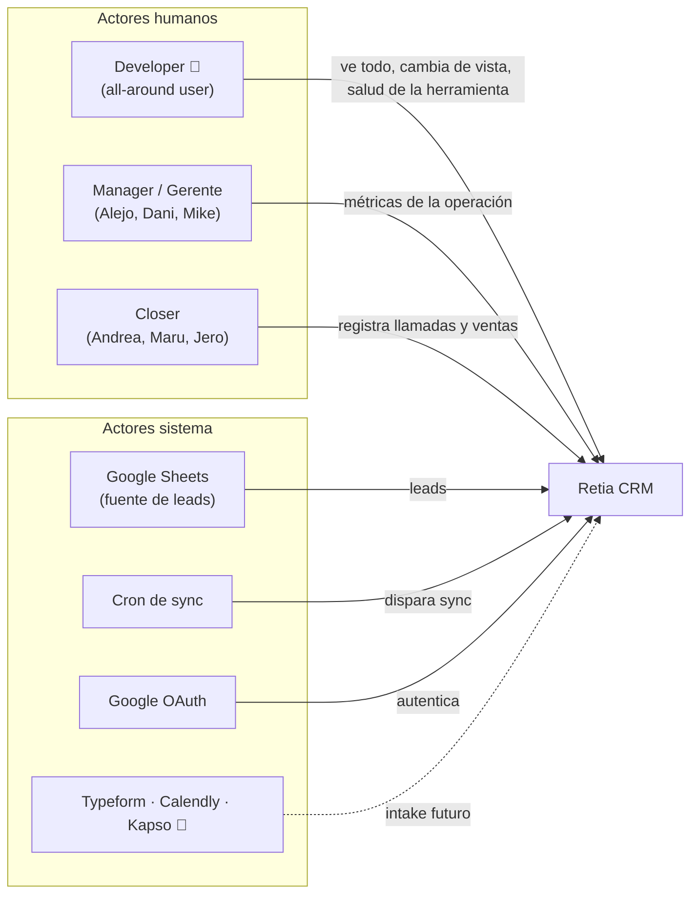
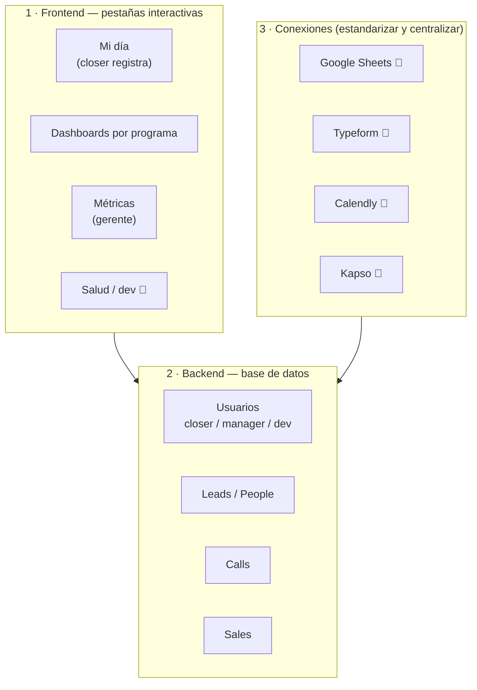
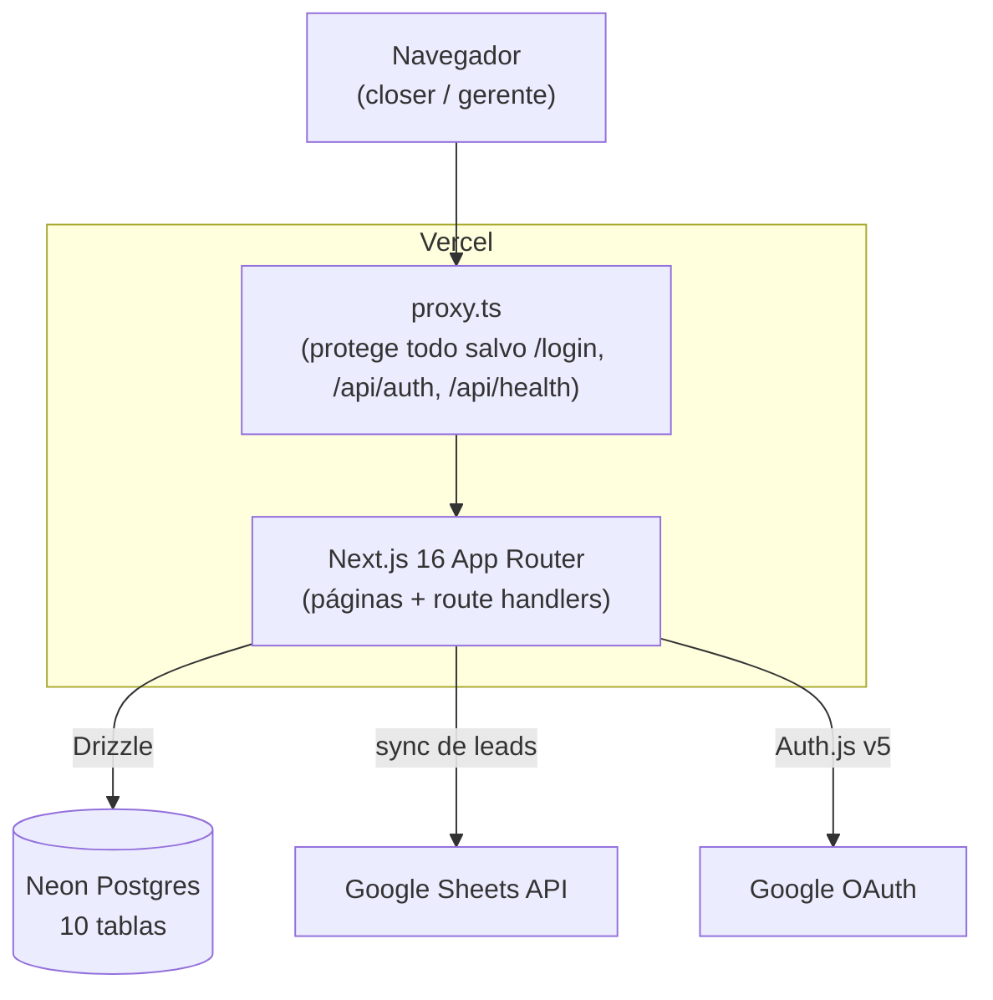
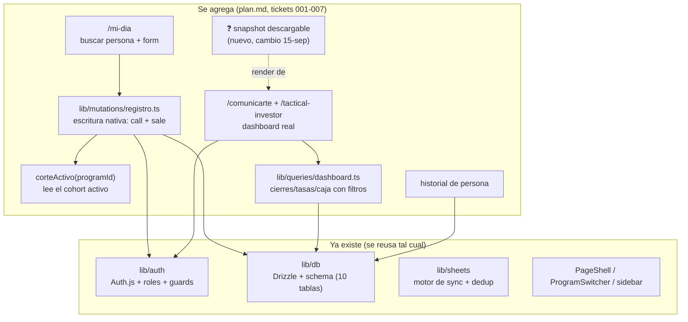
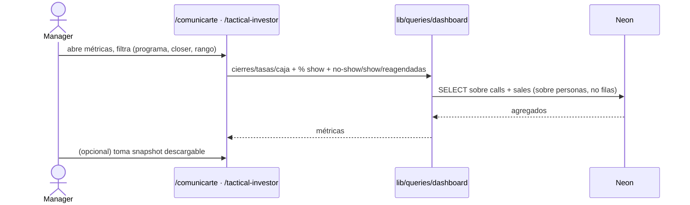
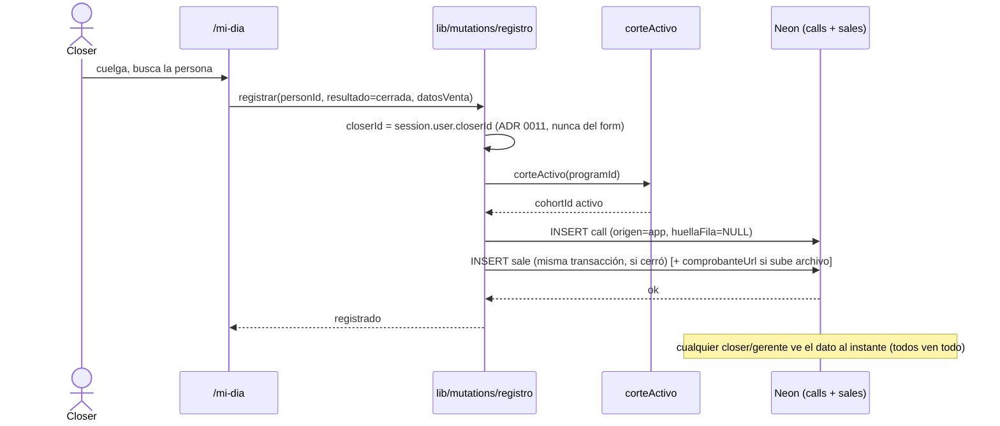

# design — Retia CRM: diseño del sistema

> **Estado: BORRADOR / jot-down.** Este documento es el pensamiento de diseño en voz alta, para
> concretar entre Mani y el agente. NO es un doc final ni re-litiga lo decidido: se apoya en
> `docs/spec.md`, `docs/plan.md` y los ADR 0008–0011 y los hace explícitos como vista de diseño
> (actores, servicios, propuesta de valor, componentes). Todo lo marcado `❓ ABIERTO` es una
> decisión pendiente, no un hecho. Cuando se cierre, baja a `docs/adr/` o al spec, no se queda aquí.
>
> **Actualización 16-sep-2026:** varias decisiones abiertas de este borrador ya bajaron a ADR 0012
> a 0017 y al plan en fases F0-F4. Donde este documento y esos ADR difieran, mandan los ADR. En
> particular: "corte" ahora es "cohorte" (0014), el comprobante es un link y no un archivo en
> Vercel Blob (0017), y los tickets "008/009/010" que se mencionan abajo se renumeraron (ver
> `docs/tasks/README.md`: snapshot = 021, developer = 024).

> **Actualización 24-sep-2026:** la navegación de §4 ya no es la vigente. Se decidió navegar **por
> objetos, como HubSpot** (ADR 0050): tabs Inbox, Dashboard, Leads, Deals, Calls, Students, Campañas,
> Programs, Products, Resources y Ajustes, con un **selector de programa** arriba. "Mi día" pasa a ser
> el Inbox y los dashboards por programa pasan a una tab Dashboard. Lo que ve cada rol está en
> `docs/auditorias/propuesta-crm-y-reunion-comercial-2026-09-24.md` §3.5. Y el modelo de §4 (Leads /
> People, Calls, Sales) es el del MVP: hoy es Lead, Envío, Deal, Calls, Abonos y Cuotas (ADR 0035-0042).

---

## 0. Para qué existe este documento

El spec dice *qué hace*, el plan dice *en qué orden se construye*. Faltaba una vista de **por qué
existe el sistema y cómo se descompone**: quiénes lo usan, qué servicio le presta a cada uno, cuál
es la propuesta de valor que justifica construirlo, y en qué piezas estructurales se divide. Eso es
lo que ordena este archivo, para poder implementar con criterio en vez de armar pantallas sueltas.

---

## 1. Propuesta de valor

> **En una línea:** _estandarizar y centralizar un pipeline de ventas que hoy está desconectado,
> para que llamadas, ventas e información dejen de perderse entre WhatsApp, screenshots sueltos y
> dos Google Sheets manuales._

**El problema, en crudo (voz de Mani):** el pipeline de sales está muy desconectado. Los closers
tienen un grupo por el cual mandan comprobantes — literal screenshots de ventas — y esos
screenshots **se pierden**. Es pésimo. Hay un Google Sheets para Comunicarte y otro para Tactical
Investor; ahí se maneja toda la visualización de dashboards y el registro de llamadas, y es **todo
muy manual**. Además, el flujo termina en el Claude personal de Mike (WhatsApp → calendario →
resumen → Claude → PDF), donde el dato queda atrapado y nadie más lo puede consultar.

**La propuesta:**

- **Estandarizar** el registro: una sola forma de registrar llamadas y ventas, no tres fuentes.
- **Automatizar** lo más posible: actualización automática de leads.
- **Mapear** las llamadas, la información de contacto y las ventas.
- **Persistir**: que el dato viva en una base central con histórico, no en el Claude de Mike.

| Antes (hoy) | Con el CRM |
|---|---|
| Comprobantes = screenshots en un grupo, se pierden | Venta registrada como dato (+ archivo si es viable), persistente |
| Dos Sheets manuales, uno por programa | Una base central, misma forma para los dos programas |
| Mike reconcilia 3 fuentes a mano y arma el PDF | El dashboard se calcula solo desde lo registrado |
| El dato vive en el Claude de Mike | Base consultable por todos, con histórico |
| Ver "cómo vamos" depende de que Mike lo genere | Cualquier gerente o closer lo ve en vivo y lo verifica |

**Lo principal que se consigue:** visibilidad total, transparente y verificable de qué pasa con
cada closer y cada programa — sin intermediario humano, y sin que el closer tenga que cambiar de
contexto para reportar.

**La ambición es reemplazar la operación, no solo mirarla.** El raw de Mani lo deja claro:
estandarizar + automatizar + persistir. El CRM es EL lugar donde se trabaja el pipeline, no un
dashboard que refleja lo que sigue viviendo en WhatsApp.

---

## 2. Actores

Tres actores humanos y varios actores-sistema. Los tres roles humanos son la razón por la que el
enum de roles del schema pasa de dos (`gerente`/`closer`) a tres.

| Actor | Quién es (definición de Mani) | Alcance |
|---|---|---|
| **Developer** | Acceso sin restricción a la plataforma completa, settings de todo tipo y dev metrics. El *all-around user*: puede convertirse en gerente o closer para ver lo que ellos ven. | Rol 🎯 MVP; capacidades (salud, cambio de vista) 🔮 post-scaffold |
| **Manager / Gerente** | El dueño de la operación, interesado en métricas desde el intake del lead hasta el cierre de la venta. | 🎯 MVP |
| **Closer** | Trabaja en la agencia para los managers. Toma llamadas con leads entrantes y cierra. Tiene calls asignadas en Calendly, perfil e ID propio. | 🎯 MVP |

**Actores-sistema:** Google Sheets (fuente de **leads**, ADR 0004/0008 — ya no de llamadas/ventas),
Cron de sync (diario, ADR 0007), Google OAuth (identidad; el acceso lo controla la tabla `users`).
🔮 **Typeform, Calendly y Kapso** son actores-sistema *futuros* (intake por DTO estandarizado vía
crontab, ver §3 Closer), no del MVP.

### Cuentas — resuelto con Mani (15-sep)

| Rol | Cuenta de Google | Consecuencia |
|---|---|---|
| **Closer** | **Su propia cuenta individual** | `closerId` se copia limpio de la sesión (ADR 0011 funciona). "Sales por closer" es real |
| **Manager** | La cuenta `administrativa@retiagrowth.com` | Comparten esa cuenta; no registran llamadas atribuidas a un closer, así que no rompe la atribución |
| **Developer** | Cualquier cuenta | Se le asigna el rol en la tabla `users` |

Esto **cierra** el bloqueante que antes estaba abierto: como cada closer entra con su cuenta, la
atribución de llamadas y ventas por closer funciona sin ambigüedad.

> ⚔️ **Actualiza ADR 0003 conscientemente (no re-litigar en silencio):** hoy el schema tiene
> `rolEnum = ["gerente","closer"]`, disjuntos y sin herencia. **Developer** es un rol nuevo →
> migración del enum + guards + tests + navegación. Decisión de Mani: sí entra. Cuando se
> implemente, ADR 0003 se amplía a tres roles (Developer por encima, gerente/closer siguen siendo
> disjuntos entre sí). El "cambiar de vista" del developer es capacidad 🔮 post-scaffold.

---

## 3. Servicios por rol (qué le da el sistema a cada quien)

> Capacidades, no pantallas. Una capacidad puede vivir en varias pantallas.
> 🎯 = entra al MVP (cierre C2, 22–29 sep) · 🔮 = visión validada, fuera del MVP.

### Al Developer 🔮 (rol MVP, capacidades post-scaffold)

Visión de Mani: el developer es el *all-around user*. Pantalla de **actividad total de uso** de la
herramienta (estado, log de actividades, dividido por pestaña), un **tab de salud** de la
herramienta, cualquier **setting solo-developer** (y poder cambiarlo), y poder **cambiar de vista**
(convertirse en gerente o closer para ver lo que ellos ven). En general: ver y poder cambiar todo.

| Capacidad | Alcance |
|---|---|
| Ver salud de la herramienta / log de actividad (por pestaña) | 🔮 post-scaffold (aún sin definir; no hay nada construido todavía) |
| Settings solo-developer, editables | 🔮 |
| Cambiar de vista (verse como gerente / closer) | 🔮 |
| Acceso a todo lo que ven gerente y closer | 🎯 (implícito en el rol) |

### Al Gerente / Manager 🎯

Visión de Mani: al gerente le interesan **métricas**. De la reunión — sales por closer, % de shows
en una ventana de tiempo, última actividad, cambio de estados, reportes. Necesita estadísticas,
mediciones, visibilidad, transparencia y **persistencia** de todo el insumo que maneja la app; por
eso existe la database, con histórico.

| Capacidad | Alcance |
|---|---|
| Métricas: sales por closer, % show en ventana de tiempo, tasas por programa/fecha | 🎯 |
| Última actividad y cambios de estado | 🎯 (el schema ya tiene `change_log`) |
| Snapshot descargable del dashboard para compartir fuera de la app | 🎯 (formato ❓, ver §5) |
| Alimentar el diseño con ejemplos de reportes reales | 🎯 insumo — *pendiente que Maico los mande* |
| Administrar fuentes de sync, usuarios y ajustes | 🎯 |

### Al Closer 🎯

Visión de Mani: el closer es el usuario del dashboard, enfocado en **su propio perfil** (tiene ID
propio y llamadas asignadas). **Alimenta la página**: registra ventas, registra que un call cerró/
convirtió, sube comprobantes. Es quien mete los datos de verdad.

| Capacidad | Alcance |
|---|---|
| Registrar resultado de llamada contra un lead ya sincronizado | 🎯 |
| Registrar la venta en la misma pantalla (caja, precio, tipo de pago, plataforma) | 🎯 |
| **Subir el comprobante como archivo** | 🎯 *si es viable en el plazo* — ver nota 💾 |
| Ver su propio perfil / sus llamadas asignadas | 🎯 |
| Ver el dashboard completo, comparativo incluido (todos ven todo, ADR 0009) | 🎯 |
| Ver el historial de una persona (sus llamadas en orden) | 🎯 |
| Intake automático (Typeform/Calendly → DTO estandarizado por crontab → `calls`) que reemplace el registro manual | 🔮 futuro |

> 💾 **Comprobante como archivo — viabilidad (decisión de Mani: sí, si es viable):** guardar los
> *datos* de la venta ya está en el MVP. Guardar *también* la imagen del comprobante es **storage
> nuevo**: hoy no hay blob storage en el stack. Opciones — (a) **Vercel Blob**, la más simple,
> integra con el stack actual y es prácticamente gratis al volumen de Retia; (b) S3; (c) por ahora
> solo datos y el archivo como 🔮. Añade un campo `comprobanteUrl` a `sales` + un endpoint de
> upload. **Recomendación:** MVP guarda datos + comprobante opcional vía Vercel Blob si no aprieta
> el deadline; si aprieta, el archivo cae a la primera iteración post-lanzamiento. No bloquea el
> registro de la venta en ningún caso.

### 🔮 Nota transversal — mapeo de leads (futuro)

Mani: mapear los leads (cada lead con sus notas, información de contacto, estado, si está "frío")
es valioso, pero **no es MVP**. El MVP es **llamadas y ventas con métricas reales**. El mapeo
enriquecido de leads (perfil de lead tipo CRM, notas por lead, estados fríos/calientes) queda
anotado como desarrollo futuro.

---

## 3bis. Snapshot descargable — pendientes de definir

❓ **Formato:** PDF renderizado del dashboard / PNG de la vista / CSV de los números. El brief del
jefe decía "PDF con un botón"; Mani lo definió como "snapshot del estado actual". Fijar antes de
construir (afecta si se necesita una dependencia pesada tipo puppeteer o una liviana tipo
html2canvas — ver §5).

❓ **Quién lo puede tomar:** ¿solo gerente, o cualquiera bajo "todos ven todo"? Puesto en gerente
por defecto; revisar.

---

## 4. Layout general de la app (estructura de Mani: 3 capas)

> ⚠️ **Superado el 24-sep en la capa de Frontend** (ADR 0050, ver la nota de arriba). El principio se
> conserva y es justo el que guió la decisión: *las pestañas reflejan los objetos del modelo*.

Mani no dibujó diagrama, pero definió el layout en tres capas. Traducido a diagrama:

- **1 · Frontend:** pestañas interactivas. Principio clave de Mani: _las pestañas reflejan la
  conexión entre los objetos/clases que maneja la app_ — la UI espeja el modelo de datos (ver
  Nota 1 sobre inspiración de HubSpot).
- **2 · Backend:** una base de datos que mapea Usuarios (closers, managers, developers), Leads,
  Sales, Calls, etc. **Ya existe** (10 tablas en el schema).
- **3 · Conexiones:** Typeform, Calendly, Sheets, Kapso — para estandarizar y centralizar el
  intake. 🎯 hoy solo Sheets; 🔮 las otras tres son intake futuro.

Las §4bis y §5 bajan este layout a las vistas C4 (contenedores y componentes) que ya están en el
repo funcionando.

---

## 4bis. Vista de contenedores (C4 nivel 2)

Todo esto **ya existe y funciona** (handoff: 71 tests verdes, motor verificado contra datos reales).
El diseño del CRM no agrega contenedores nuevos; agrega *componentes* dentro del contenedor Next.

---

## 5. Vista de componentes (C4 nivel 3) — dónde entra lo nuevo

**Principios SOLID aplicados a esta descomposición** (jot-down, para que quede explícito el porqué):

- **SRP** — `corteActivo`, `registro`, `dashboard` son tres piezas con una sola razón de cambio
  cada una: leer el corte, escribir un registro, leer métricas. No se mezclan.
- **DIP** — la UI depende de las funciones de `lib/mutations` y `lib/queries`, no de Drizzle
  directo. Si mañana cambia la base, cambia la capa, no las pantallas.
- **OCP** — `calls`/`sales` se extienden con `origen="app"` sin tocar el sync de Sheets (ADR 0010):
  agregar el origen nativo no modificó el código existente que lee filas de Sheets.
- **Regla de oro del repo** — toda tasa se calcula sobre **personas**, no sobre filas. El dashboard
  hereda esa regla del schema (`people` es único por correo).

❓ ABIERTO — el snapshot: ¿es un componente de servidor (renderiza el dashboard a PDF en el route
handler) o de cliente (captura el DOM en el navegador)? Afecta si necesitamos una dependencia nueva
(puppeteer/playwright pesa; html2canvas es liviano pero peor fidelidad). Decidir con el formato del
punto 3.

---

## 6. Vista de secuencia — por actor (escenario de negocio)

Mani pidió la secuencia como escenario de negocio, un flujo por actor.

### Developer 🔮
Straightforward: entra a la página, ve la salud de la herramienta y las métricas de uso, cataliza
bugs visuales, y optimiza o hace cambios. Es un flujo de observación y mantenimiento, no de
operación comercial. Post-scaffold.

### Manager / Gerente 🎯
Entra y va a una **pestaña de Métricas** con subpestañas:

- **Calls:** qué calls se van a tener, quiénes están asignados, cuáles se tuvieron, cuáles tuvieron
  update en su actividad, si se reagendó. _Calendar view_ 🔮 futuro.
- **Ventas:** entries de ventas, llamadas asociadas, si fue self-checkout, y (🔮 futuro) el mapeo
  de leads (perfil con contacto, call asignada, si ya pagó, estado, si está frío, notas).

Filtra por resultado y ganancias: qué se hizo esta semana, cuántas no-show / show / reagendadas,
por closer, métricas de cada closer individual. **Overview transparente del flujo de venta de la
agencia.**

### Closer 🎯
Entra a ver el **estado de sus llamadas** con los leads (si se está cerrando algo). Registra una
venta / que un call cerró / convirtió. Más que todo: **registrar ventas**.

---

## 7. Componentes estructurales a implementar (resumen accionable)

Esto NO reemplaza los tickets 001–007 de `docs/tasks/`; los mira desde la lente de diseño para
verificar que no falta ninguna pieza estructural.

| Componente | Tipo | Estado | Ticket |
|---|---|---|---|
| `sales.plataformaPago` | schema | por hacer | 001 |
| `corteActivo(programId)` | lectura | por hacer | 002 |
| `lib/mutations/registro.ts` | escritura | por hacer | 002 |
| UI `/mi-dia` | pantalla | placeholder | 003 |
| `lib/queries/dashboard.ts` | lectura | por hacer | 004 |
| Dashboard real (2 programas) | pantalla | placeholder | 005 |
| Historial de persona | pantalla | por hacer | 006 |
| Onboarding `closerId` | datos | por hacer | 007 |
| **Snapshot descargable** | **nuevo** | sin ticket | **❓ falta ticket 008** |
| **Comprobante como archivo** (`sales.comprobanteUrl` + upload) | **nuevo** 🎯 si viable | sin ticket | **❓ falta ticket 009** |
| **Rol Developer** (enum + guards + tests + nav) | **nuevo, actualiza ADR 0003** | sin ticket | **❓ falta ticket 010** |
| Salud/dev tab, cambio de vista, intake automático, mapeo de leads | 🔮 futuro | fuera de MVP | — |

---

## 8. Decisiones abiertas (consolidadas — esto es lo que hay que cerrar)

**Ya resueltas en esta sesión (15-sep):** cuentas (closer individual, manager `administrativa@`,
dev cualquier cuenta); Developer entra como tercer rol; ambición = reemplazar la operación;
comprobante como archivo = sí, vía Vercel Blob si el plazo lo permite.

**Siguen abiertas:**

1. ❓ **Formato del snapshot descargable** (§3bis, §5). PDF / PNG / CSV.
2. ❓ **Quién puede tomar el snapshot** (§3bis). Gerente vs. todos.
3. ❓ **Comprobante en el MVP o post-lanzamiento** (§3, nota 💾). Depende del deadline.
4. ❓ Supuestos que ya venían en `docs/spec.md` §7 y siguen sin validar con negocio:
   "todos ven todo" sin confirmar por Michael; import histórico con discrepancias; qué pasa si un
   lead no está en el sync; marco regulatorio de datos financieros; Calendly individual vs.
   compartido.
5. ❓ **Ejemplos de reportes reales** — pendiente que Maico los mande, para alimentar el diseño de
   la pestaña de métricas del gerente.

---

## 9. Qué NO es este sistema (para no derrapar el diseño)

Del spec §2, a la vista mientras se diseña: no API pública propia, no Calendly todavía, no
Kapso/WhatsApp, no recordatorios de follow-up, no kanban, no migración retroactiva como parte del
MVP. El snapshot descargable es la **única** capacidad de export, y refleja el dashboard, no
re-calcula nada. 🔮 Mapeo enriquecido de leads, calendar view y el intake automático por DTO
(Typeform/Calendly/Kapso) son visión, no MVP.

---

## Nota 1 — Inspiración externa: no improvisar

Este CRM se está construyendo desde criterio propio, pero una pieza importante es **tomar
inspiración de otros sistemas de CRM ya probados** en vez de improvisar. El principal referente:
**HubSpot Customer Platform** — su flujo y la manera en que conecta objetos (contactos, deals,
actividades) es justo el modelo de "las pestañas reflejan la relación entre los objetos de la app"
(ver §4).

Video de referencia para revisar más adelante y entender su flujo:
[HubSpot Customer Platform — flujo (YouTube)](https://www.youtube.com/watch?v=vfW5Qwl_JQY)
