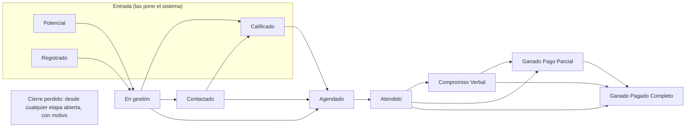

# Manual de gestión comercial: cómo se mueve un deal por las etapas de 30X

> **Qué es:** la respuesta a la **QD-8** de [`comercial.md`](./comercial.md) §7.0: cuándo y cómo pasa un
> deal de una etapa a otra, qué tiene que tener para entrar a cada una y quién lo mueve. Lo escribe Alejo
> (carril de Alejo en NC1, [`plan-reparto.md`](./plan-reparto.md) §4) y es el insumo del ticket **142**
> (las once etapas en una migración), que abre NC2.
>
> **Para quién:** closers, gerencia y quien construya el 142. Está escrito para leerse sin saber de código;
> las referencias técnicas van entre paréntesis para quien las necesite.
>
> **Estado: aprobado el 2-oct-2026 por Mani**, con las dudas de §10 contestadas en el
> [ADR 0071](./adr/0071-como-se-mueve-un-deal-por-las-etapas-de-30x.md) y la QM-10 en el
> [ADR 0070](./adr/0070-re-agenda-seguimiento-y-proxima-cohorte-son-pendientes-del-deal.md). Donde este texto
> diga 🟡 o 🔴 sobre algo que esos ADR deciden, mandan los ADR. Norte de 30X:
> [`insumos/30x-ciclo-de-vida.md`](./insumos/30x-ciclo-de-vida.md).
>
> **Borrador del 1-oct-2026.** No es un ADR y no decide nada que no esté
> decidido: junta lo que ya dicen `comercial.md`, los ADR vigentes y lo que se leyó del HubSpot de 30X
> ([`insumos/hubspot-30x-workflow.md`](./insumos/hubspot-30x-workflow.md)), y **marca como pendiente** lo
> que espera una decisión (QM-10, QM-12, QD-2 y las dudas de §10). Lo que este manual propone y nadie ha
> confirmado va con 🟡.

Leyenda: ✅ decidido (con su fuente) · 🟡 propuesta de este manual, por confirmar · 🔴 pendiente de una
decisión abierta · ⚫ lo hace 30X y aquí no se copia.

---

## 0. El método de Retia desde el 2-oct: el ciclo de vida de 30X

**Mani, 2-oct:** *el diagrama del ciclo de vida de 30X es como se maneja la gestión comercial en Retia.* Está
transcrito en [`insumos/30x-ciclo-de-vida.md`](./insumos/30x-ciclo-de-vida.md). Donde Retia se aparta, lo dice
un ADR: la etapa de entrada (0069), los pendientes (0070) y las reglas de movimiento (0071). Lo demás de este
manual baja de ahí.

**El manual en PDF de 30X (junio) no define las etapas** (el diagrama es más nuevo), pero sí trae las reglas
alrededor de ellas, y esas sirven:

| Del manual de 30X | En Retia | Dónde |
|---|---|---|
| *El comercial llena propiedades; el sistema mueve los deals* | el motor (`moverEtapa()`) ya es el único que escribe la etapa | ADR 0037; ver M-1 y M-2 |
| Propiedades condicionales: cada etapa pide solo lo suyo | las propiedades obligatorias por etapa | 143, §6 |
| Prioridad HVM × Lead Quality y tiempo de respuesta por etiqueta; 15 deals por bloque | el orden de la cola del closer | hub del closer (QD-12, 075); ver M-5 |
| Flag DESATENDIDO (+2 días sin contacto, sin próximo paso, con contacto previo) | alerta calculada al leer, no mueve el deal | 128, 071 |
| Reglas de oro (no arrastrar, registrar todo, motivo al perder, 3 intentos) | lo que se le enseña al closer en el corte | este manual; `operations.md` §12 |

### Lo que faltaba decidir para dejarlo igual al diagrama

> **Contestadas el 2-oct en el [ADR 0072](./adr/0072-una-pregunta-por-etapa-mueve-el-deal.md):** M-1 sí, una
> pregunta por etapa · M-2 se arrastra, y soltar abre la pregunta con lo que tiene y le falta · M-3 Seguimiento
> también en Calificado (solo ya contactado) y en Compromiso Verbal · M-4 solo alertas, nada automatizado en v1 ·
> M-5 Lead Value ordena, y se puede ordenar por días en la etapa, última actividad y próximo paso · M-6 el origen
> se pide al entrar a Atendido. El texto de abajo queda como estaba planteado.

- **M-1. Una pregunta de resultado por etapa.** En 30X cada etapa tiene UNA propiedad cuya respuesta mueve el
  deal: intento de contacto (En gestión), resultado del contacto (Contactado), resultado de la calificación
  (Calificado), estado de agenda (Agendado), resultado de reunión (Atendido), estado de negociación (Compromiso
  Verbal). Hoy Retia solo la tiene en Atendido (los seis botones). ¿Se extiende a todas las etapas? Cambia la
  ficha, el 142 y el 143.
- **M-2. El arrastre del Kanban.** Hoy el tablero deja arrastrar (`components/deals/tablero-kanban.tsx`, pasando
  por el motor). 30X: *nadie arrastra tarjetas*. ¿Se quita, o se queda como atajo del motor?
- **M-3. Seguimiento fuera de Atendido.** En el diagrama, "Interesado" en Calificado se queda con próximo
  contacto, y "Revisando propuesta" en Compromiso Verbal se queda con tareas a T+3 y T+6. El ADR 0070 solo pone
  Seguimiento desde Atendido. ¿Se permite también en Calificado y en Compromiso Verbal?
- **M-4. Las automatizaciones** (cadencia de WhatsApp 1 h/24 h/48 h al calificado que no agenda, recordatorios de
  la cita 24 h/1 h/15 min, reintentos del no-show, nutrición de los perdidos, tareas a T+n). ¿Entran a la v1, por
  Kapso, o la v1 solo muestra alertas y lo demás viene después?
- **M-5. La prioridad.** 30X usa HVM × Lead Quality. Retia tiene Lead Quality y Lead Value (el ADR 0069 ya dice
  que Lead Value ordena). ¿Lead Value hace de HVM, con las cuatro etiquetas y sus tiempos de respuesta?
- **M-6. El origen del deal.** 30X lo pide obligatorio al entrar a Atendido; aquí el área declarada se pide en
  Compromiso Verbal y en ganado (121). ¿Se adelanta a Atendido?
- ✅ **D-7** (§10) decidida con el 118: Calificado por un parcial, sin completo a los 5 minutos.

### El orden hasta tenerlo en vivo

1. ✅ M-1 a M-6 contestadas (ADR 0072).
2. **142**, las once etapas en una migración (Codex implementa; la sesión principal genera y aplica la migración
   con el ok de Mani).
3. **143** propiedades por etapa y **128** alertas (con los tres intentos y DESATENDIDO).
4. **117** enmendado (la etapa de entrada por agenda y calidad) y **118** (D-7).
5. **078 `--aplicar`**: la migración de las hojas a las etapas nuevas.
6. **El corte** (`operations.md` §12): los closers pasan a trabajar en el CRM = **hito B**.
7. **148** el dashboard comercial y el hub del closer; **082** apagar las pestañas de gestión de las hojas a la
   semana hábil del corte = **hito C**.

---

## 1. En una página

**Un deal es la oportunidad de venderle un programa a un lead.** Tiene un dueño, una etapa, una cohorte y,
cuando se vende, un valor vendido. Como máximo hay **un deal abierto por lead y programa** (ADR 0037).

Las once etapas son las del HubSpot de 30X, con sus nombres exactos (`comercial.md` §4, GC-01):

El dibujo muestra el camino normal, no todas las flechas: también se puede vender sin llamada y llegar a
Agendado directo desde el formulario. Todas las flechas están en §4.

Lo que **no cambia** con las etapas nuevas (`comercial.md` §4, ticket 142):

1. **Ninguna persona escribe la etapa a mano.** El único camino es el motor de etapas (`moverEtapa()`), que
   revisa que la flecha exista y que el deal tenga lo que pide, y deja la huella en el historial (ADR 0037).
2. **La plata mueve las etapas de ganado.** A Ganado Pago Parcial y a Ganado Pagado Completo se entra al
   registrar un abono, nunca arrastrando la tarjeta (ADR 0037, T13 a T18).
3. **Una venta es un deal en una de las dos etapas de ganado**, nunca un deal a secas (ADR 0037).
4. **Anular no es Cierre perdido** (ADR 0038, §8 de este manual).
5. **No hay relojes:** un deal no se mueve solo porque pasó el tiempo. Lo vencido se pinta en rojo y cae al
   Inbox; decide una persona (ADR 0037). ⚫ 30X sí cierra solo las reuniones vencidas (W10); aquí no.
6. **Todo movimiento queda en el historial** con quién, cuándo y por qué (ADR 0037, ADR 0042).

---

## 2. Quién mueve un deal

| Quién | Qué puede mover | Fuente |
|---|---|---|
| **El sistema** (el CRM solo) | La entrada al crear el deal (§3.1), el paso a Agendado cuando Calendly cuelga una llamada, el paso a Atendido al pegar el Grain, y las dos etapas de ganado al registrar o anular un abono | ADR 0037, 0049, 0069 |
| **El dueño del deal** (un closer) | Todas las flechas de persona sobre **sus** deals | ADR 0056 punto 3 |
| **Quien administra** (gerente y developer) | Todas las flechas de persona sobre cualquier deal, tenga o no dueño | ADR 0056 punto 3, ADR 0025 |
| Un closer que **no** es el dueño | Nada, hasta **reclamar** el deal (si no tiene dueño) o que un gerente se lo asigne | ADR 0037 punto 6, ADR 0056 |
| **El setter** (un closer en otra función) | Las flechas de En gestión hasta Agendado sobre sus deals; la cita entrega el deal a quien da la llamada | ADR 0076 |
| Customer Success (rol nuevo, 145) | Ninguna etapa: solo marca los pasos del onboarding en Students | `comercial.md` GC-42 |

- **Los deals nacen sin dueño** y un closer los reclama desde el Inbox. Excepción: si llega agendado por
  Calendly y el host es un closer registrado en el programa, ese closer queda como dueño (ADR 0037 punto 6,
  ADR 0049). ⚫ En 30X la app de ingesta asigna el dueño; aquí no.
- **Setter:** no es un rol, es una **función** (ADR 0076, 2-oct, que reemplaza la D-6): una persona con cuenta
  de closer trabaja la cola de En gestión, manda el link de agenda y entrega el deal por la cita a quien da la
  llamada. El deal no se suelta mientras tanto; el setter queda con su crédito (`deals.setter_user_id`) y, si a
  1 día hábil no hay cita, sale una alerta.
- Toda flecha de persona pide los datos que le faltan **en el mismo movimiento** (como en HubSpot): si el
  movimiento se rechaza, no queda nada escrito (ADR 0056 punto 4).

---

## 3. Las etapas, una por una

Cada ficha dice: qué significa, cómo entra el deal, qué tiene que tener, a dónde puede ir y quién lo mueve,
y qué alertas le aplican. Las flechas entre etapas están todas juntas en la tabla de §4.

### 3.1 Las tres puertas de entrada: Potencial, Registrado y Calificado

En 30X **Potencial y Registrado no son pasos en orden: son dos puertas** por las que entra un lead que no
agendó, según cómo llenó el formulario. Calificado es la puerta del lead bueno (`hubspot-30x-workflow.md`
§3; Mani, QD-1). La regla de entrada es una sola para todos los programas y la decide el CRM, no el
formulario (✅ ADR 0069; QD-3):

| Formulario | Calidad (Lead Quality) | ¿Agendó? | El deal nace en |
|---|---|---|---|
| cualquiera | cualquiera | sí | **Agendado** (§3.4) |
| parcial o completo | High | no | **Calificado** |
| completo | Low o Mid | no | **Registrado** |
| parcial | Low, Mid o sin calidad | no | **Potencial** |

- **Ningún envío se descarta:** todo envío abre un deal o actualiza el abierto (✅ GC-27, ADR 0069).
- **Lead Value no cambia la etapa:** se guarda y ordena el trabajo dentro de la etapa (✅ ADR 0069 punto 4;
  GC-29). Lead Quality y Lead Value se muestran en el deal (✅ QD-10, QD-12).
- **La regla vale para cada envío, no solo para el primero** (✅ ADR 0073, Mani 2-oct). Si el lead ya tiene un deal
  abierto que **sigue en una puerta** (Potencial o Registrado), el envío nuevo lo sube a la etapa que le tocaría:
  Potencial → Registrado al llegar el completo, Potencial o Registrado → Calificado al llegar calidad High. Solo hacia
  arriba, lo hace el sistema y deja nota en el log del deal. Si el deal ya está En gestión o más adelante, alguien lo
  trabaja y el envío no lo mueve (salvo la cita, §3.4).
- **El parcial y su completo son el mismo envío** (✅ ADR 0073): el parcial se va actualizando y, al terminar, el completo
  lo absorbe; se ve y se cuenta como uno. Volver a llenar el formulario es un envío nuevo.
- **Todos los envíos de un lead quedan guardados y a la vista** (✅ ADR 0073): ninguno se reemplaza ni se fusiona; la
  ficha del lead los muestra con lo que cambió entre uno y otro, y la tarjeta y la ficha del deal avisan "N envíos"
  cuando la persona aplicó más de una vez. Un reenvío nunca abre un segundo deal ni reabre uno cerrado (ADR 0037).

**Potencial**

- **Significa:** empezó el formulario y no lo terminó; no hay calidad todavía.
- **Entra:** solo el sistema, al llegar un envío parcial sin calidad y sin agenda.
- **Tiene:** lead, envío de origen, cohorte activa del programa (✅ ADR 0065, segunda enmienda), sin dueño.
- **Sale a:** En gestión · Registrado o Calificado cuando llega otro envío que le toca esa puerta (✅ S1, S2, ADR
  0073) · Agendado · Cierre perdido.

**Registrado**

- **Significa:** terminó el formulario con calidad baja o media (Low o Mid) y no agendó.
- **Entra:** solo el sistema, al nacer o al subir desde Potencial (S1). **Tiene:** lo mismo que Potencial, más su calidad.
- **Sale a:** En gestión · Calificado si llega un envío con calidad High (✅ S3, ADR 0073) · Agendado · Cierre perdido.

**Calificado**

- **Significa:** calidad alta (High) y todavía no agendó: es el lead al que hay que ofrecerle la agenda.
  En 30X es la etapa más llena (7.107 de 9.790 deals): el calificado que nunca agenda se queda aquí.
- **Entra:** el sistema (puerta High). 🟡 También una persona desde En gestión o Contactado cuando confirma
  en el contacto que el lead califica (en 30X lo hace el bot; `hubspot-30x-workflow.md` §3). Requisito
  propuesto: un contacto registrado con fecha y canal, igual que la T1 de hoy.
- **Tiene:** lo de las otras puertas. En la cola de trabajo va **primero**, por calidad alta (es la
  "prioridad alta" que hoy tiene en Pendiente Setteo, ADR 0069).
- **Sale a:** Agendado · Compromiso Verbal o ganado sin llamada (§4, venta por chat) · Cierre perdido.
- **Alerta:** "se perdió en el Calendly" (ticket 118) cuando llegó a la pantalla del Calendly y a los
  minutos no agendó. 🔴 Con la variable `estado` retirada (ADR 0069 punto 5), la regla del 118 se reescribe
  sobre "nació en Calificado por un parcial y no llegó su completo" (§10, D-7 ✅: a los 5 minutos).

### 3.2 En gestión

- **Significa:** la **cola del setteo**: alguien tiene que contactar a esta persona y conseguirle la agenda.
  En 30X un workflow saca a Potencial y Registrado a En gestión en minutos (W1).
- **Entra:**
  - desde Potencial o Registrado. 🔴 **Cuándo:** en 30X el workflow solo mueve deals que **ya tienen dueño**
    (W1), porque allá la ingesta asigna el dueño. Aquí los deals nacen sin dueño. La propuesta 🟡 es que el
    deal pase a En gestión **cuando alguien lo reclama o se lo asignan** (lo mueve el sistema en ese mismo
    acto); así Potencial y Registrado quieren decir "nadie lo ha tomado". La alternativa es moverlo al
    nacer, y entonces Potencial y Registrado quedan vacías (§10, D-1).
  - los deals de setteo y los descartados que traiga la migración de las hojas (🟡 QD-2, por confirmar:
    "cola del setter = En gestión").
  - un deal creado a mano (ticket 140). 🟡 Nace aquí con quien lo crea como dueño (§10, D-5).
- **Tiene:** dueño (propuesta 🟡, ver arriba).
- **Sale a:** Contactado · Calificado · Agendado · Compromiso Verbal o ganado sin llamada · Cierre perdido.
- **Alertas:** deal estancado (sin actividad por más de los días hábiles del programa,
  `programs.dias_sin_actividad`, ticket 071) y el "nivel de contacto" de la pantalla de entrada del closer
  (deals que no ha movido, actividad vieja; ✅ QD-12).

### 3.3 Contactado

- **Significa:** el dueño ya habló con la persona por primera vez (llamada, WhatsApp o correo). En 30X casi
  no se usa en la venta B2C (0 a 1% de los deals): el contacto se anota como actividad, no como etapa.
- **Entra:** el dueño, desde En gestión. Requisito: deal con dueño y una actividad de contacto con fecha y
  canal (es la T1 de hoy, de Pendiente Setteo a En Contacto: reemplaza a los `Registro 1-5` de la hoja).
- 🔴 **Si se usa o no** (§10, D-2): si Retia la usa como la En Contacto de hoy, el primer contacto mueve el
  deal; si sigue a 30X, el contacto se anota como actividad y la etapa queda casi vacía. La etapa existe en
  el enum de todos modos (las once de 30X, ticket 142).
- **Sale a:** Calificado · Agendado · Compromiso Verbal o ganado sin llamada · Cierre perdido.

### 3.4 Agendado

- **Significa:** hay una llamada con fecha. En 30X dura de 1,2 a 6 días (la espera hasta la reunión).
- **Entra:**
  - el sistema: el formulario llegó con agenda (ADR 0069), o Calendly colgó la llamada del deal sin duda
    (ADR 0049). Si Calendly no la puede colgar sin duda, queda como **llamada suelta** en el Inbox y un
    closer la asigna.
  - el dueño, al crear la llamada con fecha a mano.
  - desde cualquier etapa anterior a la llamada (las tres puertas, En gestión, Contactado) y desde Atendido
    cuando se agenda otra llamada (hoy T27, desde Seguimiento) o desde Cierre perdido al recuperar.
- **Tiene:** una llamada vigente con fecha (✅ hoy T2, T3, T6).
- **Si la cita se mueve antes de ocurrir:** sigue en Agendado con la fecha nueva (✅ T9).
- **Si no llega o cancela:** hoy pasa a Pendiente Re-agenda con el resultado como motivo (T8). 🔴 Con las
  etapas de 30X, Pendiente Re-agenda es un **estado dentro del deal** (QM-10, §5): el deal se queda en
  Agendado marcado como "por re-agendar", que es lo que hace 30X (Estado de agenda = Cancelada o No asistió,
  y una tarea "Contactar para reprogramar").
- **Sale a:** Atendido · Cierre perdido.
- **Alertas:** la llamada de hoy (o ya pasada) sin resultado (ticket 128, GC-32: el "no value" de Dani);
  la re-agenda sin fecha nueva (Inbox).

### 3.5 Atendido

- **Significa:** la llamada ocurrió.
- **Entra:**
  - el sistema, al pegar el link de Grain de la llamada (✅ T10).
  - el dueño, **sin Grain** (✅ ADR 0066, ticket 135): mover a Atendido es decir que la llamada ocurrió, y
    la llamada queda como `show`. Pide una llamada vigente con fecha.
  - En 30X lo mueve un workflow cuando el closer marca la reunión como *Terminada*: es el mismo acto.
- **Tiene:** la llamada más reciente con resultado de "ocurrió" (✅ ADR 0056 punto 5: una llamada vieja no
  cuenta).
- **Alertas:**
  - 🔴 rojo **"atendido sin Grain"** mientras la llamada no tenga Grain; se apaga sola al pegarlo. No hay
    forma de apagarla declarando un motivo (✅ ADR 0066 puntos 3 y 4).
  - rojo si el closer no dijo **cómo terminó** la llamada (GC-32).
- **Sale a**, con la pregunta "¿Cómo terminó?" (✅ `structure.md` §3.2, seis botones):

  | Botón | El deal pasa a | Se pide |
  |---|---|---|
  | Pagó ahora | Ganado Pago Parcial o Ganado Pagado Completo | el abono (§3.7) |
  | Compromiso | Compromiso Verbal | §3.6 |
  | Seguimiento | 🔴 estado "Seguimiento" dentro del deal (QM-10) | fecha de seguimiento |
  | Otra llamada | 🔴 estado "Pendiente Re-agenda" (QM-10), o Agendado si ya hay la llamada nueva | motivo de la lista de re-agenda |
  | Próxima cohorte | 🔴 estado "Próxima Cohorte" (QM-10) | cohorte destino |
  | Perdido | Cierre perdido | motivo de la lista de pérdida |

  🔴 En 30X lo que el closer anota después de la reunión es la propiedad *Resultado de reunión completada*,
  con 12 valores ("Interesado - debe consultarlo", "Interesado - problema de fecha o cohorte"...;
  `hubspot-30x-workflow.md` §4). Si esos 12 reemplazan o completan los seis botones es la duda D-3 (§10).

### 3.6 Compromiso Verbal

- **Significa:** dijo que sí y promete pagar en una fecha.
- **Entra:** el dueño, desde Atendido, desde el estado Seguimiento, o sin llamada desde las etapas de
  setteo (venta por chat: ✅ T4, *"Jero: 10 estudiantes, 0 llamadas"*).
- **Tiene** (✅ lo que pide hoy el motor, `lib/deals/requisitos.ts`):
  - **fecha límite de pago**, prellenada con el inicio de clases de su cohorte y editable (ADR 0053);
    opcional, la nota del acuerdo de pago;
  - **el área declarada** ("¿cómo nos conoció?", el origen declarado, ticket 121).
  - La cohorte la tiene desde que nace (ADR 0065, segunda enmienda).
- **Sale a:** Ganado Pago Parcial o Ganado Pagado Completo (al registrar el abono) · 🔴 estado Seguimiento
  si el sí se echa para atrás pero sigue interesado (hoy T15, con motivo de la lista de retroceso; QM-10) ·
  Cierre perdido.
- **Alertas:** Compromiso Verbal con la fecha límite vencida y sin pago (Inbox, ticket 128).

### 3.7 Ganado Pago Parcial y Ganado Pagado Completo

- **Significan:** pagó una parte y queda saldo · pagó todo. En 30X las dos cuentan como **ganado**, igual que
  aquí (✅ ADR 0037: venta = una de las dos). Toda persona en una de las dos es **Student** de la cohorte de
  su deal (✅ GC-41).
- **Entran solo por la plata:** el sistema mueve el deal **al registrar un abono** (✅ T5, T13, T14, T16,
  T17, T26): con saldo, a Ganado Pago Parcial; con saldo en cero, a Ganado Pagado Completo. De Parcial a
  Completo pasa solo cuando la suma de abonos cubre el valor vendido (✅ T18). Nadie arrastra la tarjeta a
  ganado. ⚫ En 30X el closer puede moverla; aquí no.
- **Tiene** (✅ ADR 0065 y el motor de hoy):
  - **valor vendido mayor que 0**. El closer no lo teclea: el ticket base lo pone la cohorte del deal y el
    closer escribe el **descuento** en USD (0 por defecto); el valor vendido = ticket base − descuento,
    congelado en la venta (ADR 0065, primera enmienda). Sin cohorte con precio no se puede vender.
  - un abono vigente **con comprobante**;
  - el área declarada.
  - La comisión se congela al entrar a venta por primera vez: el porcentaje del programa ese día (10,04% en
    ComunicArte, 6,67% en Tactical; QD-5).
- **Ganado Pago Parcial también tiene:** la fecha límite de pago (ADR 0053). 🔴 La **próxima fecha de
  pago** que pidió Dani (GC-14) y la lista de cartera por fecha esperan la QM-3 y la charla con los closers
  (GC-17); ticket 144.
- **Ganado Pagado Completo es terminal:** no se pierde (✅ ADR 0037).
- **Ganado Pago Parcial sí se puede perder** (desiste a mitad de pago): lo abonado sigue contando en la caja
  (✅ ADR 0037). Ver la duda D-8.
- **Si se anula un abono:** el motor recalcula. Si era el único, el deal vuelve a la etapa en que estaba
  (✅ A1); si deja saldo en un Completo, vuelve a Parcial (✅ A2). Corregir el descuento de una venta (con
  explicación obligatoria) también puede moverlo entre Parcial y Completo (✅ ADR 0065, segunda enmienda).
- **Alertas:** cartera vencida, saldo pendiente con la fecha límite pasada (ADR 0053).
- 🔴 **Cortesía** (QM-12): un cupo regalado tiene valor vendido 0, y hoy el motor exige más de 0 para
  vender. Si la cortesía es un deal con 100% de descuento y una marca, o una persona creada directo como
  estudiante, no está decidido (ADR 0065, primera enmienda punto 6).

### 3.8 Cierre perdido

- **Significa:** el lead dijo que no, no responde o desistió. **Es un resultado del negocio y cuenta en el
  embudo** (✅ ADR 0038).
- **Entra:** el dueño o quien administra, desde **cualquier etapa abierta** (las tres puertas, En gestión,
  Contactado, Agendado, Atendido, Compromiso Verbal y Ganado Pago Parcial). Nunca desde Ganado Pagado
  Completo (✅ ADR 0037).
- **Tiene:** **motivo obligatorio** de la lista de pérdida (✅ flecha P; ADR 0056: cuatro listas de motivos,
  13 motivos del ticket 104). El motivo queda también en el deal, no solo en el historial. ⚫ 30X tiene su
  propia lista de 7 motivos y un tercio de sus perdidos no dice por qué; aquí el motivo es obligatorio.
- **Sale a:** se puede **recuperar** con un motivo de la lista de recuperación (✅ flecha R). Hoy vuelve a En
  Contacto, Agendado o Próxima Cohorte; 🟡 con las etapas nuevas: a En gestión o Agendado (y al estado
  Próxima Cohorte, QM-10). A las etapas de llamada y de pago solo se entra por un hecho (Grain, abono).
- **Si vuelve a llenar el formulario** con el deal cerrado, se abre un deal **nuevo** y la ficha muestra los
  anteriores (✅ ADR 0037).

---

## 4. Todas las flechas (propuesta para el 142)

La tabla de hoy (`structure.md` §3.1, T1 a T29, P, R, A1 y A2) remapeada a las etapas de 30X. El requisito
es lo que el motor exige hoy (`lib/deals/requisitos.ts`), salvo donde se dice. "Setteo" = las tres puertas,
En gestión y Contactado.

| De → a | Qué la dispara | Quién | Requisito | Hoy | Estado |
|---|---|---|---|---|---|
| (nada) → Potencial, Registrado, Calificado o Agendado | llega un envío sin deal abierto | sistema | la regla de §3.1 | 052, 117 | ✅ ADR 0069 |
| Potencial → Registrado o Calificado; Registrado → Calificado | llega otro envío que le toca esa puerta | sistema | la regla de §3.1 | S1, S2, S3 | ✅ ADR 0073 |
| Potencial o Registrado → En gestión | se reclama o se asigna el deal | sistema | dueño | (nuevo; en 30X, W1) | 🔴 D-1 |
| En gestión → Contactado | primer contacto | dueño | dueño + actividad de contacto con fecha y canal | T1 | 🔴 D-2 |
| En gestión o Contactado → Calificado | el contacto confirma que califica | dueño | actividad de contacto | (nuevo) | 🟡 |
| Setteo → Agendado | Calendly cuelga la llamada, o el dueño la crea | sistema / dueño | llamada vigente con fecha | T2, T3, T23 | ✅ |
| Setteo → Compromiso Verbal | acepta por chat, sin llamada | dueño | fecha límite + área declarada | T4 | ✅ (🟡 desde qué etapas de setteo) |
| Setteo → Ganado (Parcial o Completo) | paga por chat de una vez | sistema, al registrar el abono | valor vendido > 0 + abono con comprobante + área declarada | T5 | ✅ (🟡 desde qué etapas) |
| Agendado → Agendado | la cita se mueve antes de ocurrir | sistema | llamada vieja reagendada + nueva con fecha | T9 | ✅ |
| Agendado → (estado Re-agenda) | no-show o cancelada | sistema | el resultado es el motivo | T8 | 🔴 QM-10 |
| Agendado → Atendido | se pega el Grain | sistema | Grain | T10 | ✅ |
| Agendado → Atendido | el closer dice que ocurrió | dueño | llamada vigente con fecha; queda `show` | 135 | ✅ ADR 0066 |
| Atendido → Compromiso Verbal | dijo que sí, paga después | dueño | fecha límite + área declarada | T12 | ✅ |
| Atendido → Ganado | pagó en la llamada | sistema, al registrar el abono | valor vendido > 0 + abono con comprobante + área declarada | T13, T14 | ✅ |
| Atendido → (estado Seguimiento) | hay que volver a contactarlo | dueño | fecha de seguimiento | T24 | 🔴 QM-10 |
| Atendido → (estado Re-agenda) o Agendado | hace falta otra llamada | dueño | motivo de re-agenda (o la llamada nueva) | T29, T27 | 🔴 QM-10 |
| Atendido → (estado Próxima Cohorte) | quiere la siguiente cohorte | dueño | cohorte destino | T20, T28 | 🔴 QM-10 |
| Compromiso Verbal → Ganado | primer abono | sistema | valor vendido > 0 + abono con comprobante + área declarada | T16, T17 | ✅ |
| Compromiso Verbal → (estado Seguimiento) | el sí se echa para atrás | dueño | motivo de retroceso | T15 | 🔴 QM-10 |
| Ganado Pago Parcial → Ganado Pagado Completo | los abonos cubren el valor vendido | sistema | saldo en cero + comprobante | T18 | ✅ |
| Ganado Pago Parcial → etapa previa | se anula el único abono | sistema | la anulación del abono, con su motivo | A1 | ✅ |
| Ganado Pagado Completo → Ganado Pago Parcial | se anula un abono, o sube el valor vendido, y queda saldo | sistema | saldo pendiente | A2, ADR 0065 | ✅ |
| cualquier abierta → Cierre perdido | dijo que no, no responde, desistió | dueño / administra | motivo de pérdida | P | ✅ |
| Cierre perdido → En gestión o Agendado | se recupera | dueño / administra | motivo de recuperación | R | 🟡 los destinos |
| etapa actual → etapa anterior del último movimiento | se corrige un clic equivocado | dueño / administra | motivo de corrección | CORR | ✅ ADR 0078 |

Reglas de la tabla que siguen igual (✅ ADR 0037):

- **Ninguna regla compara etapas por orden** ("de Agendado en adelante" no existe): cada flecha nombra sus
  etapas una por una.
- **La conversión cuenta deals distintos** que llegaron a una etapa, no entradas: ir y volver no infla nada.
- **Un deal, muchas llamadas.** Una llamada nueva sobre un deal en setteo (o en un estado de re-contacto) lo
  pasa a Agendado; sobre un deal en Atendido, Compromiso Verbal o Ganado Pago Parcial se agrega sin cambiar
  la etapa y se avisa al dueño (ADR 0049 punto 4, remapeado).

---

## 5. Los estados dentro del deal (🔴 QM-10)

Dani: **Pendiente Re-agenda, Seguimiento y Próxima Cohorte no son etapas, son estados dentro del deal**
(QD-1). Cómo se guardan (¿una propiedad del deal con su lista, como fila de catálogo?) y **en qué etapa queda
el deal mientras tiene uno** es la QM-10, que se decide con un ADR antes del 142. Este manual no lo decide;
deja la lectura de lo que hace 30X para esa conversación:

| Estado | Qué significa (lo de hoy) | Lo que hace 30X | Lectura para la QM-10 |
|---|---|---|---|
| Pendiente Re-agenda | la llamada falló o hace falta otra, siempre con motivo | el deal se queda en **Agendado** con *Estado de agenda* = Cancelada o No asistió, y un workflow crea la tarea "Contactar para reprogramar" (W3, W5) | el deal se queda en Agendado (o Atendido, si la llamada sí ocurrió y hace falta otra) con el estado y su motivo |
| Seguimiento | la llamada ocurrió y hay que volver a contactarlo, con fecha | el deal se queda en **Atendido** con *Resultado de reunión* = "Interesado - debe consultarlo" y *Próximo contacto* con fecha | el deal se queda en Atendido con el estado y su fecha de seguimiento |
| Próxima Cohorte | quiere entrar, pero a la siguiente cohorte (con cohorte destino) | *Resultado de reunión* = "Interesado - problema de fecha o cohorte" | el deal se queda donde estaba, con el estado y la cohorte destino; su cohorte de origen no se toca (ADR 0056 punto 1) |

Lo que ya está decidido sobre estos estados y debe sobrevivir a la QM-10:

- Re-agenda **siempre** lleva motivo de la lista de re-agenda (ADR 0037, ADR 0056).
- Próxima Cohorte guarda las **dos** cohortes: la de origen y la destino (ADR 0056 punto 1). Cuando la cohorte
  destino abre ventas, el deal reaparece en el Inbox para recontactarlo (hoy T22).
- Seguimiento exige fecha de seguimiento (T24).

---

## 6. Las propiedades que tiene que tener cada etapa

La lista que pide el ticket 143. Una propiedad que la etapa exige y está vacía es **alerta roja, sin grados**
(✅ QD-4): quiere decir que algo de una etapa anterior quedó sin llenar. Las etiquetas de 30X **no se usan**;
solo Lead Quality y Lead Value, que llegan con el envío (✅ QD-10).

| Etapa | Tiene que tener (acumulado) |
|---|---|
| Potencial, Registrado, Calificado | lead, envío de origen, cohorte, Lead Quality (salvo Potencial) y Lead Value si el formulario los mandó |
| En gestión | + dueño (🟡 D-1) |
| Contactado | + una actividad de contacto con fecha y canal (🔴 D-2) |
| Agendado | + una llamada vigente con fecha |
| Atendido | + la llamada más reciente con resultado de "ocurrió" · el link de Grain (si falta: "atendido sin Grain") · cómo terminó (si falta: el "no value") |
| Compromiso Verbal | + fecha límite de pago · área declarada |
| Ganado Pago Parcial | + valor vendido > 0 (vía descuento) · abono vigente con comprobante · porcentaje de comisión congelado · fecha límite (🔴 y próxima fecha de pago, QM-3) |
| Ganado Pagado Completo | + saldo en cero |
| Cierre perdido | motivo de pérdida |

🟡 "Acumulado" es la propuesta: un deal en Compromiso Verbal sin dueño, o un Atendido sin llamada, también
es rojo. Los deals históricos de la hoja quedan exentos del valor vendido y del área declarada en el motor
(ADR 0059, ADR 0065 punto 2), y la ficha les dice lo que les falta como a cualquiera.

---

## 7. Las alertas

Todas se calculan al leer: nada se guarda ni la apaga un clic (ADR 0024).

| Alerta | Cuándo | Dónde | Fuente |
|---|---|---|---|
| Le falta una propiedad de su etapa | §6 | rojo en la ficha y la tarjeta; cifra con su lista en el dashboard | QD-4, 128, 143 |
| Para avanzar le falta... | lo que pide la siguiente flecha (§4) | amarillo en la ficha | 128 |
| Atendido sin Grain | llamada que ocurrió sin link de Grain | rojo en ficha y tarjeta; "N de M shows sin Grain, X%" en el dashboard | ADR 0066, 135 |
| Llamada sin resultado ("no value") | la llamada ya pasó y nadie dijo cómo terminó | rojo; Inbox | GC-32, 128 |
| Se perdió en el Calendly | llegó al Calendly y no agendó en X minutos | arriba del Inbox | 118 (D-7 ✅, 5 min) |
| Re-agenda sin fecha | estado Re-agenda sin llamada nueva | Inbox | 071, 128 |
| Compromiso vencido · cartera vencida | fecha límite pasada sin pago, o con saldo | Inbox, ficha | ADR 0053, 071 |
| Deal estancado | sin actividad más días hábiles que los del programa | Inbox | 071 |
| Lead volvió a llenar el formulario | envío nuevo con deal abierto | Inbox, aviso al dueño | ADR 0037 |
| Métrica caída N días hábiles seguidos | 5 por defecto, configurable | dashboard | QD-6, 147 (🔴 QM-11: de qué métricas) |

---

## 8. Perder, anular y recuperar

**Cierre perdido, anular y corregir no son lo mismo** (ADR 0038, ADR 0078).

| | **Cierre perdido** | **Anular** | **Corregir** |
|---|---|---|---|
| Qué es | el lead dijo que no | el deal nunca debió existir | una persona eligió la etapa equivocada |
| ¿Cuenta en las métricas? | **sí**, es un deal perdido | **no**, en ninguna | cuenta en su etapa corregida |
| Cómo se dice en la pantalla | "el lead dijo que no" | "me equivoqué al registrar" | "corregir último movimiento" |
| Motivo | lista de pérdida | texto de la anulación | lista de corrección |
| ¿Es una etapa? | sí | no, es una marca | no, vuelve a la etapa anterior |
| ¿Se recupera? | sí, con motivo de recuperación | no aplica | no aplica |
| ¿Se borra? | no | no | no, queda en historial y bitácora |

- **Un closer nunca usa Cierre perdido para limpiar un duplicado:** eso mete un "no" del cliente que nunca
  ocurrió. Lo correcto es anular (ADR 0038).
- Anular un deal anula sus llamadas y abonos. Anular un abono **no** anula el deal, pero el motor recalcula la
  etapa (A1, A2).
- Un deal anulado **libera el cupo**: se puede crear el correcto sobre el mismo lead (índice de un deal
  abierto por lead y programa, que excluye los anulados).
- Lo raro que viene de las hojas **no se anula**: de la hoja sí pasó. Queda visible como rareza (ADR 0038,
  ADR 0059).

---

## 9. Lo que queda pendiente

Puesto al día el 2-oct. Lo cerrado: QM-10 (ADR 0070), QM-12 y D-1 a D-9 (ADR 0071; D-6 reemplazada por el
ADR 0076), QD-2 (confirmada el 2-oct). La lista única de lo abierto vive en `plan.md` §7; lo que toca a este
manual:

| # | Qué | Quién decide | Bloquea |
|---|---|---|---|
| QM-3 · GC-17 | La próxima fecha de pago al lado de la fecha límite; cómo pactan los abonos los closers | Mani con 2 o 3 closers | 144 |
| QM-11 | De qué métricas son los umbrales de la alerta por persistencia | Mani | 147 |
| QM-5 | Los cuatro pasos del onboarding, fijos o por programa | Mani | 145 |
| Objeciones | Cómo se registran al responder "¿Cómo terminó?" | Mani con Michael | 158 |
| · | Construir la marca de cortesía y la alerta de tres intentos (ya decididas en el ADR 0071) | · | · |

---

## 10. Dudas para Mani (contradicciones y huecos entre fuentes)

> **Contestadas el 2-oct (ADR 0071):** D-1, primera actividad comercial → En gestión (no al reclamar) ·
> D-2, el contacto logrado mueve a Contactado · D-3, seis botones · D-4 y D-10, avisos: los arregla el 142 ·
> D-5, el deal a mano nace en En gestión · D-6, sin setter en v1 (⚠️ reemplazada el mismo día por el ADR 0076: el setter es una función) · D-8, el Parcial que desiste es Cierre
> perdido · D-9, los cerrados sin monto entran a ganado y se corrigen con el equipo ya en vivo · QM-12,
> cortesía = deal con 100% de descuento y marca. Además: los tres intentos se cuentan y alertan, no cierran
> solos. **La D-7 se decidió con el 118** (2-oct).

- **D-1. Cuándo pasa un deal a En gestión.** 30X lo mueve en minutos, pero solo si la ingesta ya le asignó
  dueño (W1). Aquí los deals nacen sin dueño y se reclaman (ADR 0037 punto 6). Si se mueve al nacer,
  Potencial y Registrado quedan vacías y no dicen nada; si se mueve al reclamar (propuesta de §3.2), "sin
  tomar" y "en la cola de alguien" se distinguen. ¿Y Calificado, que en 30X no pasa por En gestión, se queda
  en Calificado al reclamarse?
- **D-2. Contactado.** En 30X casi no se usa (0 a 1% en B2C); hoy aquí En Contacto sí se usa (T1, el primer
  contacto con fecha y canal, que reemplazó a `Registro 1-5`). ¿El primer contacto mueve a Contactado, o se
  anota como actividad y Contactado queda vacía como en 30X?
- **D-3. "¿Cómo terminó?" contra el resultado de reunión de 30X.** Aquí son seis botones (`structure.md`
  §3.2); en 30X, *Resultado de reunión completada* con 12 valores, que en la reunión del 30-sep se llamaron
  "las etiquetas de Atendido" (QD-4). La QD-10 dice que las etiquetas de 30X no se usan, pero esta es una
  propiedad, no una etiqueta. ¿Se quedan los seis botones, o se adoptan los 12 valores como el "cómo terminó"?
- **D-4. `structure.md` §3.1 está atrasado frente al motor.** Dice "producto + fecha límite" en T4, T5, T12,
  T13 y T25, pero el 134 retiró `productos` y el motor (`lib/deals/requisitos.ts`) pide **fecha límite + área
  declarada** para Compromiso Verbal, y **valor vendido + abono con comprobante + área declarada** para
  vender. T10 y T7 todavía dicen "solo sistema" (la flecha manual de ADR 0066 llega con el 135). Este manual
  sigue al motor; el 142 reescribe la tabla de todas formas.
- **D-5. La etapa de un deal creado a mano.** `structure.md` §2.1 y el ADR 0044 dicen que el lead a mano
  nace en Pendiente Setteo, En Contacto o Compromiso Verbal; el ticket 140 dice "en la etapa de entrada" y
  deja fuera elegir una avanzada. Con las etapas de 30X, ¿nace en En gestión (tiene dueño desde el principio)
  o en una de las tres puertas?
- **D-6. Setter.** En 30X el setteo lo hace un setter (y el bot Emma) y la venta un closer; en Retia no hay
  rol de setter y el dueño hace las dos cosas. ¿Se mantiene así en v1?
- **D-7. "Se perdió en el Calendly" sin `estado`.** El 118 se define con la variable `estado`
  (`con_calendly_sin_agenda` y sus `alerta_minutos`), que el ADR 0069 retira. ¿Se reescribe como "nació en
  Calificado por un parcial y su completo no llegó en X minutos", y dónde vive la X? ✅ **Sí (Mani, 2-oct)**: X = 5
  minutos, una constante del código; ver el ticket 118.
- **D-8. Ganado Pago Parcial que se pierde.** El ADR 0037 deja perder un Abonado (lo abonado sigue en la caja),
  pero entonces deja de ser venta (no está en ganado) y su gente deja de ser Student. En 30X Ganado Pago
  Parcial es "Won" y un *Refund* es motivo de pérdida. ¿Se cuenta como venta perdida, como venta con
  devolución, o hace falta otro tratamiento?
- **D-9. QD-2 contra el ADR 0059.** La QD-2 dice "cerrados → ganado"; el ADR 0059 punto 7 manda a **Compromiso
  Verbal** los `Parcial` sin monto cobrado y los `Ya pago` sin monto. ¿Sigue valiendo el 0059 para esos
  casos?
- **D-10. Documentos atrasados (sin decisión, solo aviso).** `overview.md` §11 todavía marca 🔴 si Student
  empieza en el primer abono o con el pago completo; GC-41 (Dani) ya dijo que con el primer pago. Y el ADR
  0037 punto 7 sigue diciendo comisión de monto fijo, que el ADR 0065 reemplazó. `comercial.md` §4 dice que
  la probabilidad de Agendado y Atendido "no se vio": por API son 60% y 70% (aquí no se usa el ponderado, §9.1,
  así que no cambia nada).
