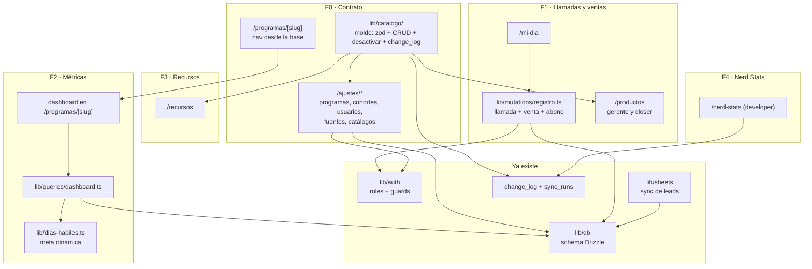
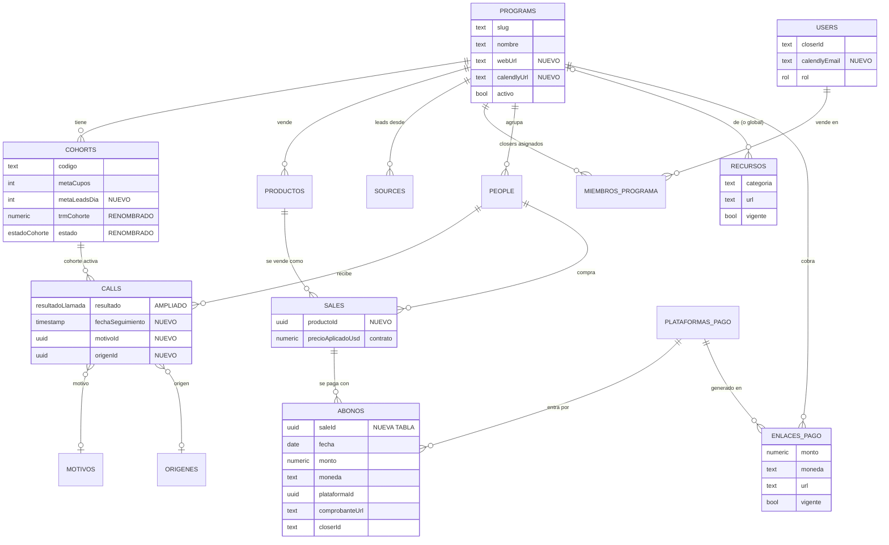
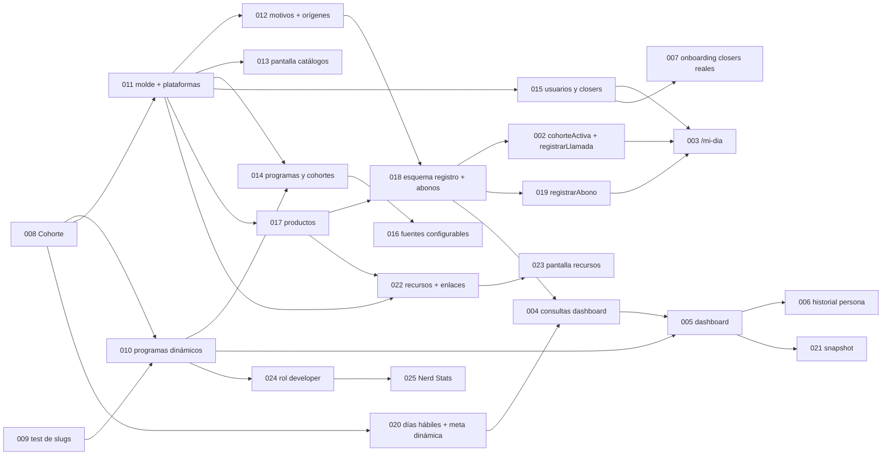

# plan — Retia CRM: contrato de extensión, llamadas y ventas, métricas, recursos, Nerd Stats

Deriva de [docs/spec.md](./spec.md). Decisiones que este plan da por sentadas (no se re-discuten
aquí): ADR 0008 a 0011 y ADR 0012 a 0017 (16-sep-2026).

**El estado de cada ticket vive en [docs/tasks/README.md](./tasks/README.md)**, no aquí.

## Orden de construcción (decidido con Mani el 16-sep)

| Fase | Qué entrega | Por qué va en ese lugar |
|---|---|---|
| **F0 · Contrato de extensión** | Cohorte renombrada, programas dinámicos, molde de catálogo, administración de programas, cohortes, closers y fuentes | Todo lo que viene se construye encima. Construir pantallas sobre programas fijos es rehacerlas después |
| **F1 · Llamadas y ventas** | Productos, esquema de registro con abonos, mutaciones, `/mi-dia` | Es lo que reemplaza el grupo de WhatsApp |
| **F2 · Métricas** | Días hábiles y meta dinámica, consultas, dashboard por programa, historial, snapshot | Sin datos de F1 no hay nada que medir |
| **F3 · Recursos** | Recursos y enlaces de pago con vigente | Independiente de F1 y F2; reusa el molde de F0 |
| **F4 · Nerd Stats** | Rol developer y vista de salud | Lo usa el equipo técnico, no la operación |

**Sobre el plazo:** Comunicarte C2 cierra el 22-sep (4 días hábiles desde el 16). F0 y F1
completas no caben ahí. La meta realista es tener F1 usable para el cierre de Tactical C2
(29-sep) y para la cohorte C3 de Comunicarte desde el primer día. Si hay que recortar, se
recorta dentro de F0 (el ticket 016 puede esperar), no se salta la fase.

## Arquitectura: qué se agrega

## El molde (ADR 0012), una sola vez

`lib/catalogo/` expone, por entidad, un esquema zod y cuatro operaciones: `listar(activos?)`,
`crear(session, input)`, `editar(session, id, input)`, `desactivar(session, id)`. Las tres
escrituras registran en `change_log` con `origen = "app"`. Cada pantalla de administración y
cada server action llaman a estas funciones; ninguna habla con Drizzle directo. Así, una entidad
nueva es: tabla + esquema + registro en el molde + pantalla.

## Modelo de datos al final de F3

## Grafo de tickets

## Contra las restricciones no-negociables de AGENTS.md

- **Rol en servidor:** cada pantalla nueva usa `paginaConRol` y cada escritura `requireRole`. El
  molde recibe la sesión para registrar quién cambió qué, no para decidir permisos.
- **Caja ≠ ventas:** ahora cada una tiene su tabla (ADR 0013).
- **Moneda siempre visible:** los abonos guardan su moneda; la caja se agrupa por moneda y nunca
  se convierte.
- **Ningún dato personal en URLs:** historial por `personId`; programas por slug (no es dato
  personal).
- **Mapeo que no cuadra falla ruidosamente:** el ticket 016 adelanta ese fallo al momento de
  guardar la fuente.
- **Escala:** los catálogos tienen decenas de filas; nada nuevo opera sobre el set completo
  salvo las consultas del dashboard, que agregan en SQL.
