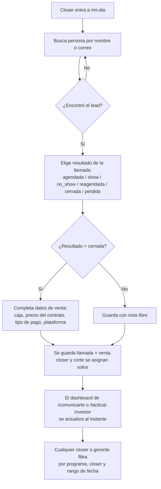
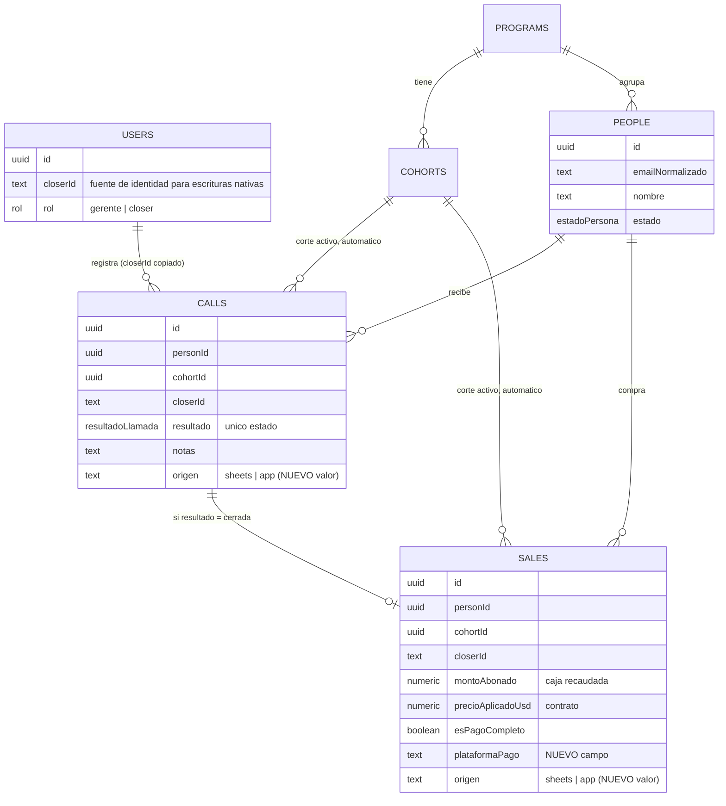

# plan — Retia CRM: registro de llamadas y ventas

Deriva de [docs/spec.md](./spec.md). Decisiones que este plan da por sentadas (no se re-discuten
aquí): ADR 0008 (Sheets deja de ser fuente de llamadas/ventas), ADR 0009 (closer ve todo en el
dashboard), ADR 0010 (se reusan `calls`/`sales`), ADR 0011 (`closerId` se copia de la sesión).

## Arquitectura: qué se agrega, qué se reusa

**Se reusa tal cual:** auth (Auth.js + roles), `lib/db` (Drizzle + Neon), `people`/`programs`/
`cohorts` (ya sincronizados desde Sheets), `PageShell`, `ProgramSwitcher`, guards de servidor.

**Se agrega:**

1. **Un campo en el schema**: `sales.plataformaPago`, una lista fija (MercadoPago, PayPal,
   Bancolombia, Global66, Hotmart, Otro) con opción libre para "Otro". Única migración de este
   plan.
2. **Una capa de lectura para "corte activo"**: dado un `programId`, devuelve el `cohort` con
   `estado = "activo"`. El closer nunca elige el corte a mano (spec §4, paso 2).
3. **Una capa de escritura nativa** (`lib/mutations/registro.ts`): recibe la sesión del closer, el
   `personId`, el resultado de la llamada y (si aplica) los datos de venta. Escribe en `calls` con
   `origen = "app"`, `closerId` copiado de `session.user.closerId` (nunca del formulario), y si el
   resultado es `cerrada`, escribe también en `sales` en la misma transacción.
4. **Una capa de lectura para el dashboard** (`lib/queries/dashboard.ts`): cierres, tasas y caja
   agrupados por closer/programa/fecha, filtrando por rango. Sin importar si la fila vino de Sheets
   o de la app (ADR 0010 lo permite: un solo `SELECT`, no dos fuentes que unir a mano).
5. **Contenido real en tres páginas que hoy son placeholder** (`ProximaFase`):
   - `/mi-dia`: buscar persona → registrar resultado (+ venta si cerró).
   - `/comunicarte` y `/tactical-investor`: el dashboard, ahora abierto a `closer` y `gerente`
     por igual (ADR 0009).
6. **Historial de una persona**: dentro del dashboard, entrar a una persona muestra sus llamadas en
   orden. Es lectura sobre `calls` ya filtrado por `personId`, no una tabla nueva.
7. **Componentes de UI que no existen hoy**: un input de búsqueda con resultados (para elegir la
   persona) y un formulario con campos condicionales (los de venta solo aparecen si el resultado es
   `cerrada`). Se agregan con `npx shadcn add` en el ticket que los usa (ADR 0006: no antes).

**No se toca:** `lib/sheets/` (el sync sigue igual, sigue siendo dueño de `people`), `/ajustes`
(sigue exclusivo de gerente).

## Contra las restricciones no-negociables de AGENTS.md

- **Rol en servidor:** la mutación de registro y las páginas de dashboard pasan por
  `requireRole`/`paginaConRol` como cualquier otra ruta. Ninguna verificación vive solo en el
  cliente.
- **Caja recaudada ≠ ventas cerradas:** la mutación escribe ambas por separado en `sales`, igual
  que hoy; el dashboard las suma por separado, nunca una a partir de la otra.
- **Moneda siempre visible:** todo monto en el dashboard se muestra junto a `USD` (los montos de
  venta) — no hay pauta en COP en este dominio, así que no aplica la mezcla de monedas.
- **Nada de datos personales en URLs:** el historial de persona se navega por `personId` (UUID),
  nunca por correo.
- **Escala real (~3.000 filas, 5 usuarios concurrentes):** la mutación de registro es una
  escritura de una sola fila a la vez, no un batch — el límite de función de Vercel que rige el
  sync completo no aplica aquí. Sin colisión.

No encontré ninguna colisión real entre el spec y las restricciones no-negociables.

## Flujo del MVP

## Modelo de datos (deriva del bloque 6 del spec; no agrega tablas)

## Secuencia de construcción

| # | Qué se construye | Sirve al criterio |
|---|---|---|
| 1 | Migración: `plataformaPago` en `sales` | Precondición de 1 y 2 |
| 2 | `corteActivo(programId)` + `lib/mutations/registro.ts` | Criterio 1 |
| 3 | UI de `/mi-dia`: buscar persona + formulario de registro | Criterio 1 |
| 4 | `lib/queries/dashboard.ts`: cierres/tasas/caja con filtros | Criterios 2 y 3 |
| 5 | UI de `/comunicarte` y `/tactical-investor`: dashboard real | Criterios 2 y 3 |
| 6 | Historial de persona dentro del dashboard | Bloque 1 (qué hace) |
| 7 | Onboarding: cargar `closerId` a las cuentas de Andrea, Maru y Jero | Precondición de ADR 0011 |

Fuera de esta secuencia a propósito (spec §2, "qué NO hace"): import histórico de los dos
consolidados, Calendly, Kapso, API propia, recordatorios, vista kanban.

## Handoff

Cuando se apruebe este plan, `docs/agents/handoff.md` se actualiza para apuntar a los tickets de
`docs/tasks/` en vez de repetir esta secuencia.
