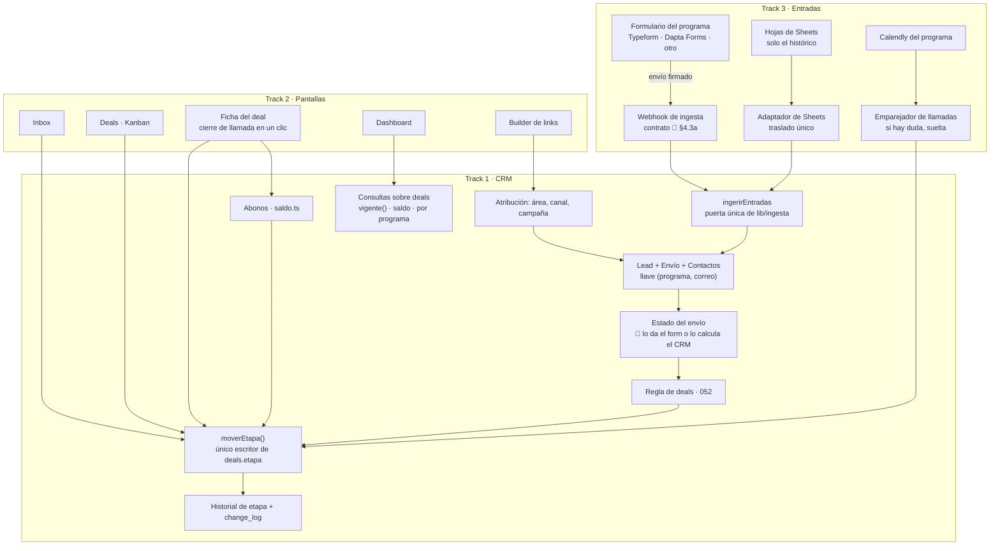

# Plan de implementación del CRM de Retia

> **Punto de entrada único del trabajo.** Quien retome (persona o agente) lee `AGENTS.md`, después este
> plan, y después el ticket. Consolidado el **27-sep-2026**, cuando Comercial dio luz verde para
> construir. Lo nuevo de ese día viene de Mani y va marcado 🆕; los choques que abre, 🔴.
>
> **La documentación vive en cuatro documentos y una carpeta, sin copias entre sí:**
> [`overview.md`](./overview.md) (qué es la herramienta, de principio a fin),
> [`structure.md`](./structure.md) (diagramas y componentes, técnicos y operacionales),
> [`operations.md`](./operations.md) (cómo se opera), este plan (en qué orden se construye y qué
> falta decidir) y [`adr/`](./adr/README.md) (el porqué de cada decisión). Un ADR manda sobre este
> plan. El estado de cada ticket vive **solo** en [`tasks/README.md`](./tasks/README.md); la memoria
> de sesiones, en [`agents/handoff.md`](./agents/handoff.md).
>
> Los documentos que se fundieron el 27-sep (spec, plan v2, propuesta del 24-sep, revisión del 22-sep,
> diseño, glosario, mapa de las hojas, insumos) siguen en git; la tabla de §8 dice dónde quedó cada
> referencia vieja.

Leyenda: ✅ decidido · 🟡 propuesta sin validar · 🔴 falta decidir · 🆕 dicho por Mani el 27-sep ·
⚠️ riesgo.

---

## 1. El norte

El CRM es el lugar donde vive la operación comercial de Retia, y tiene que trackear dos cosas: **el
camino de cada deal** y **el origen de cada lead** (`overview.md` §2). Existe para contestar la
pregunta de Daniel Tovar: *"no sé si estoy perdiendo plata o no con la pauta"*.

**Los tres tracks** 🆕 (Mani, 27-sep). La columna de la derecha son sus palabras:

| Track | Qué entrega | Cómo se sabe que cumplió |
|---|---|---|
| **1 · CRM** | la base del CRM desde el backend | *"asegurando escalabilidad y total integridad de TODA la información que se va a manejar, tanto del proceso comercial como para poder sacar métricas confiables"* |
| **2 · UI/UX** | el backend traducido a pantallas por rol, según las historias de usuario de cada uno (`overview.md` §4) | *"debe ser súper intuitivo y debe eliminar el error humano ya que se va a trabajar todo con valores y protocolos estandarizados"* |
| **3 · Integraciones** | un webhook propio y estándar para Typeform, Dapta Forms o cualquier formulario (y Calendly) | *"que este se rutee correctamente en nuestro CRM sin perder nada de info"* |

**Dos dolores que Mani pidió no perder de vista** 🆕:

- Los closers registran las llamadas a mano en las hojas de cada programa. Lo resuelven los pasos 3 y
  4 de §5 (llamadas y abonos sobre el deal, Inbox, cierre de llamada en un clic).
- El `Estado` del lead lo escribe hoy un Apps Script de la hoja. Mani quiere que lo asigne **el
  formulario, con su scoring**, cambiando el Typeform. Choca con una decisión construida: §4.3b.

**Cuándo está "funcionando en su totalidad".** El plan nunca tuvo fecha y no la inventa. La línea de
llegada es el ticket **082: apagar las pestañas de gestión de Sheets** (lo hace Mani), que solo pasa
cuando los closers operan en el CRM y lo histórico ya migró. Los hitos intermedios están en §5.

---

## 2. Dónde estamos (medido el 27-sep, no copiado)

- `main` tras el merge del 27-sep en la noche (E2 de Alejandro + 094 y ADR 0054/0055 de Mani). **867 tests en verde**, typecheck y lint limpios.
- ✅ **El lock se resincronizó el 27-sep** (`134d293`): le faltaban entradas opcionales de `@emnapi`.
  `npm ci` pasa con él en una copia limpia. Ojo: en Windows con npm 11 tampoco fallaba con el viejo,
  así que la falla era de otra versión de npm o de Linux; conviene confirmarlo en el CI (R4).
- ⚠️ Un checkout con `node_modules` de antes del 22-sep **falla 46 tests** porque no tiene el driver
  `postgres` (ADR 0047). Es entorno, no regresión: se arregla instalando.
- **Base:** 26 migraciones (0000 a 0025), todas aplicadas en `dev` y verificadas por hash contra el repo. Supabase `dev` existe, vacío y sembrado. **El proyecto de
  producción en Supabase no existe** (`DB_PROD` vacía). Vercel producción se desplegó el 23-sep y 🔴 no
  se ha verificado a qué base apunta (`operations.md` §1).
- **Cero** deals, llamadas y abonos en cualquier base. Los closers siguen en Sheets.

| Pieza | Estado |
|---|---|
| Esquema del modelo (Lead, Envío, Contacto, Deal, historial, actividades, Calls, Abonos) | ✅ migración 0020. Las 11 etapas desde la 0024; acuerdo de pago y fecha de seguimiento en el deal desde la 0025 |
| Ingesta que escribe: `ingerirEntradas` (una transacción, por lotes, idempotente) | ✅ código, sin nadie que la llame todavía |
| Calificación del envío (T2): las cuatro reglas del Apps Script, por fuente | ✅ código, 6.397 de 6.400 envíos coinciden con la hoja. 🔴 choca con §4.3b |
| Puntaje del lead (T4) | ⚙️ motor sin pesos, a propósito |
| RLS en todas las tablas, Data API apagada en `dev` | ✅ |
| Catálogos, productos, recursos, usuarios, roles, "ver como", sistema de diseño Tinta | ✅ del MVP |
| **Motor de etapas (E2, 043-047):** la tabla de transiciones, `queLeFalta`, `moverEtapa()` y `abrirDeal()` con historial, el guardián, y el saldo (`lib/queries/saldo.ts`) | ✅ 27-sep, sin nadie que lo llame todavía |
| Webhook, Calendly, registro de llamadas y abonos, UI por objetos, atribución, dashboard sobre deals, migración | ❌ |

El tracker iba atrasado: 048, 049, 050, 051 y 053 tenían código y seguían en `todo`. Desde el 27-sep
figuran `en curso`, con lo que les falta anotado en cada ticket.

---

## 3. Qué construye cada track, en un diagrama

Los componentes en detalle, el modelo de datos y los flujos están en `structure.md`.

```mermaid
flowchart TD
  subgraph T3["Track 3 · Entradas"]
    FORM["Formulario del programa<br/>Typeform · Dapta Forms · otro"]
    WH["Webhook de ingesta<br/>contrato 🔴 §4.3a"]
    HOJA["Hojas de Sheets<br/>solo el histórico"]
    ADS["Adaptador de Sheets<br/>traslado único"]
    CAL["Calendly del programa"]
    EMP["Emparejador de llamadas<br/>si hay duda, suelta"]
    FORM -->|"envío firmado"| WH
    HOJA --> ADS
    CAL --> EMP
  end
  subgraph T1["Track 1 · CRM"]
    ING["ingerirEntradas<br/>puerta única de lib/ingesta"]
    LEAD["Lead + Envío + Contactos<br/>llave (programa, correo)"]
    CALIF["Estado del envío<br/>🔴 lo da el form o lo calcula el CRM"]
    REGLA["Regla de deals · 052"]
    MOTOR["moverEtapa()<br/>único escritor de deals.etapa"]
    RASTRO["Historial de etapa + change_log"]
    DINERO["Abonos · saldo.ts"]
    ATRIB["Atribución: área, canal, campaña"]
    Q["Consultas sobre deals<br/>vigente() · saldo · por programa"]
    WH --> ING
    ADS --> ING
    ING --> LEAD --> CALIF --> REGLA --> MOTOR --> RASTRO
    EMP --> MOTOR
    DINERO --> MOTOR
    ATRIB --> LEAD
  end
  subgraph T2["Track 2 · Pantallas"]
    INBOX["Inbox"]
    DEALS["Deals · Kanban"]
    FICHA["Ficha del deal<br/>cierre de llamada en un clic"]
    DASH["Dashboard"]
    BUILDER["Builder de links"]
    INBOX --> MOTOR
    DEALS --> MOTOR
    FICHA --> MOTOR
    FICHA --> DINERO
    DASH --> Q
    BUILDER --> ATRIB
  end
```

---

## 4. Los tres tracks

### 4.1 Track 1 · CRM: la base y su integridad

**Las garantías que ya rigen**, y que todo ticket de este track tiene que respetar (detalle en
`AGENTS.md`, restricciones y contratos, y en `structure.md` §4.1):

- Toda tasa se cuenta sobre **personas**; la llave es `(programa, correo)` con índice único. El
  programa es **frontera**: una vista que cruce programas tiene que ser imposible por el tipo
  (ADR 0005, 0043, 0048).
- **`moverEtapa()` es el único escritor de `deals.etapa`**, con requisitos por etapa y un guardián que
  caza cualquier otro escritor (ADR 0037; tickets 045, 046).
- **Toda escritura deja rastro** en la misma operación (`lib/crm/rastro.ts`, ADR 0042).
- **Anulado no cuenta en ninguna métrica** y no es Cierre Perdido (`vigente()`, ADR 0026, 0038).
- **El dinero derivado tiene una sola definición** (`saldo.ts`, lo recrea el 060). Caja y ventas son
  dos métricas: la caja suma abonos por su fecha; las ventas cuentan deals en Abonado o Completo.
- **Toda mutación valida el alcance en el servidor** y lee, decide y escribe en la misma transacción.
- Fechas de Bogotá con `-05:00` explícito; moneda siempre al lado del número; todo por lotes.
- Lo configurable es una fila (ADR 0012); lo derivado no se guarda (ADR 0024).

**Tickets, en el orden de §5:**

| Bloque | Tickets | Qué deja |
|---|---|---|
| Motor de etapas (E2) | 043 · 044 · 045 · 046 · 047 | las 11 etapas y sus transiciones, requisitos de entrada, `moverEtapa()` con historial, guardián, saltos y retrocesos con motivo |
| Alcance | 094 | un closer ve solo los programas de su membresía (sin dependencias, puede ir ya) |
| Entrada (E3 mínimo) | 048 · 049 · 050 · 051 (en curso) · 052 | la ingesta llamada desde el webhook, el estado del lead desde su envío, la regla que abre y mueve deals |
| Llamadas y dinero (E4) | 057 · 058 · 059 · 060 · 061 · 063 · 035 | calls del deal, Grain = la llamada sucedió, no-show a Re-agenda, abonos y saldo, acuerdo de pago, `onboarded_at`, comprobante con foto (Supabase Storage) |
| Atribución (E1b) | 083 · 084 · 085 · 101 · 092 · 102 · 086 · 087 | áreas, campañas con su patrón, emparejador determinista, canales, generador de links, rol Paid Trafficker, origen humano, CPL. Una sola migración para 083, 084, 092, 101 y 102 |
| Reportes (E5) | 064 · 065 · 066 · 067 · 088 · 089 · 090 · 062 · 093 | consultas del dashboard sobre deals, embudo por etapa, Urgencias, ROAS, registros vs agendas, series con dimensiones, rendimiento por área, comisión. El 093 no tiene dependencias |

### 4.2 Track 2 · UI/UX por rol

**Cómo se elimina el error humano, con lo que ya está decidido** (cada punto tiene su ADR o ticket):

- **Nada que decida se escribe a mano.** Resultados de llamada y etapas son listas (ADR 0015, 0037);
  el precio sale del producto; motivos, plataformas y canales son catálogos; un link con UTM sale del
  builder, nunca armado a mano (ADR 0051).
- **El motor exige el requisito antes de mover** (044): no hay Atendido sin Grain, ni Cierre Perdido
  sin motivo, ni Próxima Cohorte sin cohorte destino.
- **Cierre de llamada = pegar el Grain y un clic** (N2), con seis salidas explícitas (`structure.md`
  §3.2).
- **El programa se elige una vez**, arriba, y todas las listas son de ese programa (ADR 0050).
- **Sistema de diseño Tinta obligatorio**: ningún color, sombra ni radio a mano (`structure.md` §9).
- **Una pantalla se prueba haciendo clic en todo lo que se abre**, y un permiso se prueba forjando la
  petición, no mirando que el botón no aparezca (`AGENTS.md`, convenciones).

**Tickets:**

| Bloque | Tickets | Qué deja |
|---|---|---|
| Operación (E6 mínimo) | 097 · 069 · 070 · 071 · 074 · 099 | navegación por objetos con selector de programa, Kanban de Deals, Setteo y Unclaimed, Inbox, ficha del deal, Students por cohorte con onboarding |
| Resto de E6 | 072 · 073 · 098 · 100 · 091 · 076 | tab Leads, ficha del lead, tab Calls, tab Programs, aviso de otros programas del correo, bitácora en Nerd Stats |
| Reportes | 095 · 068 · 021 | tab Dashboard (un programa o "todos" con lo sumable), Nerd Stats reescrito, snapshot en PDF |
| Cierre | 075 | revisión profunda de toda la UI |

⚠️ **Antes de abrir E6 hay que decidir la garantía** (§7, A4): este repo no tiene tests de
componente, y el 20-sep dos bugs pasaron con 669 tests en verde.

### 4.3 Track 3 · Integraciones

#### 4.3a El webhook estándar de formularios

> ✅ **Cerrado el 27-sep: ADR 0055** (A2). El programa sale de la URL de cada formulario; un adaptador
> por proveedor y un mapeo por fuente; los parciales llegan por *partial submission point*. Es un track
> propio. Lo de abajo es el contexto previo; quedan abiertas solo las 🔴 2 y 4, como recomendación en
> el ADR.

**Decidido ✅** (22-sep, T1; ADR 0004, 0036, 0039):

- Firma HMAC-SHA256 verificada sobre el **cuerpo crudo**; nunca responde con redirección; la ruta va
  en la lista pública de `proxy.ts` o cada envío falla sin que nadie lo vea.
- **El programa sale de la fuente registrada**, nunca de un campo del formulario. Una fuente
  desconocida es un **error visible**, no un lead en cualquier programa.
- Idempotente por `(fuente, token, es_parcial)`: un reintento no duplica, y la parcial y la completa
  del mismo envío conviven (migración 0022).
- **Se guardan todas las respuestas** del envío en `submissions.respuestas` (ADR 0036).
- Es **un adaptador más** de la puerta única `ingerirEntradas`: fila de hoja y payload de webhook
  producen el mismo Envío.

**🆕 Lo que pidió Mani el 27-sep:** que sea **nuestro webhook, estandarizado**, el mismo para Typeform,
Dapta Forms o cualquier formulario. Coincide con la meta que ya estaba escrita desde el 21-sep
("webhook propio del CRM"); el 22-sep se había arrancado como un endpoint solo de Typeform.

**Precedente en otro repo de Retia:** `dapta-forms-sheets` (`docs/protocolo.md`), probado de punta a
punta con un lead real el 7-sep y todavía sin tráfico de verdad. Tres decisiones suyas aplican directo
a este problema: el destino viaja **en la URL** (`/api/forms/<slug>`) para saber qué secreto usar
antes de leer un cuerpo sin verificar (D1); cada fila lleva `score_version` (D3); ante una falla
permanente responde 200 y guarda **el sobre crudo** para no perder el lead (D4). El payload de Dapta
(capturado en un envío de prueba) trae `submission.score` y `outcome`, y llegan dos webhooks por lead,
parcial y completo con el mismo id (verificado con un lead real).

**🔴 Por decidir (va a un ADR antes del ticket):**

1. La forma del contrato: un adaptador por proveedor detrás de una ruta que lleva la fuente en la URL,
   o un JSON propio de Retia que cada formulario tenga que respetar. Si un proveedor no deja moldear su
   payload (por verificar en Typeform), el segundo camino le obliga a un intermediario.
2. Dónde queda un envío que llega y no se puede procesar, para reprocesarlo. El repo no lo decide; el
   puente de Dapta usa el sobre crudo.
3. Cómo se da de alta una fuente webhook desde la app, sin tocar código (ADR 0012): hoy `sources` no
   tiene identificador del formulario y `tipo_fuente` no tiene un valor para webhook.
4. Cómo se entera alguien de que una fuente dejó de recibir (el equivalente del 055).

**Hechos por verificar:** el payload real de Typeform, y si Typeform manda las respuestas parciales
por webhook (hoy hay 1.152 parciales en Tactical y 193 correos que solo existen como parcial).

⚠️ **Riesgo operativo (T3):** Typeform tiene que seguir escribiendo en Sheets hasta que los closers
trabajen en el CRM, aunque el CRM ya no lea la hoja, o se quedan sin ver los leads nuevos.

✅ Las cuatro 🔴 se cerraron el 27-sep (ADR 0055 y las respuestas de Mani: sobre crudo + 200, aviso en la
app). Tickets: **105** (la fuente webhook), **106** (la ruta y el adaptador de Typeform), **107** (el aviso).

#### 4.3b El Estado del lead sale del formulario 🆕

> ✅ **Cerrado el 27-sep: ADR 0054** (A1), **enmendado esa noche:** el form manda el Estado completo con
> los nombres de la hoja (`descartado`, `setteo_no_calificado`, `con_calendly`) y el CRM confía en él,
> sin calcular ni validar. T2 queda desconectado mientras se decide A8. El script de la hoja se borra
> después del hito B. Lo de abajo es el contexto previo.

**Lo que dijo Mani el 27-sep:** *"Ahorita Estado es un campo que llena un script de sheets, pero esto
debe ser asignado directamente desde el forms según el scoring que les da: toca cambiar el Typeform
para que funcione así."*

**Con qué choca:**

- **T2 (22-sep), construido y validado:** el CRM calcula el Estado con las cuatro reglas del Apps
  Script, configuradas por fuente (`lib/ingesta/calificacion.ts`, migración 0023). Coincide con la
  hoja en 6.397 de 6.400 envíos.
- **T4 (23-sep):** el puntaje del lead vive en el CRM, sin pesos (`structure.md` §6).
- Lo de Mani **retoma el diseño del 21-sep**: *"Dapta debe entregar el Estado ya lleno, su scoring
  nativo califica dentro del form"*, que el 22-sep se cambió por T2 porque ya no había hoja en el
  camino (historia en el ADR 0004).
- Según la evaluación del 18-ago (vault, `dapta-forms-vs-typeform`), Dapta Forms puntúa cada opción de
  forma nativa y Typeform no. Hoy el Typeform ya decide quién ve el Calendly según el ingreso. 🔴 Lo
  primero es verificar si el Typeform puede producir el Estado que se necesita.

**🔴 Por decidir:**

1. Qué manda el formulario: el Estado ya calculado, un puntaje, o los dos.
2. Qué pasa con T2: se retira, o se queda como respaldo cuando el form no manda Estado y como
   validador del que sí manda.
3. Si el scoring del form también ordena el Setteo, o eso sigue siendo la pregunta de ingreso
   configurable por fuente (N1, ticket 070).
4. Si "cambiar el Typeform" alcanza, o este es el momento de pasar a Dapta Forms.
5. D4: si `leads.estado` (texto) se retira en favor de `calificacion` (lista).

**Lo que no cambia, se decida lo que se decida:** un envío sin Estado, o con un valor que el CRM no
reconoce, no se adivina: queda sin calificar y se reporta.

#### 4.3c Calendly (ticket 096)

Cuelga cada llamada de su deal por el **correo del invitado**, nunca por el teléfono; si hay duda, la
llamada queda **suelta** en el Inbox (ADR 0049; flujo en `structure.md` §2.2). 🔴 Webhook (tiempo real,
exige plan Standard de Calendly) o consulta periódica (cada 15 min exige Vercel Pro); dónde vive la
credencial de cada programa. Sin la integración, el closer crea la llamada a mano y el modelo funciona
igual.

#### 4.3d Lo que viene de Sheets

- **Traslado de leads y envíos:** una sola vez, por la misma puerta, con el Estado tal como lo escribió
  la hoja y la calificación del CRM al lado para compararla.
- **Migración de las pestañas de gestión (E7):** 077 · 078 · 079 · 080 · 081 → 082. Los deals viejos
  entran con su estado de gestión, no como ~2.400 deals iguales en Pendiente Setteo. Los casos que ya se
  sabe que piden decisión están en `structure.md` §11.
- 🔴 **053 a 056 se escribieron (21-sep) para un sync de Sheets vivo.** El corte directo (22-sep) dice
  que el CRM recibe leads **solo** por webhook, y nadie decidió si esos tickets se retiran, se reescriben
  para el webhook o quedan solo para el traslado. El 053 (zona horaria) ya tiene código.

#### 4.3e Después de v1

Ventas que vuelven solas desde los checkouts (Hotmart, PayPal, MercadoPago), Kapso, recordatorios,
acortador de links (`overview.md` §8).

---

## 5. Orden de construcción

El orden oficial es el de **P1, operación antes que analítica** (decidido el 24-sep): E2 → E3 mínimo
→ E4 → E6 mínimo → E1b → E5 → E7. Lo que este plan agrega es **dónde cae cada track** y dónde entran las
piezas que no tenían ticket (producción, webhook).

| Paso | Track 1 · CRM | Track 2 · UI/UX | Track 3 · Integraciones | Termina cuando |
|---|---|---|---|---|
| **0 · Terreno** | reparar el lock (§2) | · | crear Supabase producción (`operations.md` §4); verificar a qué base apunta Vercel | decisiones A1 a A3 de §7 |
| **1 · Motor** | 043 → 044 → 045 → 046 → 047 · 094 en paralelo | · | ✅ ADR 0055 (webhook) y ADR 0054 (Estado), 27-sep | un deal se mueve solo por `moverEtapa()` |
| **2 · Entrada** | 048 · 049 · 050 (en curso) · ✅ 051 · 052 | · | ✅ 105 (fuente webhook) · 106 (ruta + adaptador de Typeform) · 107 (aviso); payload real de Typeform | **Hito A: los leads entran solos al CRM** (primero `dev`, luego producción) |
| **3 · Llamadas y dinero** | 057 · 058 · 059 · 060 · 061 · 063 · 035 | · | 096 cuando se decida su forma | una llamada y un abono mueven el deal |
| **4 · Operación** | · | 097 · 069 · 070 · 071 · 074 · 099 | · | **Hito B: los closers operan en el CRM.** Desde aquí Typeform puede dejar de escribir en Sheets |
| **5 · Atribución** | 083 · 084 · 085 · 101 · 092 · 102 · 086 · 087 | pantalla del builder y de campañas | reunión con Pauta | el origen de cada lead se clasifica solo |
| **6 · Reportes y resto de UI** | 064 · 065 · 066 · 067 · 088 · 089 · 090 · 062 · 093 | 095 · 068 · 021 · 072 · 073 · 098 · 100 · 091 · 076 · 075 | · | el dashboard sale de los deals |
| **7 · Migración** | · | · | traslado · 077 → 078 → 079 · 080 · 081 → 082 | **Hito C: se apagan las pestañas de gestión** |

🟡 Tres cosas del orden son lectura de este plan y no decisión de nadie: el paso 0 como paso propio,
el lugar del webhook en el paso 2 (T1 dice que su primera versión crea lead, envío y contactos, y que
el deal llega con el motor) y los hitos A, B y C. El traslado de leads sin deal podría adelantarse; no
está decidido cuándo. Y el paso 5 depende de una reunión (Pauta), no de código: si llega antes, se
adelanta.

**Reglas de ejecución** (de `AGENTS.md`, no se negocian):

- Un paso no se cierra sin `npm test`, `npm run typecheck` y `npm run lint` limpios.
- **Las migraciones las genera y aplica la sesión principal**, nunca un subagente, y el SQL que genera
  `drizzle-kit` se lee antes de aplicarlo. Primero `dev`; producción con el ok de Mani.
- En paralelo se reparte **por archivos**: dos tickets con migración no van juntos, y nadie más que el
  coordinador toca el tracker y el handoff.

---

## 6. Qué paso sirve a qué criterio de aceptación

Criterios de `overview.md` §9:

| # | Criterio | Lo cumplen |
|---|---|---|
| 1 | El closer registra una llamada cerrada con su venta y su primer abono, sin WhatsApp | pasos 3 y 4: 057, 058, 060, 074 |
| 2 | Un cierre lo ven igual los closers **del programa** y el gerente; un closer sin membresía no | 094 y 095 |
| 3 | El gerente filtra por programa y fechas y ve agendas, show, ventas, % de cierre y caja | paso 6: 064, 065, 095 |
| 4 | Un programa nuevo con su cohorte, fuente y recursos, sin tocar código | hecho con fuentes de Sheets (016). Con el webhook depende de la 🔴 3 de §4.3a y del 100 |
| 5 | Un closer nuevo, asignado a un programa, registra y aparece en las métricas | 094, 057, 064. En operación faltan los closers reales en la base de producción, que todavía no existe (ticket 007) |
| 6 | Recursos y links de pago vigentes en un clic | ✅ hecho (022, 023) |

---

## 7. Decisiones abiertas (la lista única)

Lo que no está aquí, está decidido. Cada una dice qué bloquea y cuándo hace falta. Cuando una se
cierra, baja a un ADR (con `/grill-with-docs`) o a su ticket, y sale de esta lista.

**A. Mani** (bloquean el arranque o la entrada de leads):

| # | Qué | Bloquea | Cuándo |
|---|---|---|---|
| A3 | Crear Supabase producción; pasarlo a Pro cuando haya operación | hito A en producción | paso 0 |
| A4 | Garantía de la UI: tests de componente o Playwright (R5); CI (R4) | paso 4 | antes del paso 4 |
| A5 | Calendly: webhook o consulta; plan de Calendly; Vercel Pro (R3) | 096 | paso 3 |
| A6 | Qué pasa con 053 a 056 y con el código del sync de Sheets después del corte directo (§4.3d) | limpieza del tracker | paso 2 |
| A7 | Las fichas técnicas de §7.1 (D3, D5, R2, P2, T4) | 060, 084 | según el ticket |
| A8 | ¿El Estado lo calcula el formulario o una función del CRM por programa? Hoy: el formulario (ADR 0054, enmienda). T2 queda desconectado en el repo hasta decidirlo | nada: el 052 lee `leads.calificacion` sin saber quién la escribió | antes del hito A en producción, con el envío real de Typeform |

**B. Closers** (por chat, cuando llegue el ticket que la necesita):

- Qué pregunta del formulario es el ingreso, en qué moneda y periodo, y si las bandas son iguales en
  los dos programas (070, 071).
- El X de "deal sin actividad en X días" (071).
- De quién es el deal si el lead agenda con otra closer por Round Robin (096).
- ¿"Estudiante" desde el primer abono o con el pago completo? ¿Quién hace el onboarding (el transcript
  dice "Anis"; Jero nombró a Dani Rincón)? (099)
- Cómo mandan el comprobante: foto, link o PDF (035, 060).
- Hasta cuántos días atrás vale migrar Setteo con deal (080).
- Uso desde el celular; quién prueba primero; cómo y cuándo se paga la comisión.
- **Los motivos (104, ya cargados):** revisar los 13 que salieron de su `_ListasDropdown`; sobre todo
  reagenda y recuperación, que no tenían equivalente en la hoja. Se ajustan desde el catálogo.
- Confirmar: la venta sin llamada y los perdidos que se recuperan (transiciones T4, T5 y R de
  `structure.md` §3.1; no confundir con la ficha T4 de §7.1).

**B2. Equipo (Mani, 27-sep):** ¿para qué sirven las preguntas del formulario que hoy no deciden nada?
Ingreso filtra quién ve el Calendly (por confirmar en la ramificación de la pregunta de pago) y ordenará
Setteo (070); **motivación y urgencia no se usan en ninguna parte**, y la situación profesional solo se
copia a Setteo para que el closer la lea. Tres preguntas: ¿ordenan la cola o cambian a dónde va el lead?;
¿quién fija el criterio y con qué datos (lo que respondieron los que compraron, de la migración de las
pestañas de gestión)?; ¿las que no sirvan se quitan del formulario? Se cruza con T4.

**C. Gerencia (Alejo, Daniel):** el área de cada canal (101); qué ve el Paid Trafficker (102); los
umbrales de éxito del dashboard; el precio de lista de ComunicArte, 797 o 697 (los consolidados de C2
dicen 797 desde el 13-ago con 697 respetado; la hoja y la comisión usan 697); el límite de los
descuentos; si un lead traído por un closer cuenta distinto en su comisión; ratificar que se construye
y no se compra HubSpot (R10).

**D. Pauta** (Jero consigue la reunión; prioridad altísima según los closers): la convención de UTM y
el builder (083, 084, 085, 092, 101); qué checkouts usan y si mandan webhooks; si además capturan
`utm_id` y `fbclid` (R6); por qué Tactical tiene 26% de leads sin UTM.

**E. Michael** (antes de que salga): por qué se dejó de calcular el ROAS; cómo marca Juanito su rastro
en el UTM; si alguien edita el Estado de la hoja a mano; qué pasa cuando un pago parcial nunca se
completa; qué se rompe primero si se va mañana.

**F. Media:** si el orgánico usa el mismo formulario que la pauta; qué cuentas o creadoras van en
`utm_content` (`rosario`, `milena`, otras).

### 7.1 Las fichas técnicas abiertas, con su contexto

Vienen de la revisión del modelo del 22-sep (su texto completo:
`git show da68cdf:docs/auditorias/revision-modelo-hubspot-2026-09-22.md`). Deciden Mani y, donde se
dice, alguien más.

| Ficha | El problema | Opciones y recomendación escrita |
|---|---|---|
| **D3 · ¿Abonado cuenta como deal abierto?** | El índice de "un deal abierto por lead y programa" excluye solo Completo y Cierre Perdido: un Student en Abonado con saldo **bloquea** cualquier otro deal del mismo lead (una mentoría, un upsell) | A: se mantiene (el upsell espera a que se complete el pago). B: se excluye Abonado del índice. Recomendación: B solo si venden una segunda cosa a la misma persona en el mismo programa; si no, A, y se deja escrito |
| **D5 · UTM en dos tablas** | `leads` y `submissions` guardan los mismos `utm_*`, sin estar declarado; el 093 filtraría por uno y el 088 por el otro: dos cifras para la misma pregunta | Recomendación: el origen del lead es el de su primer envío, derivado, y `leads.utm_*` se elimina; mientras tanto, lo que lea `leads.utm_*` lo marca como temporal |
| **R2 · El rastro por triggers** | Hoy el rastro lo garantiza un guardián por regex que no ve alias de tabla, `.delete(` ni algunas tablas | Con las transacciones reales del ADR 0047, triggers `AFTER INSERT/UPDATE` con `SET LOCAL app.user_id` harían que la base garantice el rastro, como el dedup. Recomendación: sí; el guardián de etapas (046) encoge |
| **R3 · Vercel Pro** | Hobby permite un cron al día y es para uso no comercial | Recomendación: Pro (20 USD/mes por miembro). Habilita la consulta de Calendly cada 15 min |
| **R4 · CI** | No hay `.github/`; "una etapa no se cierra sin los tres chequeos" depende de que alguien se acuerde | Recomendación: un workflow que corra test, typecheck y lint en cada push y PR. Requiere reparar el lock primero (§2) |
| **R5 · Playwright** | Dos bugs de UI pasaron con más de 600 tests en verde; el Kanban es la superficie más grande | Recomendación: 5 o 6 flujos contra `dev` (reclamar un deal, moverlo, pegar el Grain, registrar un abono, anular, forjar una server action sin permiso) |
| **P2 · Empates en el emparejador** | En Postgres dos `NULL` no chocan en un índice único, y todos los campos del patrón son opcionales | Hace falta `NULLS NOT DISTINCT` **y** detectar el empate en tiempo de ejecución, como error visible (084, 085) |
| **P3 · El costo del proceso** | `AGENTS.md` pesa ~50 KB y el handoff ~2.900 líneas: cada sesión gasta contexto en historia | Recomendación: `AGENTS.md` solo reglas, contratos y comandos, cada regla con su ADR; el handoff con el estado actual y lo siguiente. La consolidación del 27-sep ya movió los documentos |
| **T4 · El valor del puntaje** | El motor existe sin pesos; no hay datos de venta para calibrarlo | Opciones: A categoría (A/B/C), B puntaje de 0 a 100, C valor esperado en USD. Recomendación: A por ahora y C cuando haya histórico, calibrando con la migración de las pestañas de gestión. Preguntas: ¿solo ordena la cola o también cambia a dónde va un lead?; ¿quién fija los pesos? Se cruza con A1 |

---

## 8. Mapa de documentos y referencias viejas

| Documento | Qué es | Cuándo se lee |
|---|---|---|
| `AGENTS.md` | el contrato del repo: restricciones, contratos, comandos, convenciones | siempre, primero |
| **`docs/plan.md`** | este plan | siempre, segundo |
| `docs/overview.md` | qué es la herramienta de principio a fin: problema, programas, roles, recorrido de un lead, métricas, alcance, criterios, historia, vocabulario | para entender el producto o el dominio, y antes de nombrar algo |
| `docs/structure.md` | diagramas y componentes: operación de hoy, flujos, motor de etapas y transiciones, arquitectura, modelo de datos, ingesta, atribución, pantallas, sistema de diseño, mapa de las hojas, migración | al construir cualquier pieza; §9 antes de tocar una pantalla |
| `docs/operations.md` | entornos, URLs de los programas, variables, base de datos, scripts, despliegue, secretos, incidentes, deuda, datos de validación | al operar, migrar, desplegar o validar cifras |
| `docs/adr/README.md` y `docs/adr/` | las decisiones vigentes y el índice de las retiradas | antes de tocar un área decidida |
| `docs/tasks/README.md` y `docs/tasks/NNN-*.md` | estado de cada ticket y su detalle | al tomar un ticket |
| `docs/agents/handoff.md` | memoria de sesiones | al arrancar y al cerrar una sesión |

**Dónde quedó cada referencia vieja.** Los tickets y los comentarios del código citan documentos que se
fundieron el 27-sep. Su texto sigue en git (`git show da68cdf:<ruta>`).

| Referencia vieja | Hoy está en |
|---|---|
| `docs/spec.md`, "spec §N" | `overview.md` (§2 qué es, §8 alcance, §9 criterios, §6 datos) |
| `docs/plan-crm-v2.md`, "plan v2 §N", "etapa EN", "E-N" | el orden, en §5 de este plan; el porqué, en los ADR |
| "plan v2 §12" (la atribución por área) | ADR 0043, 0044, 0045 y 0051; `structure.md` §7 |
| `docs/auditorias/propuesta-crm-y-reunion-comercial-2026-09-24.md`, "propuesta §0" | `overview.md` §10 (lo que dijeron los closers) y §7 de este plan |
| "propuesta §2.3 a §2.6" (flujos, etapas, transiciones) | `structure.md` §2 y §3 |
| "propuesta §3.2 a §3.7" (modelo, UTM, builder, pantallas, dashboard, Calendly) | `structure.md` §5, §7, §8 y §2.2 |
| `docs/auditorias/revision-modelo-hubspot-2026-09-22.md`, fichas D, R, P, S, T | §7 y §7.1 de este plan; las cerradas, en su ADR (S1 y S2: ADR 0047; T1 y T3: ADR 0004 y §4.3a; T2: §4.3b) |
| `docs/auditorias/auditoria-arquitectura-2026-09-19.md` | sus lecciones, en `structure.md` §4.1 |
| `docs/design.md` | `overview.md` §1, §2 y §4 |
| `docs/design-system.md` | `structure.md` §9 |
| `docs/estructura-bbdd.md` | `structure.md` §10 y `operations.md` §2 |
| `docs/agents/context.md` (el glosario) | `overview.md` §11 |
| "insumo §N" (el diseño consolidado del 20-sep, `crm-retia-modelo-hubspot-scaffold.md`) | lo vigente, en los ADR y en `structure.md`; el original vive en el vault (`mani_vault/02 Projects/retia/notebook/`) |
| `docs/insumos/` (reuniones, notas del vault, consolidados de C2) | lo útil, en `overview.md` §3 y §10, `structure.md` §1 y §11 y `operations.md` §11; el crudo, en git, en Granola y en el vault |
| un ADR que ya no está en `docs/adr/` | `docs/adr/README.md`, tabla de retirados |
