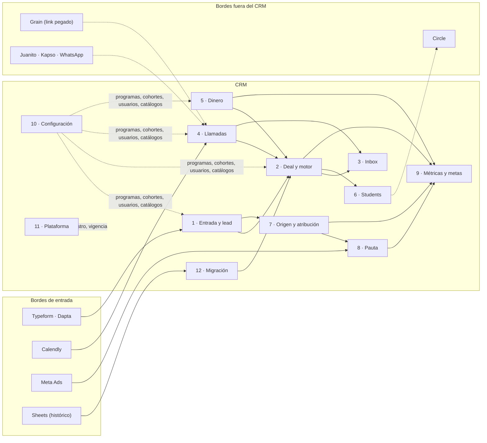

# Plan de implementación del CRM de Retia

> **Punto de entrada único del trabajo.** Quien retome (persona o agente) lee `AGENTS.md`, después este
> plan, y después el ticket.
>
> **Reorganizado el 2-oct-2026 por componentes** (Mani): el plan ya no se ordena por tres tracks técnicos
> sino por los **componentes del CRM** (§4), cruzados con los **actores** que los usan (§4.0). Así cada
> pendiente se escribe una sola vez, en el componente que lo dueña, y los cruces entre roles quedan a la
> vista. El texto anterior, con los tracks y la historia de las integraciones: `git show 951b62a:docs/plan.md`.
>
> **Dónde vive cada cosa, sin copias:** los actores y sus historias en [`overview.md`](./overview.md) §4;
> los componentes, lo que falta y las decisiones abiertas en este plan; el código de cada componente y las
> pantallas por rol en [`structure.md`](./structure.md) §4.1 y §8; el estado de cada ticket solo en
> [`tasks/README.md`](./tasks/README.md); el orden por olas en [`plan-reparto.md`](./plan-reparto.md) §4; el
> porqué en [`adr/`](./adr/README.md). Un ADR manda sobre este plan.
>
> **El mapa visual** es [`manuales/mapa-crm.html`](./manuales/mapa-crm.html): una vista de esos tres documentos (overview §4,
> este plan y structure §8). No se edita a mano por su cuenta: cuando cambian ellos, se regenera.

Leyenda: ✅ hecho o decidido · 🟡 en `main`, falta checkpoint o recorrido · ⛔ bloqueado por una decisión ·
❌ sin construir · 🔴 falta decidir.

---

## 1. El norte

El CRM es el lugar donde vive la operación comercial de Retia, y tiene que trackear dos cosas: **el
camino de cada deal** y **el origen de cada lead** (`overview.md` §2). Existe para contestar la
pregunta de Daniel Tovar: *"no sé si estoy perdiendo plata o no con la pauta"*.

Las tres exigencias de Mani del 27-sep siguen siendo el criterio de todo componente:

| Exigencia | En palabras de Mani |
|---|---|
| **La base** | *"asegurando escalabilidad y total integridad de TODA la información que se va a manejar, tanto del proceso comercial como para poder sacar métricas confiables"* |
| **Las pantallas** | *"debe ser súper intuitivo y debe eliminar el error humano ya que se va a trabajar todo con valores y protocolos estandarizados"* |
| **Las entradas** | un webhook propio y estándar para cualquier formulario y Calendly, *"que este se rutee correctamente en nuestro CRM sin perder nada de info"* |

**La prioridad desde el 30-sep es la v1 comercial** ([`comercial.md`](./comercial.md)): Dani, *"la versión 1
es solamente la visual de comercial"*. **Desde el 2-oct (ola O2), la meta es que toda la operación
comercial, de la entrada del lead a student, se maneje en el CRM**; métricas, dashboard y pauta van encima.

**Cuándo está "funcionando en su totalidad".** El plan no tiene fecha y no la inventa. La línea de llegada
es el ticket **082: apagar las pestañas de gestión de Sheets**, que solo pasa cuando los closers operan en
el CRM y lo histórico ya migró. Los hitos intermedios están en §5.

---

## 2. Dónde estamos (3-oct noche, medido)

- **Base:** una sola, y es producción ("CRM Retia", ADR 0047 enmendado). **65 migraciones (0000 a 0064)**,
  todas aplicadas. Hay base local en Docker con login local para probar pantallas (113, 069).
- **`main`:** el último checkpoint verde es `cp-20261003-8`. Las olas O2 (sesiones de código) y O3 están cerradas;
  la vigente es la **O4** (`plan-reparto.md` §4), que sale del recorrido 8 de Mani (A-82 a A-92) y trae dentro el 167.
- **Producción (consulta de solo lectura, 3-oct noche):** la entrada funciona (Typeform de ComunicArte 289 envíos,
  Tactical 174, Dapta de ComunicArte 11), pero **nadie opera todavía**: 396 deals, todos en Registrado, Agendado,
  Calificado o Contactado, y **0 abonos**. Ningún programa tiene **fuente principal** marcada (sin ella no hay links
  de captación, ADR 0068).
- **Memorable (arranca el lunes 5-oct) NO está listo:** el programa existe pero está **inactivo**, **sin token de
  Calendly** y **sin cohorte**; su fuente Dapta está activa con 0 envíos; **Nicolás y Francisco no tienen cuenta**.
  Lo que falta es configuración y lo hace Mani (frente A de O2, A.2 a A.10), no código.

El estado de cada componente, en una línea:

| Componente | Estado | Lo que falta, en corto |
|---|---|---|
| 1 · Entrada y lead | ✅ en producción | 117: anotar el primer parcial real · 184 duplicados donde se trabaja (y separar abre deal, A-92) |
| 2 · Deal y motor de etapas | ✅ las 11 etapas de 30X, cortesía, tres intentos | 182 corregir el último movimiento y Transición en dos columnas · 181 Kanban fijo con dinero por etapa |
| 3 · Inbox | ✅ · Mi espacio es el hub (172, 179) | 183 Mi espacio con alertas y métricas del closer · la cola por Lead Value |
| 4 · Llamadas y Calendly | ✅ | 🟡 152 y 157 · Grain por API (🔴 QM-4) |
| 5 · Dinero | ✅ valor vendido, abonos, comisión | 167 quién cobró es FK (O4) · ⛔ 144 · ❌ 035 comprobante con foto |
| 6 · Students y onboarding | ✅ una marca | ⛔ 145 (rol Customer Success y cuatro pasos) |
| 7 · Origen y atribución | ✅ canales, áreas, emparejador | 092 en curso · ❌ 086 (Mi link) |
| 8 · Pauta | ❌ | 102, 119, 120, 122 a 125, 067; espera el token de Meta |
| 9 · Métricas, dashboard y metas | ✅ base comercial | 148 listo · 065, 090 · ⛔ 146, 147, 158 |
| 10 · Configuración | ✅ | 🔴 Memorable sin montar · fuentes principales · 149 manual por rol · 185 textos de Programa |
| 11 · Plataforma | ✅ | 🔴 S1 respaldos antes del corte · 185 pantalla fija en toda la app · R2 después del corte |
| 12 · Migración y corte | ❌ | 078 (CA y TI) · el corte · 082 |

---

## 3. Los componentes, en un diagrama

Cómo se conectan (el detalle de los flujos, el motor y el modelo de datos está en `structure.md` §2 a §7):

```mermaid
flowchart LR
  subgraph BORDE_IN["Bordes de entrada"]
    FORM["Typeform · Dapta"]
    CALY["Calendly"]
    META["Meta Ads"]
    HOJA["Sheets (histórico)"]
  end
  subgraph CRM["CRM"]
    C1["1 · Entrada y lead"]
    C7["7 · Origen y atribución"]
    C2["2 · Deal y motor"]
    C3["3 · Inbox"]
    C4["4 · Llamadas"]
    C5["5 · Dinero"]
    C6["6 · Students"]
    C8["8 · Pauta"]
    C9["9 · Métricas y metas"]
    C10["10 · Configuración"]
    C11["11 · Plataforma"]
    C12["12 · Migración"]
  end
  subgraph BORDE_OUT["Bordes fuera del CRM"]
    GRAIN["Grain (link pegado)"]
    JUAN["Juanito · Kapso · WhatsApp"]
    CIRCLE["Circle"]
  end
  FORM --> C1 --> C2
  C1 --> C7
  CALY --> C4 --> C2
  C2 --> C3
  C4 --> C3
  C5 --> C2
  C2 --> C6
  META --> C8
  C7 --> C8
  C2 & C5 & C7 & C8 --> C9
  HOJA --> C12 --> C2
  GRAIN -.-> C4
  JUAN -.-> C4
  C6 -.-> CIRCLE
  C10 -. "programas, cohortes, usuarios, catálogos" .-> C1 & C2 & C4 & C5
  C11 -. "permisos, rastro, vigencia" .-> CRM
```

---

## 4. Los componentes

Cada componente dice **qué pregunta contesta**, quién lo usa, qué está hecho, qué falta (con su ticket) y
qué decisión lo frena. El código de cada uno está en `structure.md` §4.1; sus pantallas, en `structure.md`
§8. Los actores y sus historias de usuario, en `overview.md` §4.

### 4.0 La matriz: qué hace cada actor en cada componente

`S` lo escribe el sistema · `O` opera · `V` ve · `A` administra · `·` nada. El **setter** es una función, no un
rol: es una persona con cuenta de closer que trabaja otro momento del deal (ADR 0076). Paid Trafficker y
Customer Success están decididos y **sin construir** (102, 145).

| Componente | Sistema | Setter | Closer | Gerente | Paid Trafficker | Customer Success | Developer |
|---|---|---|---|---|---|---|---|
| 1 · Entrada y lead | S: envío, lead, etapa de entrada, reenvío que sube | V leads de sus programas | V · alta manual | V · revisa duplicados | · | · | A + salud |
| 2 · Deal y motor | S: entrada, Agendado por cita, Atendido por Grain, ganado por abono | O: En gestión → Agendado | O: sus deals, por etapa destino | O: cualquier deal, reasigna dueño | · | · | A |
| 3 · Inbox | S: arma la cola y las alertas | O: reclama En gestión | O: reclama, lo suyo, sus sueltas | V todo el programa | · | · | A |
| 4 · Llamadas y Calendly | S: cuelga, reagenda, cancela, no-show | O: link de agenda, "Ya se lo mandé" | O: Grain, "¿Cómo terminó?", su Calendly | A: Calendly del programa | · | · | A |
| 5 · Dinero | S: ganado, saldo, comisión, cartera | · | O: valor vendido, abono, comprobante, acuerdo | V todo · anula | · | · | A |
| 6 · Students | S: cohorte al primer abono | · | O: onboarding de sus deals | O: cambia cohorte | · | O: cuatro pasos (145) | A |
| 7 · Origen y atribución | S: canal, campaña, anuncio | · | O: área declarada · Mi link (086) | A: canales y áreas | O: UTM de Meta, builder de orgánico | · | A |
| 8 · Pauta | S: árbol y gasto de Meta (120) | · | · | V | O: conecta Meta, árbol y costos (119) | · | A |
| 9 · Métricas y metas | S: calcula | V como closer | V sus programas, completo | V todo y "todos los programas" | V sin comparativo ni comisión | · | A |
| 10 · Configuración | · | O: su Calendly | O: su Calendly, recursos de sus programas | A: programas, cohortes, usuarios, catálogos, fuentes | · | · | A |
| 11 · Plataforma | S: rastro, vigencia, salud | · | · | · | · | · | A: Nerd Stats, bitácora, ver como |
| 12 · Migración y corte | · | V revisa lo suyo | V revisa lo suyo | V | · | · | O: corre el 078 |

**Los traspasos entre actores** (donde un rol le entrega algo a otro; cada uno vive en su componente):

| # | De → a | Qué pasa | Componente | Estado |
|---|---|---|---|---|
| X1 | Sistema → setter | el envío abre el deal en su puerta; En gestión es la cola del setter | 1, 2, 3 | ✅ |
| X2 | Setter → closer | el setter manda el link de agenda; la cita por Calendly entrega el deal al host; el setter queda con su crédito; alerta si a 1 hábil no hay cita (ADR 0076) | 4 | 🟡 157 |
| X3 | Sistema → closer | Calendly cuelga la llamada; la que tiene duda queda suelta en el Inbox y solo la cuelga su host | 4, 3 | ✅ |
| X4 | Closer → sistema | Grain mueve a Atendido; el abono mueve a ganado | 4, 5, 2 | ✅ |
| X5 | Closer → Customer Success | un deal ganado es Student; hoy el onboarding lo marca el closer con una sola marca | 6 | ⛔ 145 |
| X6 | Closer → Pauta | el área declarada al cerrar informa las ventas sin UTM; Mi link marca los referidos | 7 | ✅ área · ❌ 086 |
| X7 | Gerente ↔ closer | reasignar dueño, deals sin dueño, cartera vencida, anular | 2, 3, 5 | ✅ |
| X8 | Closer → gerencia | el reporte del día; hoy por WhatsApp a Michael | 9 | ⛔ 158 |
| X9 | Pauta → sistema | UTM con macros al emparejador; el gasto por la API | 7, 8 | ✅ UTM · ❌ gasto |

### 4.1 Entrada y lead

**Contesta:** ¿quién llegó, a qué programa, con qué respuestas y en qué etapa nace su deal? **Actores:**
el sistema escribe; setter, closer y gerente leen. **Pantallas:** Leads (lista y ficha), Ajustes → Fuentes y
Salud. **Garantías:** dedup por `(programa, correo)`, la caja negra no pierde un envío con firma buena, la
etapa de entrada la decide el CRM con agenda y calidad (ADR 0004, 0005, 0035, 0055, 0058, 0069, 0073).

- ✅ Webhook estándar con adaptadores de Typeform y Dapta, varios formularios por programa (105, 106, 130,
  131), identidad (050), salud de fuentes y alarma "sin calidad" (107, 110), reenvío que sube la etapa (151),
  traslado de leads desde Sheets (111), ficha del lead con el diff entre envíos (073, 091).
- Falta: **117** anotar el primer parcial real de Typeform (no es código) · **126** parte B, el embudo por
  pregunta (migración) · buscador por texto en Leads para retirar `/personas` (A-11, al 075).
- ✅ **A-41 cerrada (Mani, 2-oct): los parciales siguen abriendo deal en Potencial**, como en 30X; las etapas
  se manejan como están.
- Frena: 🔴 **B2** las preguntas del formulario que no deciden nada.

### 4.2 Deal y motor de etapas

**Contesta:** ¿en qué va cada oportunidad, de quién es y qué le falta para avanzar? **Actores:** el sistema
y los dueños mueven; quien administra mueve cualquiera. **Pantallas:** Deals (Kanban) y Ficha del deal.
**Garantías:** `moverEtapa()` es el único escritor de la etapa, con requisitos por flecha, historial y rastro;
anular no es Cierre perdido; un solo deal abierto por lead (ADR 0037, 0038, 0042, 0056, 0070 a 0072, 0075).

- ✅ Las 11 etapas de 30X (142), pendientes del deal (ADR 0070), una pregunta por etapa (ADR 0072), alertas
  del deal (128), Atendido sin Grain (135), ficha por bloques (139), crear un deal a mano (140).
- 🟡 **143** propiedades obligatorias en rojo por etapa · **156** Transición por etapa destino con un solo
  pop-up, el closer ve solo lo suyo. Los dos esperan checkpoint y recorrido de Mani.
- ✅ (3-oct) cortesía (160) y alerta de tres intentos (161).
- Falta: **182** corregir el último movimiento hecho por una persona, con motivo (ADR 0078; los retrocesos que ya
  existen: RETRO, perder y recuperar, E9, A1 y A2) y Transición en dos columnas · **181** Kanban fijo con potencial
  y confirmado por etapa · **075** revisión profunda de la UI.

### 4.3 Inbox (la cola de trabajo)

**Contesta:** ¿qué tengo que hacer ahora? **Actores:** setter y closer trabajan su cola; el gerente ve la del
programa. **Pantallas:** Inbox. Es una proyección: no guarda nada propio, lee deals, llamadas y alertas.

- ✅ Sin dueño y Pendiente Setteo con reclamo (070), "lo mío que necesita atención" (071), llamadas sueltas,
  "se perdió en el Calendly" arriba (118), Urgencias (066).
- ✅ (3-oct) el **hub del closer** es **Mi espacio** (172, 179): sus pendientes, deals, llamadas y students, y el
  mensaje para un closer sin programas (A-04); A-05 cerrada. `/mi-dia` y `/perfil` redirigen hasta después del 10-oct.
- Falta: la **cola ordenada por Lead Value**, días en etapa y próximo paso (ADR 0072 M-5, QD-12).

### 4.4 Llamadas y Calendly

**Contesta:** ¿qué llamadas hay, de qué deal y qué pasó en cada una? **Actores:** el sistema cuelga; el
setter entrega; el closer da la llamada y la cierra. **Pantallas:** Calls, la ficha del deal (Llamadas),
Inbox (sueltas), Mi espacio. **Garantías:** una llamada se cuelga solo sin duda; el teléfono no empareja; la
llamada que cuenta es la más reciente (ADR 0015, 0049, 0057, 0066, 0076).

- ✅ Webhook firmado de Calendly en los dos programas (096), calls del deal, Grain = sucedió, no-show y
  cancelada a Re-agenda (057 a 059), tab Calls (098), link de reunión genérico (156).
- ✅ **152** el closer asigna su cuenta de Calendly desde Mi espacio (ADR 0074) · **157** handoff del setter
  al closer por la cita (ADR 0076).
- Falta: recorrido con un webhook de Calendly firmado en `dev:local` (no se pudo por swap) · borrar
  `lib/calendly/buscar-llamada.ts`, que ya nadie importa (K1 decidió retirarlo).
- Frena: 🔴 **QM-4** Grain por API, ¿después de v1 o nunca?

### 4.5 Dinero

**Contesta:** ¿cuánto se vendió, cuánto se cobró, cuánto falta y cuánto gana cada closer? **Actores:** el
closer escribe; el sistema calcula; el gerente revisa y anula. **Pantallas:** ficha del deal (Facturación),
Students. **Garantías:** caja y ventas son dos métricas; una sola definición del saldo; la comisión es un %
congelado y nunca se guarda el monto; solo USD (ADR 0013, 0024, 0053, 0065).

- ✅ Valor vendido (132), comisión por porcentaje (133), ticket base de la cohorte (134), abonos y saldo
  (060), acuerdo de pago y cartera vencida (061), el comprobante no bloquea el abono (156).
- Falta: **035** comprobante con foto (Supabase Storage) · **144** próxima fecha de pago y cartera por fecha.
- Frena: ⛔ **QM-3** y **GC-17** (hablar con 2 o 3 closers sobre cómo pactan los abonos) · 🔴 formato del
  comprobante (closers).

### 4.6 Students y onboarding

**Contesta:** ¿quién ya es estudiante, de qué cohorte, y se le hizo el onboarding? **Actores:** hoy el closer
marca; con el 145, Customer Success. **Pantallas:** Students.

- ✅ Students por cohorte con saldo y cartera (099), cohorte al primer abono y cambio de cohorte (063).
- Falta: **145** el rol Customer Success y los cuatro pasos (WhatsApp interno, grupo, correo, Circle).
- Frena: ⛔ **QM-5** ¿pasos fijos o filas por programa? (recomendación: filas).

### 4.7 Origen y atribución

**Contesta:** ¿de dónde vino cada lead y cada venta, hasta el anuncio, y quién lo trajo? **Actores:** el
sistema empareja; el closer declara el área; el gerente y el paid trafficker mantienen canales y links.
**Pantallas:** Ajustes → Canales, ficha del deal (Origen), builder (sin construir). **Garantías:** el UTM no
se reescribe; el emparejamiento es determinista; el origen es del envío y la venta hereda el del envío que
abrió el deal; dos cubetas de huérfanos (ADR 0043 a 0045, 0051, 0060, 0062, 0068).

- ✅ Áreas (083), canales (101), emparejador (085), las seis UTM (116), el origen es del envío (115), área
  declarada (121), vista interina de Pauta y registros contra agendas (093, 088).
- Falta: **092** el link de captación desde la fuente principal (en curso; 0060 aplicada) · **086** el enlace
  de captación por closer ("Mi link") · el builder de orgánico, dentro de la tab Campañas (125).
- Frena: Pauta y Media (§7 D y F): PQ6, PQ9, convención del orgánico.

### 4.8 Pauta (Meta)

**Contesta:** ¿cuánto cuesta cada etapa y qué anuncio vende? **Actores:** el paid trafficker opera; el
sistema trae el gasto; gerencia mira. **Pantallas:** tab Campañas y secciones del Dashboard (sin construir).
**Garantías:** el anuncio es la llave entre pauta y venta; un solo escritor del gasto (ADR 0062, 0063).

- Falta todo: **102** rol Paid Trafficker (el enum de roles hoy no lo tiene) · **119** conexión con Meta ·
  **120** árbol y gasto por anuncio y día · **122** objetivos de la cohorte por área · **123** embudo y costos
  por etapa · **124** cumplimiento por área · **125** tab Campañas · **067** ROAS por cohorte.
- Frena: el **token de Meta** (Anderson) · 🔴 **A12** el ROAS sin la TRM de la cohorte · Pauta (PQ2 a PQ4).

### 4.9 Métricas, dashboard y metas

**Contesta:** ¿cómo vamos? **Actores:** todos leen, cada uno con su alcance. **Pantallas:** Dashboard (un
programa o "todos"), lista de cada cifra, Urgencias, Nerd Stats. **Garantías:** "todos los programas" solo
suma lo sumable; toda cifra abre su lista; periodo A contra B al mismo hábil; la meta no se reparte entre
closers (ADR 0023, 0048, 0067).

- ✅ Dashboard sobre deals (064), "todos" solo sumable (095), selector A contra B (136), toda cifra abre su
  lista (137), deals contra agendas (138), series con dimensiones (089), comisión por closer, motivos y origen
  (129).
- Falta: **148** las secciones del dashboard comercial (listo, después del 143) · **065** conversión y tiempo
  en etapa · **090** rendimiento por área · **021** snapshot en PDF (congelado hasta el dashboard nuevo).
- Frena: ⛔ **146** meta del mes (QM-6, QM-7) · ⛔ **147** alertas por persistencia (QM-11) · ⛔ **158** reporte
  del día del closer (cómo se registran las objeciones).

### 4.10 Configuración

**Contesta:** ¿qué programas, cohortes, usuarios y catálogos existen? Todo es una fila editable desde la app
(ADR 0012, 0029). **Actores:** administra el gerente; el closer edita lo suyo (ADR 0074) y los recursos de
sus programas. **Pantallas:** Ajustes (programas, usuarios, catálogos, fuentes, canales), tab Programa,
Recursos, Perfil.

- ✅ Programas y cohortes (014, 100), usuarios y membresías (015, 007), catálogos y molde (011 a 013, 030),
  fuentes webhook (105), Calendly y formulario del programa (109), recursos y enlaces de pago (022, 023).
- Falta: **crear los programas nuevos de punta a punta** antes de que arranquen (Memorable, Francisco, Majo;
  `operations.md` §2.1: programa, Calendly, formulario, fuente, secreto) · dar de alta a Nicolás y Francisco, los closers nuevos ·
  **149** el manual de uso por rol, enlazado en el CRM.

### 4.11 Plataforma

**Contesta:** ¿quién puede qué, qué cambió y está sano el sistema? **Actores:** el sistema garantiza; el
developer mira. **Pantallas:** Nerd Stats y su bitácora, Ajustes → Salud, "ver como". **Garantías:** rol y
alcance en el servidor; el developer no tiene restricciones; todo movimiento deja rastro; lo anulado no
cuenta (`AGENTS.md`, restricciones y contratos).

- ✅ Roles y alcance por membresía (024, 028, 094), rastro (041), vigencia (040), Nerd Stats y bitácora (068,
  076), CI y checkpoints (112, 150), base local (113).
- Falta: **R2** el rastro por triggers (después del corte) · alertas también por correo (A2, no bloquea).
- Frena: 🔴 **S1** Supabase Pro (respaldos), **antes del corte**.

### 4.12 Migración y corte (temporal)

**Contesta:** ¿cómo entra lo que vive en las hojas, y cuándo se dejan? Se borra de este plan cuando se
cumpla el 082. **Actores:** Mani corre el 078; los closers revisan lo suyo después. **Pantallas:** Ajustes →
Migración. **Garantías:** pasa por la misma ingesta, con huella y reversa por programa (ADR 0059; 127).

- ✅ Barrido de las pestañas (077), casos raros (080), deshacer por huella (127).
- Falta: **078** `--aplicar` en ComunicArte y después en Tactical (plan de cierre en su archivo) · **el corte**
  con capacitación (`operations.md` §12) = hito B · **082** apagar las pestañas = hito C.

### 4.13 Los bordes: lo que toca al CRM sin vivir en él

| Borde | Qué hace | Cómo se conecta | Dónde se corta el dato |
|---|---|---|---|
| Typeform · Dapta | el formulario de cada programa, con su calidad y valor | webhook firmado (componente 1) | ✅ nada se pierde (caja negra) |
| Calendly | agenda las llamadas | webhook firmado y token por programa (4) | una cita con otro correo queda suelta |
| Grain | graba la llamada | el closer pega el link (4) | sin API: el CRM no lee la grabación (QM-4) |
| Meta Ads | la pauta | API por portafolio (8), sin construir | hoy el gasto no entra |
| Juanito | recordatorios antes de la llamada | ninguna | la confirmación de la llamada no llega al CRM (fuera de v1) |
| Kapso · WhatsApp Business | contacto con el lead, masivos | ninguna | las conversaciones no llegan; el closer anota el contacto a mano |
| Circle · grupos de WhatsApp | onboarding del estudiante | ninguna | el CRM solo sabe si se marcó (145) |
| Checkouts (PayPal, Hotmart, MercadoPago) | cobran | el closer registra el abono | la venta no vuelve sola (fuera de v1) |
| Google Sheets | lo histórico | traslado y migración una sola vez (12) | se apagan en el 082 |
| MCP y second brain | herramientas por perfil | después de v1 (GC-51) | · |

### 4.14 Redundancia y acoplamiento: candidatos

Lo que el mapa destapa. Son **candidatos, no decisiones**: cada uno se decide en su ticket.

| # | Qué | Por qué importa | Dónde se resuelve |
|---|---|---|---|
| K-1 | ✅ `/mi-dia` se fundió en Mi espacio (172); solo redirige hasta después del 10-oct | · | 175 |
| K-2 | ✅ `/personas` salió con el 170 | · | falta el buscador en Leads (075) |
| K-3 | `lib/calendly/buscar-llamada.ts` sin ningún importador | código que envejece sin que nadie lo mire | borrar (K1, 29-sep) |
| K-4 | El orden del trabajo vive en tres lugares: este plan (antes los tracks), `plan-reparto.md` (olas y etapas E0 a E9, NC1 a NC3) y `tasks/README.md` (épocas) | tres formas de leer qué sigue | este plan dice el qué por componente; `plan-reparto` el cuándo; el tracker solo el estado |
| K-5 | La operación comercial se describe en `manual-gestion-comercial.md`, en el HTML de operación comercial, en `structure.md` §3 y en los ADR 0070 a 0076 | ya se contradijeron (el setter, el 2-oct) | el manual de gestión manda sobre el HTML; los ADR mandan sobre el manual |
| K-6 | El setter usa una cuenta de closer | sin separar, sus setteos se cuentan como del closer | 157 (`setter_user_id`) y 158 |
| K-8 | El reporte del día se arma a mano por WhatsApp | el dato se pierde para las métricas | 158 |
| K-9 | `lib/queries/` junta 40 lecturas de todos los componentes en una carpeta por tipo técnico | para tocar un componente hay que saber qué archivos de ahí son suyos (`structure.md` §4.1 lo dice) | migrar al dominio cuando un ticket toque el componente (ADR 0033), nunca en masa |
| K-10 | Unos 30 componentes sueltos en la raíz de `components/` | el mismo olor, en la capa de pantalla | igual que K-9 |

---

## 5. Orden

El orden por sesiones vive en [`plan-reparto.md`](./plan-reparto.md) §4. En corto:

| Hito | Qué | Componentes | Termina cuando |
|---|---|---|---|
| ✅ A | los leads entran solos al CRM | 1 | hecho el 28-sep |
| **O2** (prioridad: el frente A) | la operación comercial lista: frente 0 (checkpoint, recorridos, 160, 161, S1, manual), **frente A: programas que nacen en el CRM (Nicolás y Francisco, antes del 5-oct)** y frente B: CA y TI con hojas (078). La lista completa: `plan-reparto.md` §4 | 2, 3, 4, 5, 10, 12 | toda la operación de entrada a student se hace en el CRM |
| **O4** (vigente) | la operación sin fricción: 181 a 185 y el 167 (`plan-reparto.md` §4) | 1, 2, 3, 5, 9, 10, 11 | las notas del recorrido 8 cerradas y recorridas |
| **B** | el corte: los closers dejan las hojas, con capacitación. Antes: 🔴 S1 | 12 | los closers operan en el CRM |
| **NC3** | la v1 comercial: 148, 065, 146, 147, 158, 144, 145 cuando se desbloqueen; 075 y 149 | 3, 5, 6, 9 | Gerencia ve su dashboard comercial |
| **C** | 082: apagar las pestañas de gestión, a la semana hábil del corte | 12 | se deja de escribir en las hojas |
| **E7 y E8** | la pauta: 102, 119, 120, 122 a 125, 067, 086, 092 | 7, 8, 9 | el origen y el gasto de cada anuncio se clasifican solos |
| **E9** | revisión cruzada y cierre de v1 | todos | · |

**Reglas de ejecución** (de `AGENTS.md`, no se negocian): typecheck, lint y los tests del ticket antes de
empujar; la suite completa en los checkpoints; las migraciones las genera y aplica la sesión principal con el
ok de Mani, y su SQL se lee antes; en paralelo se reparte por archivos.

---

## 6. Qué componente cumple cada criterio de aceptación

Criterios de `overview.md` §9:

| # | Criterio | Lo cumplen | Estado |
|---|---|---|---|
| 1 | El closer registra una llamada cerrada con su venta y su primer abono, sin WhatsApp | 4 y 5: 057, 058, 060, 132, 139, 156 | ✅ código · falta que un closer lo haga en producción (corte) |
| 2 | Un cierre lo ven igual los closers **del programa** y el gerente; un closer sin membresía no | 11 y 9: 094, 095 | ✅ |
| 3 | El gerente filtra por programa y fechas y ve agendas, show, ventas, % de cierre y caja | 9: 064, 095, 136, 137 | ✅ · el embudo por etapa es del 065 |
| 4 | Un programa nuevo con su cohorte, fuente y recursos, sin tocar código | 10: 014, 100, 105, 109, 131 | ✅ · la prueba real son los programas nuevos |
| 5 | Un closer nuevo, asignado a un programa, registra y aparece en las métricas | 10 y 4: 007, 094, 152 | ✅ código · la prueba real son los closers nuevos |
| 6 | Recursos y links de pago vigentes en un clic | 10: 022, 023 | ✅ |

---

## 7. Decisiones abiertas (la lista única)

Lo que no está aquí, está decidido. Cuando una se cierra, baja a un ADR (con `/grill-with-docs`) o a su
ticket, y **sale de esta lista**. Las cerradas hasta el 2-oct salieron el día de la reorganización; su texto
sigue en `git show 951b62a:docs/plan.md` §7.

**A. Mani** (técnicas y de producto):

| # | Qué | Componente | Bloquea | Cuándo |
|---|---|---|---|---|
| S1 | 🚨 **Supabase Pro: pagar o no.** El plan gratis no trae respaldos y la única base es producción. Mientras siga abierta, un `pg_dump` el día de cada `--aplicar` | 11, 12 | el corte | antes del corte |
| QM-3 · GC-17 | La próxima fecha de pago al lado de la fecha límite (recomendación: al lado), y cómo pactan los abonos los closers | 5 | 144 | NC3 |
| QM-4 | La API de Grain: después de v1 o nunca | 4 | · | después del corte |
| QM-5 | Los cuatro pasos del onboarding: fijos o filas por programa (recomendación: filas) | 6 | 145 | NC3 |
| QM-8 | Qué hace el carril de pauta mientras la v1 comercial no cierra | 8 | 119, 120, 125, 126 | ya |
| QM-9 | Deal Insights con IA en la ficha (recomendación: después de v1) | 2 | · | después de v1 |
| A12 | El ROAS sin la TRM de la cohorte (la 0057 la quitó): de dónde sale la tasa | 8 | 123, 067 | antes de E7 |
| R2 | El rastro por triggers en la base (recomendación: sí) | 11 | · | después del corte |
| P3 | El costo del proceso: `AGENTS.md` y el handoff pesan mucho en cada sesión (recomendación: solo reglas y estado actual) | 11 | · | cuando se quiera |
| A2 | Las alertas también por correo, con un solo mecanismo | 11 | · | no bloquea |

**B. Closers** (por chat, cuando llegue el ticket que la necesita): cómo mandan el comprobante (foto, link o
PDF; 035) · uso desde el celular y cómo se paga la comisión · revisar los 13 motivos cargados (104) ·
confirmar la venta sin llamada y la recuperación de perdidos.

**B2. Equipo:** ¿para qué sirven las preguntas del formulario que no deciden nada (motivación, urgencia,
situación profesional)? ¿Quién fija el criterio y las que no sirvan se quitan? Se cruza con el scoring de
cada formulario.

**C. Gerencia (Alejo Carvajal, Daniel Tovar):** el nombre visible de las áreas (PQ7) · los umbrales de éxito
del dashboard (PQ4) · el límite de los descuentos · si un lead traído por un closer cuenta distinto en su
comisión · ratificar que se construye y no se compra HubSpot (R10).

**D. Pauta:** ¿pautan fuera de Meta? (PQ1) · cuándo aplican la plantilla de UTM (PQ2) · la conversión
agenda→venta, la ventana del ritmo y cuándo dejan de contar agendas (PQ3) · los objetivos por programa (PQ4)
· la convención del orgánico y de nombres de anuncio, con Media (PQ6) · cómo agrupan los UTM, por escrito
(PQ9) · qué checkouts usan y si mandan webhooks · por qué Tactical tiene tantos leads sin UTM.

**F. Media:** si el orgánico usa el mismo formulario que la pauta; qué cuentas o creadoras van en
`utm_content`.

---

## 8. Mapa de documentos y referencias viejas

| Documento | Qué es | Cuándo se lee |
|---|---|---|
| `AGENTS.md` | el contrato del repo: restricciones, contratos, comandos, convenciones | siempre, primero |
| **`docs/plan.md`** | este plan: componentes, matriz de actores, lo que falta y las decisiones abiertas | siempre, segundo |
| `docs/manuales/mapa-crm.html` | el mapa visual del CRM: vista de overview §4, este plan y structure §8. Se regenera, no se edita suelto | para ver la operación entera de un vistazo |
| `docs/overview.md` | qué es la herramienta: problema, programas, **actores y sus historias (§4)**, recorrido de un lead, métricas, alcance, criterios, historia, vocabulario | para entender el producto o el dominio, y antes de nombrar algo |
| `docs/structure.md` | diagramas y componentes técnicos: flujos, motor de etapas, arquitectura, **código por componente (§4.1)**, modelo de datos, ingesta, atribución, **pantallas por rol (§8)**, sistema de diseño, hojas, migración | al construir cualquier pieza; §9 antes de tocar una pantalla |
| `docs/comercial.md` | la reunión con Gerencia (30-sep) punto por punto: el pipeline de 30X, el dinero, las metas | antes de tocar etapas, dinero, metas o el dashboard |
| `docs/manual-gestion-comercial.md` | cómo se mueve un deal por las etapas de 30X, etapa por etapa | antes de tocar el motor, la ficha o el Kanban |
| `docs/analytics.md` | la reunión con Pauta (29-sep): requisitos, decisiones DP, fórmulas | antes de tocar atribución, pauta o métricas |
| `docs/plan-reparto.md` | el orden por olas, la cola de migraciones, los archivos calientes y los checkpoints | antes de tomar un ticket |
| `docs/operations.md` | entornos, URLs, configurar un programa, variables, base, scripts, despliegue, secretos, incidentes, deuda, el corte | al operar, migrar, desplegar o validar cifras |
| `docs/anotaciones.md` | la bandeja de lo que sale de recorrer la app a mano (A-NN) | antes de tocar una pantalla |
| `docs/manuales/` | manuales para quien opera el CRM (hoy: operación comercial) | para capacitar |
| `docs/adr/README.md` y `docs/adr/` | las decisiones vigentes y el índice de las retiradas | antes de tocar un área decidida |
| `docs/tasks/README.md` y `docs/tasks/NNN-*.md` | estado de cada ticket y su detalle | al tomar un ticket |
| `docs/agents/handoff.md` | memoria de sesiones | al arrancar y al cerrar una sesión |

**Dónde quedó cada referencia vieja.** Los tickets y los comentarios del código citan documentos que se
fundieron el 27-sep (su texto: `git show da68cdf:<ruta>`) y los tracks de este plan (hasta el 2-oct:
`git show 951b62a:docs/plan.md`).

| Referencia vieja | Hoy está en |
|---|---|
| "Track 1 · CRM", "Track 2 · UI/UX", "Track 3 · Integraciones", "§4.3a" a "§4.3f" | los componentes de §4; las decisiones de las integraciones, en sus ADR (0055, 0057, 0058, 0062, 0069) |
| `docs/spec.md`, "spec §N" | `overview.md` (§2 qué es, §8 alcance, §9 criterios, §6 datos) |
| `docs/plan-crm-v2.md`, "plan v2 §N", "etapa EN", "E-N" | el orden, en `plan-reparto.md` §4; el porqué, en los ADR |
| "plan v2 §12" (la atribución por área) | ADR 0043, 0044, 0045 y 0051; `structure.md` §7 |
| `docs/auditorias/propuesta-crm-y-reunion-comercial-2026-09-24.md`, "propuesta §0" | `overview.md` §10 y §7 de este plan |
| "propuesta §2.3 a §2.6" (flujos, etapas, transiciones) | `structure.md` §2 y §3 |
| "propuesta §3.2 a §3.7" (modelo, UTM, builder, pantallas, dashboard, Calendly) | `structure.md` §5, §7, §8 y §2.2 |
| `docs/auditorias/revision-modelo-hubspot-2026-09-22.md`, fichas D, R, P, S, T | las abiertas, en §7 de este plan; las cerradas, en su ADR |
| `docs/auditorias/auditoria-arquitectura-2026-09-19.md` | sus lecciones, en `structure.md` §4.1 |
| `docs/design.md` | `overview.md` §1, §2 y §4 |
| `docs/design-system.md` | `structure.md` §9 |
| `docs/estructura-bbdd.md` | `structure.md` §10 y `operations.md` §2 |
| `docs/agents/context.md` (el glosario) | `overview.md` §11 |
| "insumo §N" (`crm-retia-modelo-hubspot-scaffold.md`) | lo vigente, en los ADR y en `structure.md`; el original, en el vault |
| `docs/insumos/` | lo útil, en `overview.md` §3 y §10, `structure.md` §1 y §11 y `operations.md` §11 |
| un ADR que ya no está en `docs/adr/` | `docs/adr/README.md`, tabla de retirados |
