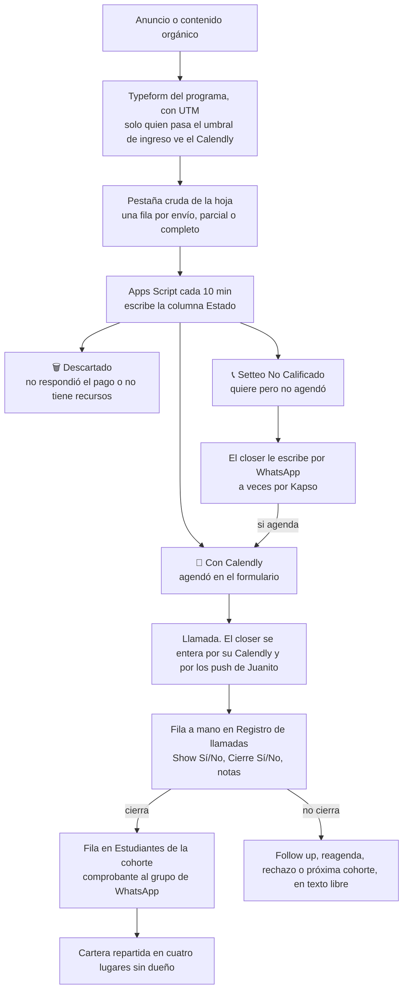
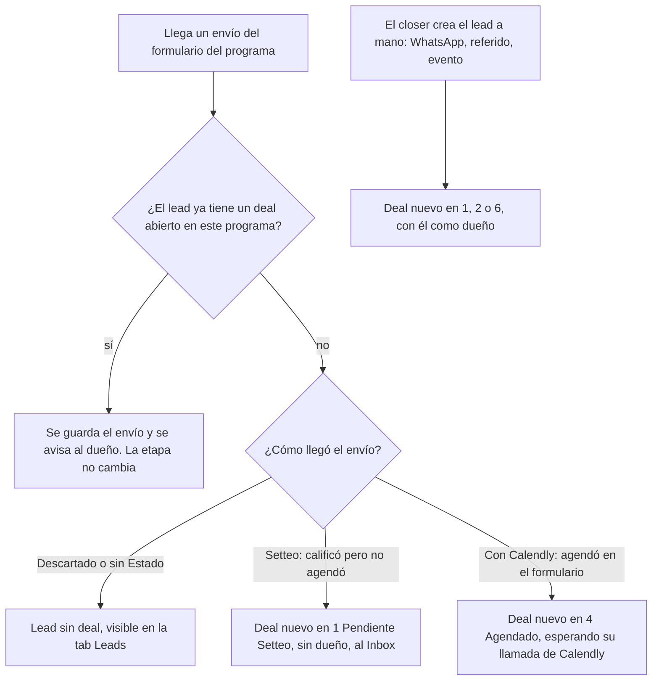
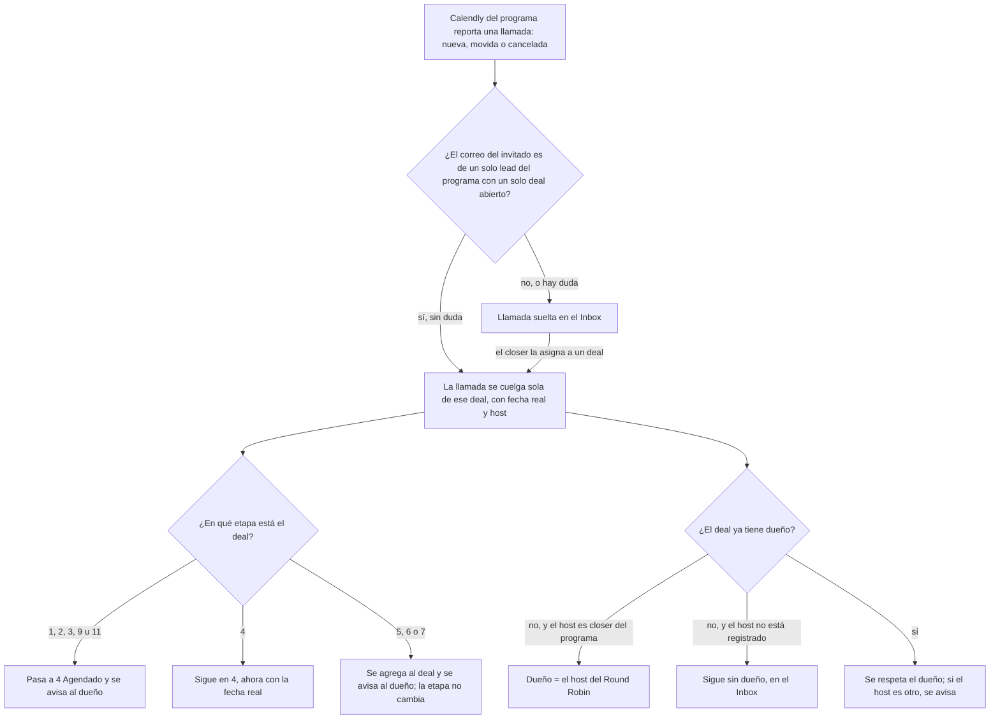
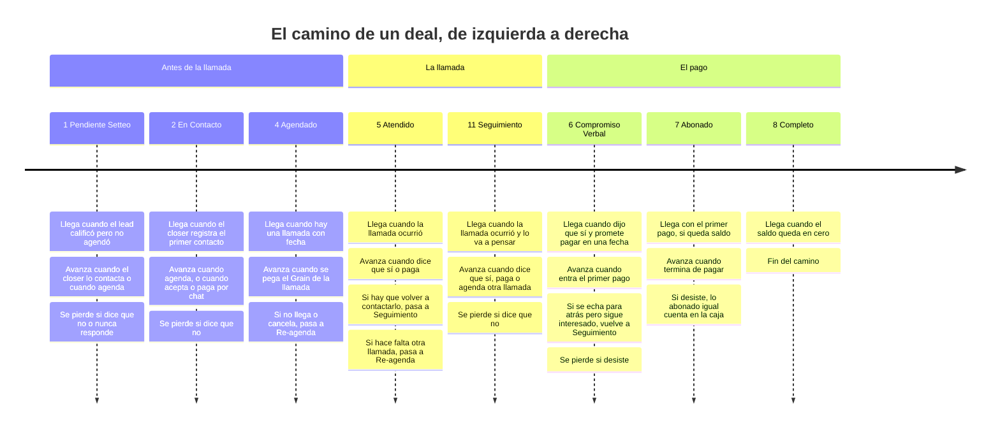
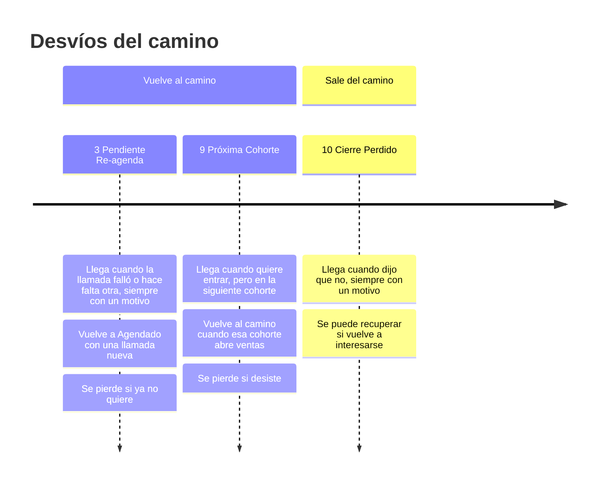
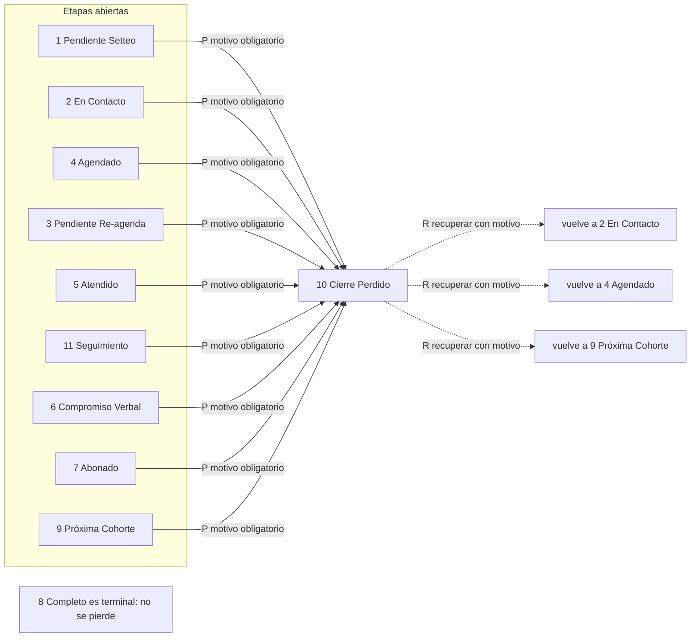
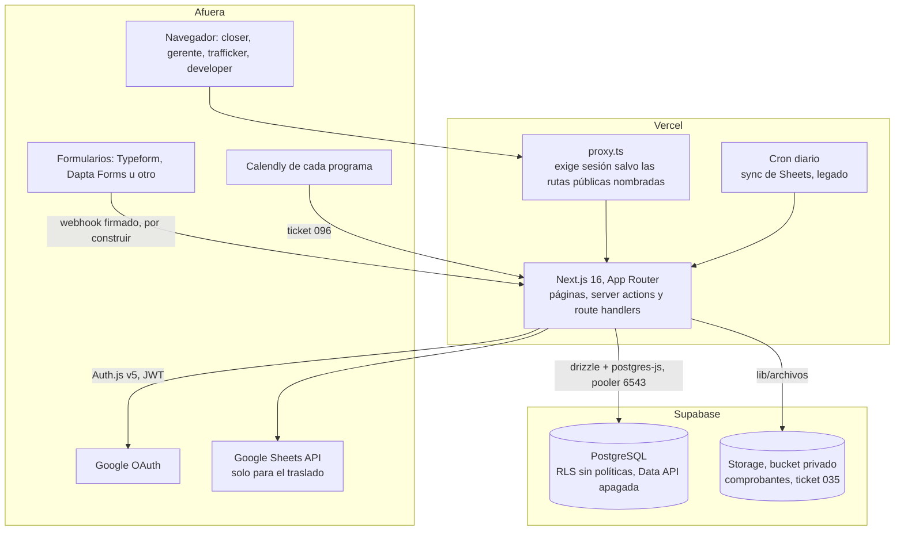
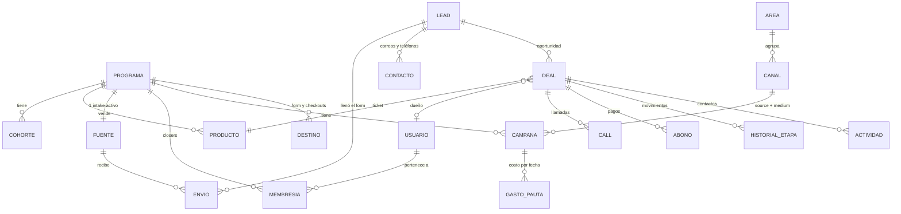
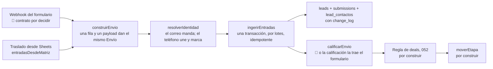

# Structure del CRM de Retia

Los diagramas de flujo y los componentes estructurales, técnicos y operacionales. Qué es el producto
y para quién: [`overview.md`](./overview.md). Cómo se opera: [`operations.md`](./operations.md). En
qué orden se construye: [`plan.md`](./plan.md). El porqué de cada decisión: [`adr/`](./adr/README.md).

Consolidado el 27-sep-2026. Leyenda: ✅ decidido · 🟡 propuesta · 🔴 falta decidir · 🩸 dato medido que
hay que tener presente.

| § | Qué hay |
|---|---|
| 1 | La operación de hoy, la que el CRM reemplaza |
| 2 | La operación con el CRM: entrada de un lead y llamadas de Calendly |
| 3 | El motor de etapas y la tabla de transiciones |
| 4 | La arquitectura técnica |
| 5 | El modelo de datos |
| 6 | La ingesta |
| 7 | La atribución: UTM, canales, campañas y el builder |
| 8 | Pantallas, roles y quién ve qué |
| 9 | El sistema de diseño "Tinta" (obligatorio antes de tocar una pantalla) |
| 10 | El mapa de las hojas de Sheets |
| 11 | La migración de lo que hay en Sheets |

---

## 1. La operación de hoy (lo que el CRM reemplaza)

Reconstruida el 20-sep leyendo las dos hojas completas y los Apps Script de cada una, y corregida con
lo que dijeron los closers el 24-sep. Solo agregados, sin datos personales.

**Las reglas del Apps Script** (idénticas en los dos programas; el ingreso no lo mira el script, lo
mira el Typeform al decidir quién ve el Calendly):

1. No respondió la pregunta de pago → 🗑️ Descartado.
2. Respondió "no cuento con los recursos" → 🗑️ Descartado.
3. Trae link de Calendly → 📅 Con Calendly (en Tactical "Con Calendly (Juanito)"). No se copia a
   ninguna pestaña.
4. Todo lo demás → 📞 Setteo No Calificado, copiado a la pestaña de Setteo, deduplicado por correo o
   teléfono. Si ya estaba, se marca "Ya estaba" y la fila nueva, con su UTM, se pierde.

**Lo que muestran los datos** (Tactical, 20-sep, salvo que se diga otra cosa):

| Paso | Qué pasa | 🩸 El dolor |
|---|---|---|
| Formulario | 3.949 filas: Descartado 52%, Setteo 39%, Con Calendly 9%. Typeform escribe la fecha en **UTC** (cinco horas adelante de Bogotá) | 1.152 filas son parciales con fecha `1/1/0001`; 193 correos solo existen como parcial (abandonos contactables) |
| Re-envíos | 245 correos enviaron más de un formulario completo; 29 pasaron de Descartado a Setteo y 9 de Setteo a Calendly | el script ignora el segundo envío: ~50 notas de closers tipo "ya había agendado" |
| Identidad | 37 teléfonos con más de un correo | el script deduplica por correo **o** teléfono y puede suprimir a otra persona |
| Setteo | reparto por turno fijo en el código (ciego a la carga y a quién está activo); en ComunicArte otro modelo, "Closer asignado" | el turno está desactualizado y nadie lo sigue (closers, 24-sep); solo la mitad del Setteo tiene algún registro |
| Llamada | el closer la registra a mano; categorías de no cierre (FIN, FIT, FU, RD, PRA) casi sin usar | solo el 53% de los Calendly de Tactical termina con fila; `si`, `Si` o `no ` no cuentan porque el KPI busca `Sí` exacto |
| Venta | la verdad de "cuántas ventas" vive en Estudiantes, no en el registro | Tactical: 29 cierres registrados contra 56 estudiantes; ComunicArte: 51 contra 60. Jero: 10 estudiantes y 0 llamadas |
| Cartera | lo que se debe vive en cuatro lugares (columna Cartera, notas, `Cash collected` contra `Precio final`, pestaña de Hotmart) | nada marca una cuota como pagada |
| Atribución | el origen de una venta es un `VLOOKUP` por correo hacia la hoja madre; el ROAS por cohorte se calculaba a mano | un correo mal escrito rompe el vínculo; el semáforo `🚨 Urgencias` mide registros y agendas, no ventas |

Llamadas registradas al 20-sep: Tactical 184 (show 55,4%, cierre 28,4% sobre shows) y ComunicArte 235
(show 43,8%, cierre 49,5%). Andrea hacía el 66% de las llamadas de Tactical y el 76% de las de
ComunicArte.

**El incidente que justifica la ingesta idempotente:** entre el 27-ago y el 4-sep, 462 leads de
Tactical etiquetados como Setteo nunca se copiaron a su pestaña. Nadie se enteró hasta que se revisó a
mano.

**Herramientas alrededor, fuera del CRM:** Calendly (una cuenta por closer y por programa), Grain
(graba todas las llamadas), Juanito (recordatorios de las llamadas; falla en los push), Kapso
(WhatsApp y masivos a descartados), etiquetas de WhatsApp Business (etapas paralelas de cada closer).

---

## 2. La operación con el CRM

### 2.1 Cómo entra un lead y cómo nace un deal

Todo empieza en **un solo evento**: el envío del formulario. La agenda de Calendly no es una entrada
aparte: el Typeform le muestra el Calendly al que califica, así que un envío puede llegar ya agendado.

| Caso | Qué pasa | Decidido en |
|---|---|---|
| Envío Setteo, lead sin deal abierto | deal en 1, sin dueño, al Inbox | ADR 0037 |
| Envío Con Calendly, lead sin deal abierto | deal en 4 Agendado | ADR 0037, 0049 |
| Envío Descartado o sin Estado | lead sin deal | ADR 0037 |
| Nuevo envío de un lead con deal abierto | se guarda, se avisa al dueño, la etapa no cambia | ADR 0037 |
| Envío parcial y luego su completa | se guardan los dos; la completa manda | ADR 0036 |
| Teléfono igual, correo distinto | se une al lead existente y se marca para revisión | ADR 0035 |
| Lead a mano | nace en 1, 2 o 6 con dueño = quien lo crea; no genera envío | ADR 0044 |
| El lead vuelve a aplicar con su deal cerrado | deal nuevo; la ficha muestra los anteriores | ADR 0037 |
| Lead que ya existía antes del corte | no abre deal por la ingesta: entra con la migración, con su estado de gestión | ADR 0037 |

🔴 Quién produce el "Estado" (Descartado, Setteo, Con Calendly) está abierto: `plan.md` §7, A1.

### 2.2 Cómo se cuelga cada llamada de su deal (Calendly)

Un solo objetivo: poner cada llamada en su deal sin trabajo manual. **No es forzosa: si hay duda, la
llamada queda suelta** y un closer la asigna (ADR 0049).

- Se empareja **solo por correo**, nunca por teléfono (el lead a veces pone un teléfono en el
  formulario y otro en la agenda).
- 🟡 Si la llamada llega antes que el envío, queda suelta y se reintenta cuando llega el envío.
- 🔴 De quién es el deal si el host es otra closer que la que ya lo trabajaba: no se alcanzó a
  preguntar.
- 🔴 Webhook (tiempo real, exige plan Standard de Calendly) o consulta periódica (cada 15 minutos exige
  Vercel Pro); dónde vive la credencial de cada programa.
- Sin la integración, el closer crea la llamada con fecha y link a mano y el modelo funciona igual.

---

## 3. El motor de etapas

Un deal está siempre en una sola etapa, y **solo `moverEtapa()` la cambia** (ADR 0037). La etapa se
pinta siempre con el mismo tono (§9).

| # | Etapa | Entra cuando | La mueve | Tono |
|---|---|---|---|---|
| 1 | Pendiente Setteo | calificó pero no agendó, o deal a mano | sistema / closer | `neutro` |
| 2 | En Contacto | el dueño registra el primer contacto | closer | `neutro` |
| 4 | Agendado | hay una llamada con fecha | sistema / closer | `info` |
| 3 | Pendiente Re-agenda | la llamada falló o hace falta otra, siempre con motivo | sistema / closer | `alerta` |
| 5 | Atendido | la llamada ocurrió (se pegó el Grain) | sistema | `info` |
| 11 | Seguimiento | la llamada ocurrió y hay que volver a contactarlo | closer | 🔴 sin tono asignado |
| 6 | Compromiso Verbal | dijo que sí: producto y fecha límite de pago | closer | `alerta` |
| 7 | Abonado | entró el primer pago y queda saldo | sistema | `exito` |
| 8 | Completo | saldo en cero | sistema | `exito` |
| 9 | Próxima Cohorte | quiere entrar en la siguiente (con cohorte destino) | closer | `neutro` |
| 10 | Cierre Perdido | dijo que no; motivo obligatorio | closer | `peligro` |

El número es un nombre, **no el orden**: Re-agenda (3) viene después de Agendado (4), y Seguimiento
(11) después de Atendido (5).

### 3.1 La tabla de transiciones ✅ (adoptada por Mani el 24-sep)

"Sistema" = el CRM mueve el deal cuando pasa el evento; "closer" = lo mueve una persona y el motor exige
el requisito antes de aceptar. La implementa el ticket 043.

| Id | De → a | Qué la dispara | Quién | Requisito | Por qué existe |
|---|---|---|---|---|---|
| T1 | 1 → 2 | primer contacto registrado | closer | deal con dueño; actividad con fecha y canal | reemplaza `Registro 1-5`: prueba que alguien lo trabaja |
| T2 | 1 → 4 | llega la agenda de Calendly, o el closer crea la llamada | sistema / closer | llamada con fecha | 🩸 9 leads de Setteo agendaron solos y la hoja no lo vio |
| T3 | 2 → 4 | el contacto consigue la agenda | sistema / closer | llamada con fecha | es el objetivo del setteo |
| T4 | 2 → 6 | acepta por chat, sin llamada | closer | producto + fecha límite de pago | existen ventas sin llamada (Jero: 10 estudiantes, 0 llamadas) |
| T5 | 2 → 7 u 8 | paga por chat de una vez | sistema, al registrar el abono | producto + abono con comprobante | no inventar un Compromiso de cero minutos |
| T6 | 3 → 4 | se crea una llamada nueva con fecha | sistema / closer | llamada con fecha | la cita fallida se reprogramó |
| T7 | 3 → 5 | se pega el Grain de una llamada que sí ocurrió | sistema | Grain (o "sucedió") | corrige un no-show mal marcado |
| T8 | 4 → 3 | la llamada queda en no-show o cancelada | sistema | el resultado es el motivo | la cita falló y tiene que quedar a la vista |
| T9 | 4 → 4 | la cita se mueve antes de ocurrir | sistema | llamada vieja `reagendada` + nueva con fecha | mover una cita no es avanzar ni retroceder |
| T10 | 4 → 5 | se pega el Grain | sistema | Grain (o "sucedió" para el caso raro sin grabar) | el Grain es la prueba de que la llamada ocurrió |
| T11 | · | reemplazada el 24-sep por Seguimiento (T24) | · | · | · |
| T12 | 5 → 6 | dijo que sí, paga después | closer | producto + fecha límite de pago (ADR 0053) | sin fecha no hay compromiso que vigilar |
| T13 | 5 → 7 | pagó en la llamada y queda saldo | sistema, al registrar el abono | producto + abono con comprobante | la etapa la mueve la plata |
| T14 | 5 → 8 | pagó todo en la llamada | sistema | abono igual al precio | mismo principio |
| T15 | 6 → 11 | el sí se echa para atrás pero sigue interesado | closer | motivo | vuelve a donde se re-contacta |
| T16 | 6 → 7 | primer abono, queda saldo | sistema | abono con comprobante | la plata cumple el compromiso |
| T17 | 6 → 8 | paga todo de una vez | sistema | abono igual al precio | igual que T14 |
| T18 | 7 → 8 | la suma de abonos llega al precio | sistema | saldo en cero | Completo es un hecho contable |
| T19, T20, T21 | 2, 5 o 6 → 9 | quiere entrar, pero a la siguiente cohorte | closer | **cohorte destino** | sin cohorte destino la etapa se vuelve un cementerio |
| T22 | 9 → 2 | la cohorte destino abre ventas y el closer lo recontacta | closer | contacto nuevo | el deal reaparece en el Inbox cuando su cohorte abre |
| T23 | 9 → 4 | agenda para la nueva cohorte | sistema / closer | llamada con fecha | igual que T2 |
| T24 | 5 → 11 | la llamada ocurrió y hay que volver a contactarlo | closer | fecha de seguimiento | separa lo que salió bien de lo que hay que re-contactar |
| T25 | 11 → 6 | en el seguimiento dijo que sí | closer | producto + fecha límite | igual que T12 |
| T26 | 11 → 7 u 8 | en el seguimiento pagó | sistema, al registrar el abono | abono con comprobante | la etapa la mueve la plata |
| T27 | 11 → 4 | se agenda otra llamada | sistema / closer | llamada con fecha | una segunda llamada es parte del mismo deal |
| T28 | 11 → 9 | quiere la siguiente cohorte | closer | cohorte destino | igual que T19 |
| T29 | 5 → 3 | la llamada no alcanzó y hace falta otra | closer | **motivo** | "si falla y no cierra, pasa a Re-agenda con motivo; no se duplica el deal" (Mani) |
| P | 1 a 7, 9 y 11 → 10 | dijo que no, no responde o desistió | closer | **motivo obligatorio** | Cierre Perdido cuenta en el embudo |
| R | 10 → 2, 4 o 9 | se recupera un perdido | closer | motivo | a 5-8 solo se entra por un evento (Grain, abono) |
| A1 | 7 → la etapa previa | se anula el único abono | sistema | anulación con motivo | si el abono no existe, Abonado tampoco |
| A2 | 8 → 7 | se anula un abono y vuelve a quedar saldo | sistema | anulación con motivo | igual que A1 |

Anular el deal entero no es una flecha: es una marca aparte que lo saca de todas las métricas, esté en
la etapa que esté (ADR 0038). Las reglas generales (un deal muchas llamadas, la conversión cuenta deals
distintos, no hay relojes, ninguna regla compara números de etapa) están en el ADR 0037.

### 3.2 "¿Cómo terminó?": lo que pasa después de cada llamada

Después de pegar el Grain, una sola pregunta con seis botones. No existe "no cerró" sin decir qué sigue.

| Botón | El deal pasa a | Se exige | Categoría vieja de la hoja | Id |
|---|---|---|---|---|
| Pagó ahora | 7 Abonado u 8 Completo | producto + abono con comprobante | · | T13, T14 |
| Compromiso | 6 Compromiso Verbal | producto + fecha límite de pago | FU con fecha | T12 |
| Seguimiento | 11 Seguimiento | fecha de seguimiento | FU-1 a FU-5 | T24 |
| Otra llamada | 3 Pendiente Re-agenda | motivo | PRA | T29 |
| Próxima cohorte | 9 Próxima Cohorte | cohorte destino | a veces FIN | T20 |
| Perdido | 10 Cierre Perdido | motivo | FIN, FIT, RD | P |

Qué le hace cada **resultado de llamada** al deal: ADR 0015.

---

## 4. La arquitectura técnica

**Stack:** Next.js 16 (App Router; `middleware.ts` se llama `proxy.ts`), React, TypeScript, Drizzle
sobre `postgres-js`, Supabase (PostgreSQL y Storage), Auth.js v5 con sesiones JWT, shadcn/ui sobre Base
UI, zod en el borde, Vitest con PGlite, npm.

### 4.1 Las piezas del código

| Módulo | Qué contesta | Estado |
|---|---|---|
| `lib/auth/` | quién es la sesión y qué puede: `roles.ts` (`esAccesoTotal`, `esAdministrador`, `trabajaLeads`), `guards.ts`, `page-guards.ts`, `vista.ts` (`rolDeVista`), `revalidacion.ts`, `origen.ts` | ✅ · falta `manejaPauta` (102) y la función de alcance por programa (094) |
| `lib/catalogo/` | el molde de toda entidad configurable: esquema zod, crear, editar, desactivar, `borrarSiNoSeUso`, `exigirAccesoAlPrograma` | ✅ · faltan áreas, canales, campañas, destinos |
| `lib/ingesta/` | la puerta única de entrada de leads: `construirEnvio`, `entradasDesdeMatriz` (Sheets), `resolverIdentidad`, `ingerirEntradas`, `calificarEnvio` | ✅ código · falta el adaptador del webhook |
| `lib/crm/rastro.ts` | escribir con rastro: `crearConRastro`, `editarConRastro` | ✅ |
| `lib/deals/etapas.ts` · `requisitos.ts` · `mover-etapa.ts` | la tabla de transiciones (043), lo que le falta a un deal (044), y `moverEtapa()` y `abrirDeal()`, los únicos escritores de la etapa (045, 047), vigilados por un guardián (046) | ✅ 27-sep |
| `lib/queries/vigente.ts` | qué registros cuentan: `vigente`, `incluyendoAnulados` | ✅ |
| `lib/queries/saldo.ts` | lo abonado y el saldo, una sola definición | ❌ lo recrea el 060 |
| `lib/atribucion/emparejar.ts` | a qué canal, campaña y área pertenece un envío | ❌ ticket 085 |
| `lib/archivos/` | guardar y servir comprobantes | ❌ ticket 035 |
| `lib/closers/identidad.ts` | si dos textos son el mismo closer (histórico) | ✅ |
| `lib/db/` | el esquema, la conexión, `ejecutarJuntas`, los códigos de error de Postgres | ✅ |
| `lib/format.ts`, `lib/dias-habiles.ts`, `lib/rangos.ts` | formato de números y fechas de Bogotá, días hábiles, rangos del dashboard | ✅ |
| `lib/sheets/` | el sync de Sheets y su lectura | legado: se retira tras el traslado (decisión A6 del plan) |
| `components/ui/` · `components/admin/` · `components/resources/` | primitivas visuales y pantallas por dominio (ADR 0033) | ✅ |

**Reglas que cumple toda mutación nueva** (salen de la auditoría del 19-sep, que encontró las dos
violaciones en el MVP):

- **El alcance se valida en el servidor, antes de escribir:** que el actor pueda tocar ese programa y
  que el registro pertenezca al programa. El objetivo sale de la sesión, nunca del input.
- **Leer, decidir y escribir van en la misma transacción** (por ejemplo, validar el saldo y registrar
  el abono), o dos peticiones simultáneas aprueban lo mismo.
- **Ningún historial ni lista crece sin tope en una pantalla:** carga por lotes o bajo demanda.
- **Las fechas de negocio pasan por `lib/format.ts`**; nunca `toISOString().slice(0,10)`.

**Los guardianes** (tests que recorren el código y fallan si alguien rompe una regla sin darse cuenta)
están en la tabla de contratos de `AGENTS.md`: vigencia, rastro, rol de vista, identidad del closer,
contrato de extensión, borrar del catálogo, base portable y RLS en todas las tablas.

---

## 5. El modelo de datos

Contrastado contra `lib/db/schema.ts` el 27-sep.

| Existe ✅ | Le falta algo | No existe ❌ |
|---|---|---|
| `programs`, `cohorts`, `users`, `miembros_programa`, `leads`, `lead_contactos`, `submissions`, `deals`, `deal_etapa_historial`, `deal_actividades`, `calls`, `abonos`, `cuotas_pactadas` (quieta en v1), `productos`, `plataformas_pago`, `plataformas_programa`, `motivos`, `origenes`, `recursos`, `categorias_recurso`, `enlaces_pago`, `sources`, `ad_spend`, `change_log`, `sync_runs` | `sources`: identificador del formulario y un tipo webhook (hoy `tipo_fuente` solo admite `google_sheet` y `upload`) · `deals`: la etapa Seguimiento (043), nota y fecha límite de pago (061) · `calls`: el closer como FK (057), id del evento de Calendly y host (096) · `abonos`: FK a quien registró (060) · membresía: cuenta de Calendly por programa (096) · `programs`: `form_url` (092) y tasa de comisión (062) · `leads`: `traido_por_user_id` (086) | áreas (083), campañas (084), canales (101), destinos (092). `ad_spend` guarda la campaña como texto hasta el 084 |

Students e Inbox son **vistas**, no tablas. `leads` todavía guarda sus propios `utm_*`, que repiten los
del envío (decisión D5 del plan).

---

## 6. La ingesta

- **La frontera del programa se hace cumplir al escribir:** una entrada con una fuente de otro programa
  se rechaza con 422 y no se escribe nada.
- **El resumen del lead se recalcula desde sus envíos** cada vez que llega uno nuevo (la parcial deja al
  lead incompleto y la completa lo corrige).
- **Calificación (T2, construida):** las cuatro reglas del Apps Script, configuradas por fuente en
  `sources.calificacion`, validadas contra 6.400 envíos del histórico (6.397 coinciden). Sin
  configuración no se califica y queda reportado; nunca se asume una respuesta vacía.
- **Puntaje (T4):** el motor existe y **no tiene pesos**, a propósito: no hay datos de venta con qué
  calibrarlos, y correlacionar con "tiene Calendly" mediría el umbral contra sí mismo. Un peso escrito a
  ojo se ve igual que uno calibrado.

---

## 7. La atribución

**La convención de UTM** (ADR 0051): tres se leen (`utm_source` la plataforma, `utm_medium` el tipo de
tráfico, `utm_campaign` la campaña) y dos se capturan (`utm_content`, quién o qué pieza según el
canal; `utm_term`, variante libre). Minúsculas y `snake_case`. Ningún link se arma a mano: sale del
builder.

**Catálogo inicial de canales** 🟡 (sale de los valores reales de las hojas; el área la confirma Alejo y
la convención se cierra con Pauta):

| Canal | `utm_source` | `utm_medium` | Área propuesta |
|---|---|---|---|
| Meta Ads | `facebook` | `cpc` | Pauta |
| TikTok Ads | `tiktok` | `cpc` | Pauta |
| Google / YouTube Ads | `google` | `cpc` | Pauta |
| Instagram bio / linktree | `instagram` | `bio` | Media |
| Instagram stories | `instagram` | `stories` | Media |
| TikTok orgánico | `tiktok` | `organic` | Media |
| YouTube orgánico | `youtube` | `organic` | Media |
| Lead magnet | `leadmagnet` | `pdf` | 🔴 Media o Pauta |
| Closer | `closer` | `referido` | Comercial |
| WhatsApp masivo (Kapso) | `whatsapp` | `masivo` | 🔴 Comercial o Gerencial |
| Juanito / automatizado | 🔴 | 🔴 | 🔴 pregunta para Michael |

🩸 Los pares reales que traían las hojas: `facebook / cpc`, `direct / organic`,
`instagram rosario / linktree`, `instagram milena / linktree`, `instagram rosario / stories`,
`leadmagnetdiagnostico / pdf`. Se clasifican hacia atrás con reglas del canal; el crudo no se reescribe.

**El builder v1:**

| Sección | En Retia |
|---|---|
| Destino | catálogo del programa: la URL del formulario y las de checkout |
| Origen | el Canal: fija source y medium y muestra el área |
| Campaña | catálogo de campañas del programa, creado en el CRM |
| Opcional | `utm_content` y `utm_term`, con "usar fecha de hoy" |
| URL final | se copia; no se guarda, se calcula |

Lo usan el gerente y el paid trafficker. El closer tiene "Mi link", ya prellenado. Crear una campaña
escribe su regla de clasificación en la misma operación. El emparejamiento es determinista (gana el
patrón más específico, un empate es un error visible, ADR 0045) y las dos cubetas de huérfanos, **sin
UTM** y **sin clasificar**, se muestran siempre con su conteo y su porcentaje.

---

## 8. Pantallas, roles y quién ve qué

Tabs a la izquierda, un selector de programa arriba (ADR 0050). El contenido de cada tab se afina al
construirla.

| Tab | Qué es | Filtros clave |
|---|---|---|
| **Inbox** | reemplaza "Mi día": deals sin dueño (Setteo ordenado), llamadas sueltas y lo que necesita atención | tipo de pendiente, antigüedad |
| **Dashboard** | un programa o "todos los programas" (solo lo sumable) | programa, fechas, cohorte, closer, área, canal, campaña |
| **Leads** | la base de personas del programa, con o sin deal | estado de llegada, canal, área, campaña, traído por, parcial, con o sin deal |
| **Deals** | Kanban por etapas y vista de tabla | etapa, dueño, cohorte, canal, antigüedad, "necesita atención" |
| **Calls** | llamadas de hoy y próximas, sin resultado, sueltas | closer, resultado, fecha |
| **Students** | estudiantes por cohorte: saldo, acuerdo de pago, fecha límite, cartera vencida, onboarding | cohorte (por defecto la activa), saldo, vencida |
| **Campañas** | catálogo de campañas, gasto y builder | canal, área, cohorte |
| **Programs** | ficha del programa: cohortes, destinos, Calendly, fuente, comisión, equipo | · |
| **Products** | productos y precios | · |
| **Resources** | brochures y links de pago | categoría |
| **Ajustes** | usuarios, membresías y su Calendly por programa, catálogos, fuentes, áreas, canales | · |
| **Nerd Stats** | salud del sistema y bitácora (solo developer) | · |

| Tab | Closer | Gerente | Paid Trafficker | Developer |
|---|---|---|---|---|
| Inbox | lo suyo + sin dueño de sus programas | todo el programa | · | todo |
| Dashboard | sus programas, completos | todos | 🔴 ¿solo la pauta de sus programas? | todo |
| Leads, Deals, Calls, Students | sus programas | todos | · | todo |
| Campañas | "Mi link" | todo | crea campañas y links de sus programas | todo |
| Programs | lectura de los suyos | edita | · | todo |
| Products | edita en sus programas | edita | · | todo |
| Resources | lee y crea en sus programas | edita | · | todo |
| Ajustes | catálogos permitidos | todo | · | todo |
| Nerd Stats | · | · | · | solo él |

Esconder una tab no es seguridad: cada ruta y cada server action valida en el servidor, y se prueba
forjando la petición.

**Las fichas.** La del Deal muestra su lead, sus llamadas, abonos, acuerdo de pago e historial, y es
donde se cierra una llamada en un clic ("¿Cómo terminó?"). La del Lead muestra todos sus envíos con lo
que cambió entre uno y otro, sus contactos, sus deals abiertos y cerrados, y un aviso si el correo está
en otro programa. Cada tarjeta lleva a su lista ya filtrada.

**El Dashboard** (qué va, 🟡 el layout):

| Pedido | Sección | ¿Se suma en "todos los programas"? |
|---|---|---|
| Cierres | ventas, % de cierre, % de show, embudo por etapa, tiempo en etapa | solo el número de ventas |
| Por closer | llamadas, show, cierres, caja, comisión, contribución a la cohorte | no |
| Por área | leads, deals y ventas por área | sí, los conteos |
| Origen | por canal y campaña: registros, agendas, ventas; las dos cubetas de huérfanos | sí, los conteos |
| Flujo de caja | caja por fecha de abono, saldo por cobrar, cartera vencida | sí (todo en USD) |
| Inversión | gasto, CPL, costo por agenda, CAC, ROAS por campaña y cohorte | el gasto sí; lo demás por programa |

También entran una réplica del semáforo `🚨 Urgencias` de la hoja (agendas de ayer, promedio de 7 días,
desglose por canal; ticket 066) y el ROAS por cohorte (067).

---

## 9. El sistema de diseño "Tinta"

**Obligatorio antes de tocar cualquier pantalla. Manda sobre cualquier estilo escrito en una
pantalla:** si una pantalla necesita algo que esto no cubre, se agrega aquí y en los tokens. Vigente
desde el 23-sep (elegido por Alejandro entre Pizarra, Tinta y Cabina); paleta de la agencia del mismo
día (Daniel Tovar): blanco, negro y morado.

**La idea:** el marco es tinta, el trabajo es la hoja. La barra lateral es negra en los dos temas; el
contenido va sobre un gris muy claro y cada bloque es una hoja blanca. Es la estructura que el equipo
conoce de HubSpot, a propósito.

**Dónde vive:**

| Pieza | Archivo |
|---|---|
| Tokens (color, sombra, radio, fuentes) | `app/globals.css` |
| Marco (barra lateral) | `components/app-sidebar.tsx`, con `data-zona="marco"` |
| Hoja (encabezado + contenido) | `components/page-shell.tsx` |
| Firma de la app | `components/marca.tsx` |
| Tarjeta, botón, badge, select, menú | `components/ui/*` (shadcn sobre Base UI) |

El selector de programa (ADR 0050) vive arriba de la barra, dentro del marco, y sigue la regla 7.

**Las reglas:**

1. **Ninguna pantalla escribe un color, una sombra ni un radio a mano.** Nada de `#hex`, `bg-green-500`
   ni `shadow-[...]` en `app/` o `components/` fuera de `components/ui/`. Se usa el token
   (`bg-card`, `text-muted-foreground`, `bg-primary`, `shadow-tarjeta`, `bg-tono-alerta-suave`). Si falta
   uno, se crea en `globals.css` con su versión clara **y** oscura.
2. **Un solo acento: el morado de la agencia** (`marca` y `primary`): `#820AD1` sobre blanco y el lila
   `#B57BFF` sobre negro. La pantalla no elige cuál: usa el token y el fondo decide. Es para la acción
   principal, lo seleccionado, el foco del teclado y la firma; su versión suave (`secondary`, `accent`,
   `marca-suave`) para el botón secundario, el hover y el ítem activo del marco. **No para decir
   "éxito"**: eso es el tono `exito`, verde, porque es un estado.
3. **Los tonos de estado son semánticos:** `neutro`, `info`, `alerta`, `exito`, `peligro`, cada uno con su
   versión suave, por `<Badge variant>`. No cuentan como acento.
4. **Toda cifra que se compare va en `cifra`** (Geist Mono, dígitos de ancho fijo): KPI, columnas
   numéricas, saldos. El formato siempre es el de `lib/format.ts`: punto de miles, coma decimal, USD con
   dos decimales y la moneda al lado.
5. **Una tarjeta se separa con sombra, no con borde** (`shadow-tarjeta`). Lo que flota usa
   `shadow-flotante`. Una lista dentro de una tarjeta se separa con `divide-y`, no con más tarjetas.
6. **Radios:** `rounded-lg` (8 px) en controles y badges; `rounded-xl` (12 px) en tarjetas;
   `rounded-full` solo para píldoras y puntos.
7. **Lo que vive dentro del marco no se estiliza aparte:** `data-zona="marco"` redefine los tokens. Lo
   que se abre desde el marco sale en un portal con los tokens normales.
8. **Claro y oscuro son el mismo sistema:** todo token existe en `:root` y en `.dark`; una pantalla nunca
   pregunta por el tema.
9. **Movimiento: 150 ms y solo para estado** (`transition-colors duration-150`). Nada de animaciones de
   entrada en pantallas que se abren cien veces al día.
10. **Todo control interactivo tiene hover, foco visible y deshabilitado.** Sin foco visible no se
    mergea.

**Paleta:**

| Token | Claro | Oscuro | Para qué |
|---|---|---|---|
| `sidebar` | `#0a0a0a` | `#050505` | el marco |
| `background` | `#f6f4f9` | `#0a0a0a` | fondo de trabajo |
| `card` | `#ffffff` | `#141414` | la hoja |
| `foreground` | `#0a0a0a` | `#ededed` | texto principal |
| `muted-foreground` | `#6b6b6b` | `#a3a3a3` | texto secundario |
| `border` | `#e5e5e5` | blanco 8% | divisores |
| `primary` / `marca` | `#820ad1` | `#b57bff` | botón principal, selección, foco, firma |
| `marca-texto` | `#820ad1` | `#c9a3ff` | texto morado legible |
| `secondary` / `accent` | `#f3e8fc` | lila 14% | botón secundario, hover |
| `sidebar-primary` | `#b57bff` | `#b57bff` | el lila del marco |

Contraste: blanco sobre `#820ad1` da 7,2:1 y `#b57bff` sobre negro 6,8:1 (AA). El morado oscuro nunca va
sobre negro ni el lila sobre blanco.

**Tipografía:** Geist para la interfaz y Geist Mono solo para cifras (las carga `app/layout.tsx`).
Escala fija: `text-xs` etiquetas, `text-sm` cuerpo, `text-base` títulos de tarjeta, `text-lg` título de
pantalla, `text-2xl` valor de KPI. Pesos 400, 500 y 600 (700 solo la marca). Minúscula de oración
("Caja recaudada"), mayúsculas solo en las etiquetas de grupo del marco.

**Anulado no es una etapa:** se muestra tachado y en `muted-foreground`, nunca con un tono. Los tonos de
cada etapa están en la tabla de §3.

**Cómo se construye una pantalla nueva:**

1. Envolver en `<PageShell titulo descripcion acciones>`.
2. Resumen arriba (KPI en una grilla de 4), detalle abajo (tablas en tarjetas).
3. Estados en `<Badge variant>`, nunca un color suelto.
4. Números con `cifra` y el formato de `lib/format.ts`.
5. Estado vacío escrito (qué falta y cómo llenarlo), nunca una tarjeta en blanco.
6. Revisarla en claro **y** en oscuro, y abrir todo lo que se abre: cargar una pantalla no es probarla.

**Criterios de uso** (de los closers, 24-sep): el cierre de una llamada cuesta pegar el Grain y un clic;
nada que decida se teclea; utilidad sobre estética. 🔴 Uso desde el celular: no se alcanzó a preguntar.

**Lo que no se hace:** gradientes, vidrio, sombras de color; cambiar de íconos (`lucide-react`, trazo 2)
sin una razón de uso.

---

## 10. El mapa de las hojas de Sheets

Las dos hojas son la fuente del **traslado** único y de la **migración** de la etapa 7. Leídas con
`npm run descubrir` (19-ago) y barridas completas el 20-sep. Las URLs completas están en
`operations.md`. La cuenta de servicio con la que hay que compartir una hoja es
`retia-metrics-sync@retia-growth.iam.gserviceaccount.com` (proyecto `retia-growth`).

**Tactical Investor** · "Aplicación De Cero a Tactical Investor"

| Pestaña | Para qué sirve |
|---|---|
| `De Cero a Tactical Investor` | **el formulario**: la fuente de leads |
| `Registro de llamadas` | las llamadas registradas a mano |
| `📞 Setteo No Calificados` | la cola de setteo |
| `🗑️ Descartados` | descartados |
| `Estudiantes Cohort Julio` · `Septiembre Estudiantes Cohort` | matriculados de C1 y C2 |
| `ROAS COHORT JULIO` | pauta y atribución de C1 |
| `Cartera por cobrar Hotmart` | 3 personas con fecha en texto, sin monto ni estado |
| `Lead Magnet Ruta` | un diagnóstico con encabezados y cero filas (20-sep) |
| `Dashboard Registros` · `Visualización Dashboard` · `_kpis` · `_dashboard_data` · `🚨 Urgencias` | vistas calculadas: **no se leen** |
| `_ListasDropdown` | catálogos de la hoja (closers, categorías) |
| `Copia de 📞 Setteo No Calificados`, `BK_*` | duplicados y respaldos de julio: **no se leen**, inflan los conteos |

**ComunicArte** · "Aplicación Comunicarte BBDD"

| Pestaña | Para qué sirve |
|---|---|
| `New form` | **el formulario actual**: la fuente de leads (desde el 23-jul) |
| `Forms viejo` | el formulario anterior (20 al 22-jul): fuente inactiva; 55 personas solo existen ahí |
| `Registro de llamadas` | las llamadas registradas a mano (con encabezados corridos, ver §11) |
| `Estudiantes Agosto` · `Estudiantes Septiembre` | matriculados |
| `📞 Setteo No Calificados` · `🗑️ Descartados` | cola de setteo y descartados |
| `ROAS ESTUDIASTES AGOSTO` | pauta y atribución |
| vistas `_*`, `Dashboard*`, `🚨 Urgencias` | **no se leen** |

**Al leerlas:** hay emojis en los nombres de pestaña (el rango va entre comillas simples); el conteo de
filas de la API es del grid, no de datos; las pestañas que empiezan con `_` y las de dashboard son
derivadas y leerlas rompería el dedup; la fecha `Submitted At` de Typeform está en **UTC**
(`sources.tz_fechas`). La duplicación es muy distinta entre programas (ComunicArte ~5%, Tactical ~38%):
no se asume una tasa común.

---

## 11. La migración de lo que hay en Sheets

Dos pasos distintos, los dos por **la misma puerta de ingesta** (nunca con inserts crudos) y con su
rastro (ADR 0029):

1. **El traslado** de los leads y sus envíos desde la pestaña del formulario, con el Estado **tal como
   lo escribió la hoja** y la calificación del CRM al lado para compararla.
2. **La migración de las pestañas de gestión** (etapa E7, tickets 077 a 081): Setteo, Registro de
   llamadas, Estudiantes y `Forms viejo`. Se hace con el CRM completo, y termina con el apagado de
   esas pestañas (082).

**Casos que ya se sabe que van a pedir decisión** (del diseño del 20-sep):

- Setteo `En proceso` sin nota: ¿En Contacto igual?
- Registro con `Show = Sí, Cierre = No`: Atendido o Perdido según la categoría. `Show = No`: Re-agenda o
  Perdido.
- `Registro 1-5`: una actividad por nota, con fecha desconocida salvo la primera y la última (Tactical
  tiene `Fecha de ultimo contacto`, ComunicArte no).
- El `Origen` de Estudiantes es un `VLOOKUP` que da `#REF!` en septiembre: la atribución se **re-deriva**
  del envío del lead, no se copia.
- `Estudiantes Septiembre` de ComunicArte: una columna de fecha sin encabezado y un contador de filas que
  no son campos; 12 estudiantes de "cohorte pasada" entran en septiembre con una fila de historial
  "movido desde agosto".
- `Registro de llamadas` de ComunicArte tiene los encabezados corridos por un bug del `onEdit`: mapear
  por posición y por nombre, y revisar a mano.
- `_kpis` apunta a pestañas equivocadas: se leen las pestañas **con datos**, no las que nombra el script.
- Cobros en COP: se convierten a USD a la tasa del día de la migración (081).
- 🔴 Hasta cuántos días atrás vale migrar Setteo con deal.
- 🔴 Cuando los consolidados de C2 de Michael y la hoja difieran: la regla que usaron los consolidados
  fue *"si el reporte del equipo y la hoja no coinciden, manda el reporte; la hoja queda como nota"*.
  Confirmarla antes de migrar. Los consolidados (con el detalle fila por fila y sus discrepancias) están
  en git: `git show da68cdf:docs/insumos/historico-c2/comunicarte-c2-consolidado.md` y
  `…/tactical-investor-c2-consolidado.md`.
- Un registro de la hoja que no se entiende **no se anula** (de la hoja sí pasó): queda visible con su
  rareza.
