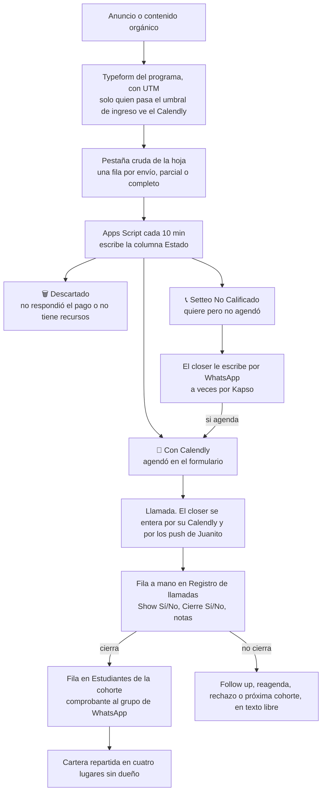
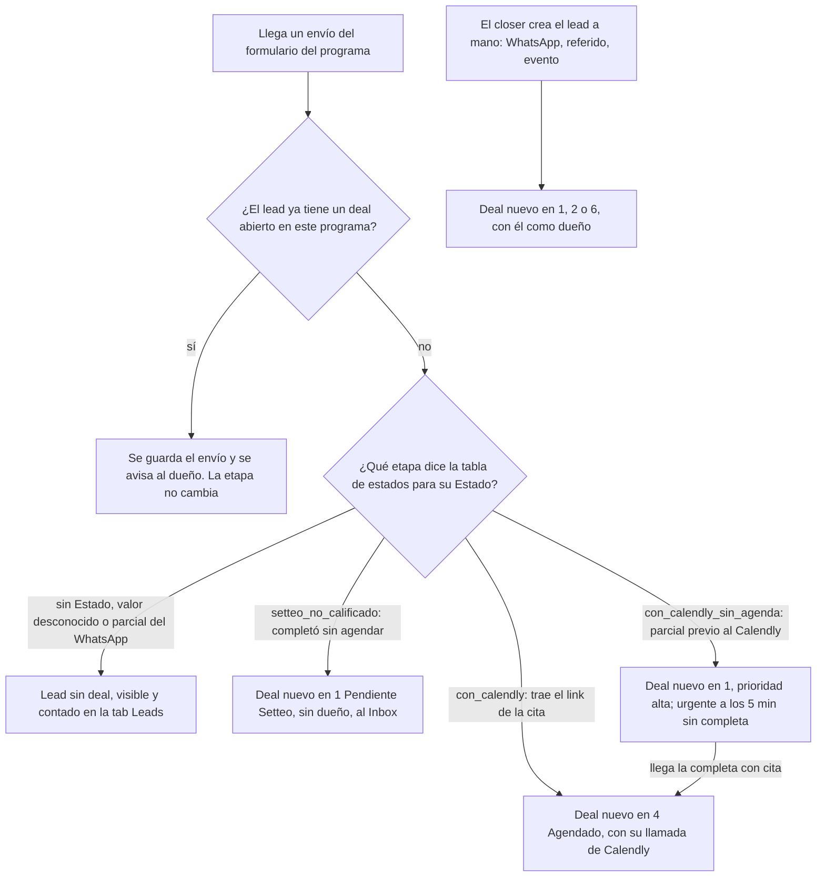
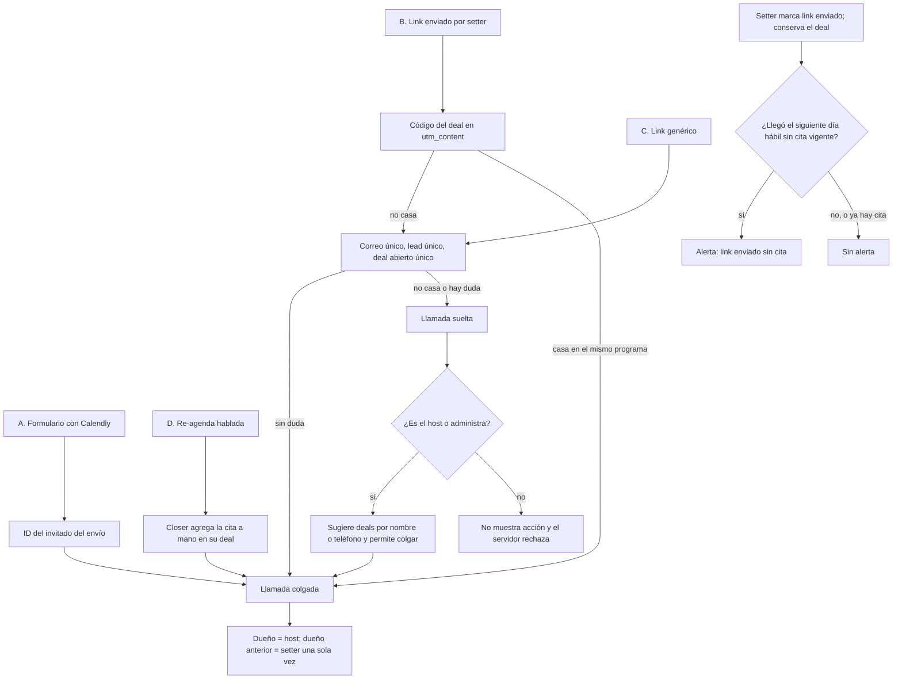
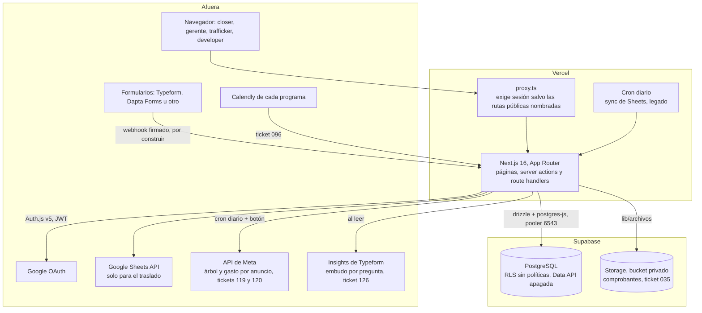
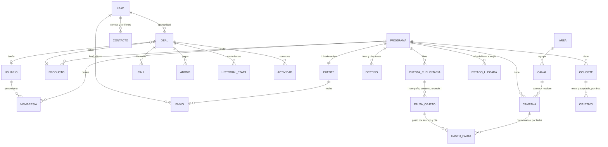
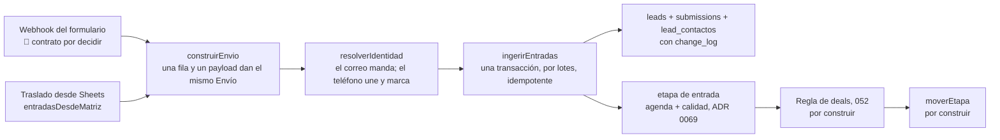

# Structure del CRM de Retia

Los diagramas de flujo y los componentes estructurales, técnicos y operacionales. Qué es el producto
y para quién: [`overview.md`](./overview.md). Cómo se opera: [`operations.md`](./operations.md). En
qué orden se construye: [`plan.md`](./plan.md). El porqué de cada decisión: [`adr/`](./adr/README.md).

Consolidado el 27-sep-2026. Leyenda: ✅ decidido · 🟡 propuesta · 🔴 falta decidir · 🩸 dato medido que
hay que tener presente.

| § | Qué hay |
|---|---|
| 1 | La operación de hoy, la que el CRM reemplaza |
| 2 | La operación con el CRM: entrada de un lead y llamadas de Calendly |
| 3 | El motor de etapas y la tabla de transiciones |
| 4 | La arquitectura técnica |
| 5 | El modelo de datos |
| 6 | La ingesta |
| 7 | La atribución: UTM, canales, campañas y el builder |
| 8 | Pantallas, roles y quién ve qué |
| 9 | El sistema de diseño "Tinta" (obligatorio antes de tocar una pantalla) |
| 10 | El mapa de las hojas de Sheets |
| 11 | La migración de lo que hay en Sheets |

---

## 1. La operación de hoy (lo que el CRM reemplaza)

Reconstruida el 20-sep leyendo las dos hojas completas y los Apps Script de cada una, y corregida con
lo que dijeron los closers el 24-sep. Solo agregados, sin datos personales.

**Las reglas del Apps Script** (idénticas en los dos programas; el ingreso no lo mira el script, lo
mira el Typeform al decidir quién ve el Calendly):

1. No respondió la pregunta de pago → 🗑️ Descartado.
2. Respondió "no cuento con los recursos" → 🗑️ Descartado.
3. Trae link de Calendly → 📅 Con Calendly (en Tactical "Con Calendly (Juanito)"). No se copia a
   ninguna pestaña.
4. Todo lo demás → 📞 Setteo No Calificado, copiado a la pestaña de Setteo, deduplicado por correo o
   teléfono. Si ya estaba, se marca "Ya estaba" y la fila nueva, con su UTM, se pierde.

**Lo que muestran los datos** (Tactical, 20-sep, salvo que se diga otra cosa):

| Paso | Qué pasa | 🩸 El dolor |
|---|---|---|
| Formulario | 3.949 filas: Descartado 52%, Setteo 39%, Con Calendly 9%. Typeform escribe la fecha en **UTC** (cinco horas adelante de Bogotá) | 1.152 filas son parciales con fecha `1/1/0001`; 193 correos solo existen como parcial (abandonos contactables) |
| Re-envíos | 245 correos enviaron más de un formulario completo; 29 pasaron de Descartado a Setteo y 9 de Setteo a Calendly | el script ignora el segundo envío: ~50 notas de closers tipo "ya había agendado" |
| Identidad | 37 teléfonos con más de un correo | el script deduplica por correo **o** teléfono y puede suprimir a otra persona |
| Setteo | reparto por turno fijo en el código (ciego a la carga y a quién está activo); en ComunicArte otro modelo, "Closer asignado" | el turno está desactualizado y nadie lo sigue (closers, 24-sep); solo la mitad del Setteo tiene algún registro |
| Llamada | el closer la registra a mano; categorías de no cierre (FIN, FIT, FU, RD, PRA) casi sin usar | solo el 53% de los Calendly de Tactical termina con fila; `si`, `Si` o `no ` no cuentan porque el KPI busca `Sí` exacto |
| Venta | la verdad de "cuántas ventas" vive en Estudiantes, no en el registro | Tactical: 29 cierres registrados contra 56 estudiantes; ComunicArte: 51 contra 60. Jero: 10 estudiantes y 0 llamadas |
| Cartera | lo que se debe vive en cuatro lugares (columna Cartera, notas, `Cash collected` contra `Precio final`, pestaña de Hotmart) | nada marca una cuota como pagada |
| Atribución | el origen de una venta es un `VLOOKUP` por correo hacia la hoja madre; el ROAS por cohorte se calculaba a mano | un correo mal escrito rompe el vínculo; el semáforo `🚨 Urgencias` mide registros y agendas, no ventas |

Llamadas registradas al 20-sep: Tactical 184 (show 55,4%, cierre 28,4% sobre shows) y ComunicArte 235
(show 43,8%, cierre 49,5%). Andrea hacía el 66% de las llamadas de Tactical y el 76% de las de
ComunicArte.

**El incidente que justifica la ingesta idempotente:** entre el 27-ago y el 4-sep, 462 leads de
Tactical etiquetados como Setteo nunca se copiaron a su pestaña. Nadie se enteró hasta que se revisó a
mano.

**Herramientas alrededor, fuera del CRM:** Calendly (una cuenta por closer y por programa), Grain
(graba todas las llamadas), Juanito (recordatorios de las llamadas; falla en los push), Kapso
(WhatsApp y masivos a descartados), etiquetas de WhatsApp Business (etapas paralelas de cada closer).

---

## 2. La operación con el CRM

### 2.1 Cómo entra un lead y cómo nace un deal

Todo empieza en **un solo evento**: el envío del formulario. La agenda de Calendly no es una entrada
aparte: el Typeform le muestra el Calendly al que califica, así que un envío puede llegar ya agendado.

| Caso | Qué pasa | Decidido en |
|---|---|---|
| Envío Setteo, lead sin deal abierto | deal en 1, sin dueño, al Inbox | ADR 0037 |
| Envío Con Calendly, lead sin deal abierto | deal en 4 Agendado | ADR 0037, 0049 |
| Envío sin Estado, o con un valor que la tabla del programa no tiene | lead sin deal, contado como "sin estado" | ADR 0061 |
| Parcial previo al Calendly (`con_calendly_sin_agenda`) | deal en 1 con prioridad alta; su completa con cita lo pasa a 4 | ADR 0061 |
| Parcial tras el WhatsApp, sin Estado | lead sin deal, "abandonó el formulario" | ADR 0061 |
| Nuevo envío de un lead con deal abierto | se guarda, se avisa al dueño, la etapa no cambia | ADR 0037 |
| Envío parcial y luego su completa | se guardan los dos; la completa manda | ADR 0036 |
| Teléfono igual, correo distinto | se une al lead existente y se marca para revisión | ADR 0035 |
| Lead a mano | su deal nace en En gestión con dueño = quien lo crea; no genera envío | ADR 0044, ADR 0071 punto 6 |
| Deal a mano ("Nuevo deal" del tablero) | sobre un lead del programa (o creado con el alta manual), nace en En gestión por `abrirDeal`, con quien lo crea como dueño; si el lead ya tiene deal abierto, se enlaza ese | ticket 140, ADR 0037, ADR 0071 punto 6 |
| El lead vuelve a aplicar con su deal cerrado | deal nuevo; la ficha muestra los anteriores | ADR 0037 |
| Lead que ya existía antes del corte | no abre deal por la ingesta: entra con la migración, con su estado de gestión | ADR 0037 |

**La etapa en que nace el deal la decide el CRM** con tres hechos del envío (ADR 0069, 2-oct; reemplaza al 0061): agendó → Agendado; `lead_quality` High → Calificado; completo con otra calidad o sin ella → Registrado; parcial → Potencial (`lib/ingesta/etapa-de-entrada.ts`). Ningún envío se queda sin deal (GC-27). La variable `estado` del formulario se guarda como llegó y ya no enruta. La pantalla de Estados de llegada se retiró (117, fase 2) y la tabla `estados_llegada` espera su migración sin que nadie la lea. Un formulario que deja de mandar `lead_quality` lo marca la salud de la fuente ("sin calidad"). "Agendó" es el hecho que pone el adaptador: la pregunta de agenda del mapeo trae un link de Calendly (ticket 106).

### 2.2 Cómo se cuelga cada llamada de su deal (Calendly)

Cada llamada entra por uno de cuatro caminos. Si ninguna llave basta, queda suelta. El host de
Calendly se queda con el deal y el dueño anterior conserva el crédito de setter (ADR 0076).

| Camino | Llave | Si no casa |
|---|---|---|
| A. Calendly del formulario | ID del invitado que trae el envío | Pendiente Setteo con nota del sistema |
| B. Link de agenda del deal | Código opaco del deal en `utm_content` | Sigue al camino C |
| C. Link genérico | Correo confirmado de un solo lead con un solo deal abierto | Queda suelta |
| D. Re-agenda hablada | El closer agrega la cita en el propio deal | No aplica |

Una llamada suelta solo la cuelga su host o quien administra. Si el host no está registrado, solo
quien administra. El Inbox sugiere deals abiertos del mismo programa por nombre o teléfono, pero la
persona decide. La marca de link enviado no cambia dueño ni etapa y se puede repetir para reiniciar
el reloj. El siguiente día hábil, si todavía no existe una llamada vigente agendada, aparece la
alerta en Inbox, ficha y tarjeta.

- Una cita colgada mueve el deal a Agendado desde las etapas de entrada y setteo, y le quita el
  pendiente (`unaCitaMueveAAgendado`); en Agendado se queda con la fecha real; más adelante es una
  llamada más y la etapa no cambia.
- El teléfono **nunca** empareja (el lead a veces pone uno en el formulario y otro en la agenda).
- Si la cita llega antes que el envío, entra suelta y el envío la adopta al llegar (ADR 0049 punto 7).

---

## 3. El motor de etapas

Un deal está siempre en una de once etapas, y puede tener a lo sumo un pendiente. La etapa dice hasta dónde llegó; el pendiente dice qué falta hacer sin falsear el embudo (ADR 0070). **Solo `moverEtapa()` escribe `deals.etapa` y `deals.pendiente`**. Cada movimiento deja ambos valores, antes y después, en `deal_etapa_historial` (ADR 0070, 0071).

| Etapa | Entra cuando | Tono |
|---|---|---|
| Potencial | llega un formulario parcial sin calidad (ADR 0069) | `neutro` |
| Registrado | llega un formulario completo sin calidad alta, sin actividad comercial (ADR 0069) | `neutro` |
| En gestión | nace a mano o se registra la primera actividad sobre Potencial/Registrado | `neutro` |
| Contactado | se registra un contacto logrado | `neutro` |
| Calificado | llega con calidad alta, o el closer confirma que califica | `neutro` |
| Agendado | existe una cita vigente | `info` |
| Atendido | la llamada ocurrió | `info` |
| Compromiso Verbal | dijo que sí y todavía no pagó | `alerta` |
| Ganado Pago Parcial | entró dinero y queda saldo | `exito` |
| Ganado Pagado Completo | el saldo llegó a cero | `exito` |
| Cierre perdido | la oportunidad terminó sin venta, con motivo | `peligro` |

Las etapas se nombran una por una; nunca se comparan por orden. Potencial, Registrado, En gestión, Contactado y Calificado forman el setteo. Ganado Pago Parcial y Ganado Pagado Completo son ventas. Ganado Pagado Completo y Cierre perdido son cierres.

Los pendientes son tres (ADR 0070, ampliado por ADR 0072):

| Pendiente | Qué significa | Quién lo pone | Cómo se limpia | Tono |
|---|---|---|---|---|
| Re-agenda | la cita falló o hace falta otra llamada | Calendly en Agendado; el dueño en Atendido con motivo | una cita nueva lleva el deal a Agendado | `alerta` |
| Seguimiento | hay que volver a contactar en una fecha | el dueño en Calificado, Atendido o Compromiso Verbal; también el retroceso | un cambio de etapa o un hecho que retoma el deal | `info` |
| Próxima Cohorte | espera una cohorte destino | el dueño en setteo, Agendado, Atendido o Compromiso Verbal | un contacto desde el inicio de ventas de la cohorte destino (RET), o cualquier cambio de etapa salvo Cierre perdido: muda la cohorte, con su `change_log` | `neutro` |

Poner un pendiente no cambia la etapa. Todo cambio de etapa lo limpia por defecto. Re-agenda guarda el resultado de la llamada; Seguimiento exige fecha; Próxima Cohorte exige una cohorte destino del mismo programa. No hay reloj que los quite: lo vencido aparece como alerta al leer (ADR 0070).

### 3.1 La tabla de transiciones

“Sistema” = el CRM mueve cuando ocurre el hecho. “Closer” = una persona responde la pregunta de la etapa. “Ambos” admite cualquiera de los dos caminos, siempre por el motor. Las preguntas y requisitos siguen ADR 0071 y ADR 0072.

| Id | De → a | Quién | Qué la dispara o exige |
|---|---|---|---|
| E1 | Potencial o Registrado → En gestión | sistema | primera actividad comercial |
| E2 | En gestión → Contactado | sistema | contacto logrado |
| E3 | En gestión o Contactado → Calificado | closer | confirma que califica |
| E4 | cualquier etapa de setteo → Agendado | ambos | llamada vigente con fecha |
| E5 | Contactado o Calificado → Compromiso Verbal | closer | valor vendido, área declarada y fecha límite |
| E6 | Contactado o Calificado → cualquiera de las dos Ganado | sistema | primer abono y requisitos de venta |
| E7 | Agendado → Agendado | ambos | cita nueva o reagendada; limpia el pendiente |
| E8 | Agendado → Atendido | ambos | la llamada ocurrió |
| E9 | Atendido con pendiente → Agendado | ambos | llega una cita nueva |
| E10 | Atendido → Compromiso Verbal | closer | compromiso con sus datos |
| E11 | Atendido → cualquiera de las dos Ganado | sistema | entra el primer abono |
| E12 | Compromiso Verbal → cualquiera de las dos Ganado | sistema | entra el primer abono |
| E13 | Ganado Pago Parcial → Ganado Pagado Completo | sistema | saldo en cero |
| S1 | Potencial → Registrado | sistema | llega el completo sin calidad alta ni agenda (ADR 0073) |
| S2 | Potencial → Calificado | sistema | llega un envío con calidad High sin agenda (ADR 0073) |
| S3 | Registrado → Calificado | sistema | llega un envío con calidad High sin agenda (ADR 0073) |
| RETRO | Compromiso Verbal → Atendido, Contactado o Calificado | closer | motivo de retroceso; deja Seguimiento |
| P | Potencial, Registrado, En gestión, Contactado, Calificado, Agendado, Atendido, Compromiso Verbal o Ganado Pago Parcial → Cierre perdido | closer | motivo de pérdida |
| R | Cierre perdido → En gestión o Agendado | closer | motivo de recuperación |
| A1 | Ganado Pago Parcial → Contactado, Calificado, Atendido o Compromiso Verbal | sistema | se anula el único abono |
| A2 | Ganado Pagado Completo → Ganado Pago Parcial | sistema | se anula un abono y vuelve a quedar saldo |

| Id | Etapa | Pendiente después | Quién | Requisito |
|---|---|---|---|---|
| PR1 | Agendado | Re-agenda | sistema | llamada cancelada o no-show |
| PR2 | Atendido | Re-agenda | closer | motivo de re-agenda |
| PS1 | Atendido | Seguimiento | closer | fecha de seguimiento |
| PS2 | Calificado | Seguimiento | closer | contacto previo y fecha |
| PS3 | Compromiso Verbal | Seguimiento | closer | fecha de seguimiento |
| PC | setteo, Agendado, Atendido o Compromiso Verbal | Próxima Cohorte | closer | cohorte destino |
| RET | cualquier etapa con Próxima Cohorte | ninguno | sistema | un contacto registrado desde el inicio de ventas de la cohorte destino |

Anular el deal entero no es una flecha: es una marca aparte que lo saca de todas las métricas (ADR 0038). Los T1–T29 del 24-sep se retiraron con el 142.

**Lo que el sistema decide solo, lo explica en el log del deal** (Mani, 2-oct). Cada movimiento del sistema que no sale de una acción de la persona (Calendly marca no-show o cancelada, una cita nueva quita un pendiente, una cita fallida hace nacer el deal en Calificado, un re-envío del formulario que solo agrega la llamada o solo avisa) deja una nota firmada "Sistema" en `deal_actividades`, en la misma transacción (`lib/deals/nota-del-sistema.ts`). Una nota nunca mueve el deal ni cuenta como actividad comercial.

### 3.1.1 La pregunta de la etapa: cómo se toma una flecha en pantalla

Nadie elige "mover a" una etapa: cada etapa tiene **una pregunta**, y su respuesta es la flecha (ADR 0072). La tabla
vive en `components/deals/pregunta-de-etapa.ts` (datos planos, entra al navegador) y `tests/pregunta-de-etapa.test.ts`
garantiza contra el motor que toda respuesta es una flecha de persona y que toda flecha de persona tiene respuesta,
salvo una lista nombrada (E3 desde En gestión, E4 antes de Calificado, R a Agendado). La misma respuesta se toma desde
tres lugares, por un solo componente (`useResponder`): la ficha (tarjeta bajo la cabecera), el Kanban (soltar abre la
respuesta que lleva a esa columna, o deja escoger si hay varias; sin ninguna, la tarjeta no se mueve y se dice por qué)
y "¿Cómo terminó?" en Calls.

- Una respuesta que es **flecha** abre un diálogo con lo que pide y, en verde y rojo, lo que el deal tiene y le falta.
  Esa lista no la calcula la pantalla: `revisarMovimiento` es un **ensayo** de `moverEtapa` dentro de una transacción
  que siempre se deshace, así que no puede decir algo distinto de lo que el motor acepta. Confirmar se activa solo con
  todo en verde y con la revisión de los datos que hay en pantalla.
- Una respuesta que es **actividad, llamada o abono** abre su formulario de siempre en la ficha (`?accion=…`): no hay
  un segundo camino para registrar nada, y el motor mueve el deal desde ahí.

### 3.2 “¿Cómo terminó?”: lo que pasa después de cada llamada

Después de una llamada atendida, una sola pregunta decide el siguiente paso (ADR 0071, 0072). No existe “no cerró” sin decir qué sigue.

| Botón | Resultado | Se exige | Flecha |
|---|---|---|---|
| Pagó ahora | Ganado Pago Parcial o Ganado Pagado Completo | valor vendido, área y abono con comprobante | E11 |
| Compromiso | Compromiso Verbal | valor vendido, área y fecha límite | E10 |
| Seguimiento | se queda en Atendido con Seguimiento | fecha de seguimiento | PS1 |
| Otra llamada | se queda en Atendido con Re-agenda | motivo | PR2 |
| Próxima cohorte | se queda en Atendido con Próxima Cohorte | cohorte destino | PC |
| Perdido | Cierre perdido | motivo | P |

Una llamada `no_show` o `cancelada` sobre Agendado pone Re-agenda por PR1. Una cita nueva limpia Re-agenda: en Agendado usa E7 y desde Atendido con pendiente usa E9. Grain o la confirmación manual de que ocurrió llevan Agendado a Atendido por E8.

Los motivos conservan cuatro listas (ADR 0056): pérdida para P, re-agenda para PR2, retroceso para RETRO y recuperación para R. El resultado de la llamada es el hecho de PR1; no pide un motivo escrito por el closer.

## 4. La arquitectura técnica

**Stack:** Next.js 16 (App Router; `middleware.ts` se llama `proxy.ts`), React, TypeScript, Drizzle
sobre `postgres-js`, Supabase (PostgreSQL y Storage), Auth.js v5 con sesiones JWT, shadcn/ui sobre Base
UI, zod en el borde, Vitest con PGlite, npm.

### 4.1 Las piezas del código, por componente

Los mismos doce componentes de [`plan.md`](./plan.md) §4 (reordenado el 2-oct). Aquí va **dónde vive el
código** de cada uno; qué falta, en el plan. Las consultas de lectura viven todas en `lib/queries/` y las
pantallas en `components/`: la columna dice cuáles son de cada componente.

| Componente | Escritura y reglas (`lib/`) | Lecturas (`lib/queries/`) | Pantallas (`components/`, `app/`) |
|---|---|---|---|
| 1 · Entrada y lead | `ingesta/` (adaptadores Typeform, Dapta y Sheets, `ingerir.ts`, `identidad.ts`, `etapa-de-entrada.ts`, `regla-de-deals.ts`, caja negra), `mutations/personas.ts` (alta manual del MVP) | `leads.ts`, `ficha-lead.ts`, `otros-programas-del-correo.ts`, `salud-fuentes.ts`, `entregas-webhook.ts`, `embudo-formulario.ts` | `leads/`, `embudo-formulario.tsx`; `app/api/webhooks/formularios/` |
| 2 · Deal y motor | `deals/` (`etapas.ts`, `requisitos.ts`, `mover-etapa.ts`, `mapa-transiciones.ts`, `editar-deal.ts`, `anular-deal.ts`, `crear-a-mano.ts`, `actividades.ts`, `permiso.ts`, `duenos.ts`, `nota-del-sistema.ts`), `crm/rastro.ts` | `kanban.ts`, `ficha-deal.ts`, `ultima-actividad.ts`, `sin-grain.ts` | `deals/` (tablero, tarjeta, ficha, `dialogo-mover`, `pregunta-de-etapa`, `transiciones`) |
| 3 · Inbox | `deals/reclamar.ts` | `inbox.ts`, `inbox-sin-dueno.ts`, `urgencias.ts` | `deals/inbox-*.tsx`, `urgencias.tsx` |
| 4 · Llamadas y Calendly | `calendly/` (webhook, `colgar-llamada.ts`, `emparejar-llamada.ts`, `suelta.ts`, `cuentas.ts`, `link-de-agenda.ts`), `deals/llamadas.ts`, `deals/handoff.ts` | `llamadas.ts` | `deals/llamadas-programa.tsx`, `calendly-membresias.tsx`, `perfil-propio.tsx`; `app/api/webhooks/calendly/` |
| 5 · Dinero | `deals/abonos.ts`, `deals/valor-vendido.ts`, `deals/pago.ts`, `deals/abono-sin-comprobante.ts`, `abonos/` | `saldo.ts`, `cartera.ts`, `comision.ts` | la ficha del deal (Facturación) |
| 6 · Students | `deals/estudiante.ts` | `estudiantes.ts`, `cohortes.ts` | `app/(app)/p/[programa]/students/` |
| 7 · Origen y atribución | `atribucion/` (`canal.ts`, `emparejar.ts`, `link-de-captacion.ts`, `utm-del-envio.ts`), `deals/rellenar-origen.ts` | `origen-declarado.ts`, `registros-agendas-canal.ts`, `pauta-interina.ts` | `admin/canales-admin.tsx`, `admin/areas-admin.tsx`, `pauta-interina.tsx`, `registros-agendas-canal.tsx` |
| 8 · Pauta | ❌ `lib/pauta/` (119, 120) | ❌ | ❌ tab Campañas (125) |
| 9 · Métricas y metas | `periodo.ts`, `variacion.ts`, `series-alineadas.ts`, `dias-habiles.ts`, `rangos.ts` | `dashboard.ts`, `vista-*.ts`, `metricas-*.ts`, `serie.ts`, `hechos-embudo.ts`, `agregado-programas.ts`, `deals-contra-agendas.ts`, `ventanas-de-cohortes.ts` | `dashboard-programa.tsx`, `cifra-con-lista.tsx`, `selector-periodo.tsx`, `series-lineales.tsx`, `deals-contra-agendas.tsx`, `variacion.tsx` |
| 10 · Configuración | `catalogo/` (el molde y una entidad por archivo: programas, cohortes, usuarios, fuentes, motivos, plataformas, enlaces de pago, recursos, áreas, canales) | `programas.ts`, `ficha-programa.ts`, `fuentes.ts`, `recursos.ts` | `admin/`, `programas-admin.tsx`, `cohortes-admin.tsx`, `usuarios-admin.tsx`, `catalogos-admin.tsx`, `resources/` |
| 11 · Plataforma | `auth/` (roles, guardas, alcance, vista, revalidación), `db/`, `errors.ts`, `errors-zod.ts`, `format.ts`, `closers/identidad.ts` | `vigente.ts`, `nerd-stats.ts`, `bitacora.ts` | `app-sidebar.tsx`, `program-switcher.tsx`, `user-menu.tsx`, `ui/` |
| 12 · Migración | `migracion/` (extractores, `importar.ts`, `deshacer.ts`), `sheets/` (lectura una vez) | `conciliacion-sheets.ts` | `app/(app)/ajustes/migracion/` |

**Dos olores de acoplamiento que el cuadro destapa** (candidatos en `plan.md` §4.14): `lib/queries/` agrupa
por tipo técnico (40 archivos de todos los componentes en una carpeta) y unos 30 componentes viven sueltos en
la raíz de `components/`, contra el ADR 0033 (por dominio, no por tipo). No se mueven en masa: se migran
cuando un ticket toque su componente.

**Reglas que cumple toda mutación nueva** (salen de la auditoría del 19-sep, que encontró las dos
violaciones en el MVP):

- **El alcance se valida en el servidor, antes de escribir:** que el actor pueda tocar ese programa y
  que el registro pertenezca al programa. El objetivo sale de la sesión, nunca del input.
- **Leer, decidir y escribir van en la misma transacción** (por ejemplo, validar el saldo y registrar
  el abono), o dos peticiones simultáneas aprueban lo mismo.
- **Ningún historial ni lista crece sin tope en una pantalla:** carga por lotes o bajo demanda.
- **Las fechas de negocio pasan por `lib/format.ts`**; nunca `toISOString().slice(0,10)`.

**Los guardianes** (tests que recorren el código y fallan si alguien rompe una regla sin darse cuenta)
están en la tabla de contratos de `AGENTS.md`: vigencia, rastro, rol de vista, identidad del closer,
contrato de extensión, borrar del catálogo, base portable y RLS en todas las tablas.

---

## 5. El modelo de datos

Contrastado contra `lib/db/schema.ts` el 27-sep.

| Existe ✅ | Le falta algo | No existe ❌ |
|---|---|---|
| `programs`, `cohorts`, `users`, `miembros_programa`, `leads`, `lead_contactos`, `submissions`, `deals`, `deal_etapa_historial`, `deal_actividades`, `calls`, `abonos`, `cuotas_pactadas` (quieta en v1), `productos`, `plataformas_pago`, `plataformas_programa`, `motivos`, `origenes`, `recursos`, `categorias_recurso`, `enlaces_pago`, `sources`, `ad_spend`, `change_log`, `sync_runs` | `sources`: identificador del formulario y un tipo webhook (hoy `tipo_fuente` solo admite `google_sheet` y `upload`) · `deals`: la etapa Seguimiento (043), nota y fecha límite de pago (061) · `calls`: el closer como FK (057), id del evento de Calendly y host (096) · `abonos`: FK a quien registró (060) · membresía: cuenta de Calendly por programa (096) · `programs`: `form_url` (092) y tasa de comisión (062) · `leads`: `traido_por_user_id` (086) | áreas (083), campañas (084, se reduce: DP-25 ✅), canales (101), destinos (092). Desde el 29-sep (`analytics.md` §5): `submissions.utm_id` (116), `estados_llegada` (117), `deals.area_declarada_id` (121), `meta_conexiones` y `cuentas_publicitarias` (119), `pauta_objetos` y `gasto_pauta`, que reemplaza `ad_spend` (120), `objetivos` (122), `programs.valores_calificados` (123) |

Students e Inbox son **vistas**, no tablas. `leads` todavía guarda sus propios `utm_*`, que repiten los
del envío (decisión D5 del plan).

---

## 6. La ingesta

- **La frontera del programa se hace cumplir al escribir:** una entrada con una fuente de otro programa
  se rechaza con 422 y no se escribe nada.
- **El resumen del lead se recalcula desde sus envíos** cada vez que llega uno nuevo (la parcial deja al
  lead incompleto y la completa lo corrige).
- **Calificación:** T2 (las reglas del Apps Script en el CRM) se borró el 28-sep. El Estado lo manda el
  formulario y, desde el 29-sep, una tabla por programa lo lleva a su etapa (ADR 0061, ticket 117). Un
  valor vacío o desconocido no se adivina: lead sin deal, contado. 🩸 El 29-sep una edición del Typeform de
  Tactical quitó la variable y el CRM dejó de abrir deals en silencio (`analytics.md` §2.4).
- **Puntaje (T4):** el motor existe y **no tiene pesos**, a propósito: no hay datos de venta con qué
  calibrarlos, y correlacionar con "tiene Calendly" mediría el umbral contra sí mismo. Un peso escrito a
  ojo se ve igual que uno calibrado.

---

## 7. La atribución

**La convención de UTM** (ADR 0051, enmendado por el 0062 el 29-sep):

- **Pauta de Meta:** la plantilla de Pauta, con macros que Meta llena por anuncio:
  `utm_source={{site_source_name}}` · `utm_medium=paid_social` · `utm_campaign={{campaign.name}}` ·
  `utm_content={{ad.name}}` · `utm_term={{placement}}` · `utm_id={{ad.id}}`. `utm_id` es la llave hacia el
  árbol y el gasto de Meta. El CRM no genera estos links.
- **Orgánico y closers:** los links salen del builder del CRM. Minúsculas y `snake_case`.
- **Qué significan `utm_content` y `utm_term` lo declara el canal** y lo lee solo el emparejador: en
  `paid_social`, anuncio y placement; en el `facebook / cpc` histórico de Retia (medido el 29-sep),
  conjunto y anuncio; en `closer / referido`, el código del closer.
- Una macro que llega sin expandir (`{{campaign.name}}`, 20 envíos al 29-sep) es un centinela: se guarda como
  llegó y cuenta aparte.

**Catálogo inicial de canales** 🟡 (sale de los valores reales de las hojas; el área la confirma Alejo y
la convención se cierra con Pauta):

| Canal | `utm_source` | `utm_medium` | Área propuesta |
|---|---|---|---|
| Meta Ads (plantilla de Pauta) | `fb`, `ig`, `an`, `msg`, `th` | `paid_social` | Pauta |
| Meta Ads (histórico de Retia) | `facebook` | `cpc` | Pauta |
| TikTok Ads | `tiktok` | `cpc` | Pauta |
| Google / YouTube Ads | `google` | `cpc` | Pauta |
| Instagram bio / linktree | `instagram` | `bio` | Media |
| Instagram stories | `instagram` | `stories` | Media |
| TikTok orgánico | `tiktok` | `organic` | Media |
| YouTube orgánico | `youtube` | `organic` | Media |
| Lead magnet | `leadmagnet` | `pdf` | 🔴 Media o Pauta |
| Closer | `closer` | `referido` | Comercial |
| WhatsApp masivo (Kapso) | `whatsapp` | `masivo` | 🔴 Comercial o Gerencial |
| Juanito / automatizado | 🔴 | 🔴 | 🔴 pregunta para Michael |

🩸 Los pares reales que traían las hojas: `facebook / cpc`, `direct / organic`,
`instagram rosario / linktree`, `instagram milena / linktree`, `instagram rosario / stories`,
`leadmagnetdiagnostico / pdf`. Se clasifican hacia atrás con reglas del canal; el crudo no se reescribe.
Medidos otra vez el 29-sep (`analytics.md` §2.1): además `manychat`, `storiesfijadas`, `dm`,
`storiesmanychat`, `tiktok / linktree`, `youtube / linktree`, `whatsapp rosario / chat`, `fb / paid` y
filas de prueba (`prueba`, `test`).

**El builder v1:**

| Sección | En Retia |
|---|---|
| Destino | catálogo del programa: la URL del formulario y las de checkout |
| Origen | el Canal: fija source y medium y muestra el área |
| Campaña | catálogo de campañas del programa, creado en el CRM |
| Opcional | `utm_content` y `utm_term`, con "usar fecha de hoy" |
| URL final | se copia; no se guarda, se calcula |

Desde el 29-sep es para lo que Meta no genera: el orgánico y los links de closer (ADR 0062). Lo usan el
gerente y el paid trafficker, en la tab Campañas. El closer tiene "Mi link", ya prellenado. Crear una campaña
escribe su regla de clasificación en la misma operación. El emparejamiento es determinista (gana el
patrón más específico, un empate es un error visible, ADR 0045) y las dos cubetas de huérfanos, **sin
UTM** y **sin clasificar**, se muestran siempre con su conteo y su porcentaje.

---

## 8. Pantallas, roles y quién ve qué

Tabs a la izquierda, un selector de programa arriba (ADR 0050). Las tabs de programa viven en
`/p/<programa>/<tab>`. Puesto al día el 3-oct contra `app/` (ola O3, ADR 0077); el componente de cada pantalla es el de
[`plan.md`](./plan.md) §4.

| Pantalla | Ruta | Componente | Qué es | Estado |
|---|---|---|---|---|
| **Mi espacio** | `/mi-espacio` | 3, 10 | el perfil y lo de la persona según su rol (179): closer, sus pendientes, deals, llamadas y students; gerente, lo que tiene por decidir; paid trafficker, sus canales. `/mi-dia` y `/perfil` redirigen aquí hasta después del 10-oct | ✅ |
| **Inbox** | `/p/<programa>/inbox` | 3 | lo sin dueño (Setteo ordenado), llamadas sueltas, "se perdió en el Calendly" y lo que necesita atención | ✅ |
| **Dashboard** | `/p/<programa>/dashboard` y `/dashboard` ("todos") | 9 | un programa o "todos los programas" (solo lo sumable), cada cifra abre su lista (`.../dashboard/lista`) | ✅ · secciones en el 148 |
| **Leads** | `/p/<programa>/leads` y `/leads/<id>` | 1 | la base de personas del programa, con o sin deal, y su ficha | ✅ · falta buscador por texto |
| **Deals** | `/p/<programa>/deals` y `/deals/<id>` | 2 | Kanban por etapas y la ficha del deal | ✅ · vista tabla pendiente |
| **Calls** | `/p/<programa>/calls` | 4 | llamadas de hoy y próximas, sin resultado, sueltas | ✅ |
| **Students** | `/p/<programa>/students` | 6 | estudiantes por cohorte: saldo, fecha límite, cartera vencida, onboarding | ✅ |
| **Programa** | `/p/<programa>/programa` | 10 | todo lo del programa (ADR 0077): crear y editar el programa, cohortes, destinos, Calendly, fuentes, plataformas, comisión, equipo | ✅ |
| **Campañas** | (sin ruta) | 8 | el árbol de Meta con su embudo y el builder de orgánico y closers (125) | ❌ |
| **Recursos** | `/recursos` (`/documentos` redirige) | 10 | brochures y links de pago | ✅ |
| **Ajustes** | `/ajustes/*` | 1, 7, 12 | solo lo que no es de ningún objeto (ADR 0077): usuarios y roles, Canales, Webhook Health (`/salud`), Motivos (`/catalogos`), Áreas, migración | ✅ |
| **Nerd Stats** | `/nerd-stats` y `/nerd-stats/bitacora` | 11 | salud del sistema y bitácora (solo developer) | ✅ |

Products se retiró con el 134 (el precio es de la cohorte). Personas salió con el 170; Urgencias, `/programas/<slug>`, `/documentos` y Orígenes con el 175.

| Pantalla | Closer (y setter) | Gerente | Paid Trafficker | Customer Success ⛔ | Developer |
|---|---|---|---|---|---|
| Mi espacio | Pendientes, Mis deals, Mis llamadas, Mis students y su Calendly | Por decidir: sin dueño, por settear, sueltas, hosts sin cuenta, Webhook Health | Canales: pares sin clasificar y envíos por canal | · | según su vista; en `todo`, un mensaje |
| Inbox | lo suyo + sin dueño de sus programas | todo el programa | · | · | todo |
| Dashboard | sus programas, completos | todos | ⛔ sus programas, menos el comparativo entre closers y la comisión (ADR 0052, resto del 102) | · | todo |
| Leads, Calls | sus programas | todos | · | · | todo |
| Deals | **solo sus deals** (ADR 0075) | todos | · | · | todo |
| Students | sus programas | todos | · | solo esta tab, marca el onboarding (145) | todo |
| Campañas | "Mi link" (086) | todo | árbol, embudo, links de orgánico, conexión con Meta | · | todo |
| Programa | lectura de los suyos | edita | · | · | todo |
| Recursos | lee y crea en sus programas | edita | · | · | todo |
| Ajustes | catálogos permitidos | todo | solo Canales (`manejaPauta`) | · | todo |
| Nerd Stats | · | · | · | · | solo él |

Esconder una tab no es seguridad: cada ruta y cada server action valida en el servidor, y se prueba
forjando la petición.

**Las fichas.** La del Deal muestra su lead, sus llamadas, abonos, acuerdo de pago e historial, y es
donde se cierra una llamada en un clic ("¿Cómo terminó?"). La del Lead muestra todos sus envíos con lo
que cambió entre uno y otro, sus contactos, sus deals abiertos y cerrados, y un aviso si el correo está
en otro programa. Cada tarjeta lleva a su lista ya filtrada.

**El Dashboard** (qué va, 🟡 el layout):

| Pedido | Sección | ¿Se suma en "todos los programas"? |
|---|---|---|
| Cierres | ventas, % de cierre, % de show, embudo por etapa, tiempo en etapa | solo el número de ventas |
| Por closer | llamadas, show, cierres, caja, comisión, contribución a la cohorte | no |
| Por área | leads, deals y ventas por área | sí, los conteos |
| Origen | por canal y campaña: registros, agendas, ventas; las dos cubetas de huérfanos | sí, los conteos |
| Flujo de caja | caja por fecha de abono, saldo por cobrar, cartera vencida | sí (todo en USD) |
| Atribución por área | los cinco KPI (ventas contratadas, caja, ventas, agendas, registros) con su reparto por área y su comparativo; composición semanal; calidad de la traza; "sin UTM · según el comercial" (123) | los conteos y el dinero sí; los % no |
| Inversión y costos por etapa | gasto de Meta, costo por lead, agenda, llamada, calificada, show y venta, ROAS y ad profit (la tasa COP/USD es la decisión A12 del plan), por área, campaña, conjunto y anuncio (123) | el gasto sí; lo demás por programa |
| Cumplimiento de la cohorte | por área: meta, vendidas, faltan, requeridas por día, ritmo, proyección y semáforo; tabla día a día (124) | no |
| Formulario | embudo por pregunta (Insights de Typeform) y por canal (126); sin UTM de hoy (093) | los conteos sí |

También entran una réplica del semáforo `🚨 Urgencias` de la hoja (agendas de ayer, promedio de 7 días,
desglose por canal; ticket 066) y el ROAS por cohorte (067).

---

## 9. El sistema de diseño "Tinta"

**Obligatorio antes de tocar cualquier pantalla. Manda sobre cualquier estilo escrito en una
pantalla:** si una pantalla necesita algo que esto no cubre, se agrega aquí y en los tokens. Vigente
desde el 23-sep (elegido por Alejandro entre Pizarra, Tinta y Cabina); paleta de la agencia del mismo
día (Daniel Tovar): blanco, negro y morado.

**La idea:** el marco es tinta, el trabajo es la hoja. La barra lateral es negra en los dos temas; el
contenido va sobre un gris muy claro y cada bloque es una hoja blanca. Es la estructura que el equipo
conoce de HubSpot, a propósito.

**Dónde vive:**

| Pieza | Archivo |
|---|---|
| Tokens (color, sombra, radio, fuentes) | `app/globals.css` |
| Marco (barra lateral) | `components/app-sidebar.tsx`, con `data-zona="marco"` |
| Hoja (encabezado + contenido) | `components/page-shell.tsx` |
| Firma de la app | `components/marca.tsx` |
| Tarjeta, botón, badge, select, menú | `components/ui/*` (shadcn sobre Base UI) |

El selector de programa (ADR 0050) vive arriba de la barra, dentro del marco, y sigue la regla 7.

**Las reglas:**

1. **Ninguna pantalla escribe un color, una sombra ni un radio a mano.** Nada de `#hex`, `bg-green-500`
   ni `shadow-[...]` en `app/` o `components/` fuera de `components/ui/`. Se usa el token
   (`bg-card`, `text-muted-foreground`, `bg-primary`, `shadow-tarjeta`, `bg-tono-alerta-suave`). Si falta
   uno, se crea en `globals.css` con su versión clara **y** oscura.
2. **Un solo acento: el morado de la agencia** (`marca` y `primary`): `#820AD1` sobre blanco y el lila
   `#B57BFF` sobre negro. La pantalla no elige cuál: usa el token y el fondo decide. Es para la acción
   principal, lo seleccionado, el foco del teclado y la firma; su versión suave (`secondary`, `accent`,
   `marca-suave`) para el botón secundario, el hover y el ítem activo del marco. **No para decir
   "éxito"**: eso es el tono `exito`, verde, porque es un estado.
3. **Los tonos de estado son semánticos:** `neutro`, `info`, `alerta`, `exito`, `peligro`, cada uno con su
   versión suave, por `<Badge variant>`. No cuentan como acento.
4. **Toda cifra que se compare va en `cifra`** (Geist Mono, dígitos de ancho fijo): KPI, columnas
   numéricas, saldos. El formato siempre es el de `lib/format.ts`: punto de miles, coma decimal, USD con
   dos decimales y la moneda al lado.
5. **Una tarjeta se separa con sombra, no con borde** (`shadow-tarjeta`). Lo que flota usa
   `shadow-flotante`. Una lista dentro de una tarjeta se separa con `divide-y`, no con más tarjetas.
6. **Radios:** `rounded-lg` (8 px) en controles y badges; `rounded-xl` (12 px) en tarjetas;
   `rounded-full` solo para píldoras y puntos.
7. **Lo que vive dentro del marco no se estiliza aparte:** `data-zona="marco"` redefine los tokens. Lo
   que se abre desde el marco sale en un portal con los tokens normales.
8. **Claro y oscuro son el mismo sistema:** todo token existe en `:root` y en `.dark`; una pantalla nunca
   pregunta por el tema.
9. **Movimiento: 150 ms y solo para estado** (`transition-colors duration-150`). Nada de animaciones de
   entrada en pantallas que se abren cien veces al día.
10. **Todo control interactivo tiene hover, foco visible y deshabilitado.** Sin foco visible no se
    mergea.

**Toda cifra abre su lista (ADR 0067 puntos 5 y 6, ticket 137):**

- Cada métrica clicable tiene UNA definición de su universo en `lib/queries/metricas-filtros.ts`
  (`filtroCaja`, `filtroLlamadas`, `filtroCierres`, `filtroLeads`), que usan a la vez la cifra del
  dashboard (`dashboard.ts`), el resumen y la lista (`metricas-con-filas.ts`): no pueden discrepar.
  Hoy son caja (abonos, por moneda), agendas y shows (llamadas), cierres (los deals de `vendidosEn`) y
  leads. `vigente()` va escrito en cada cadena, no en el filtro, porque el guardián lee cadena por cadena.
- Paso 1, el **resumen**: agregado en Postgres (`GROUP BY`), sin traer filas; se parte en tres desgloses
  (`desglosesDelResumen`): por closer (agrupado por `claveDeCloser`, ADR 0030), por etapa y por antigüedad
  (0-7, 8-30, 31-90, >90 días desde la fecha de la fila hasta hoy en Bogotá; lo futuro cuenta 0).
- Paso 2, la **lista**: `/p/[programa]/dashboard/lista?metrica=caja|agendas|shows|cierres|leads&periodo=custom&a_desde…&b_hasta[&closer=<sha256>][&moneda=USD][&pagina=N]`,
  paginada en el servidor (50 por página, más antiguas primero), con el total arriba y los filtros como
  chips. El closer viaja como código opaco (sha256 de su forma normalizada); un código desconocido da 404,
  nunca ensancha al programa entero. Un abono, una llamada o un lead sin deal sale sin enlace, no se descarta.
- Varios programas: `resumenDeMetrica` y `listaDeMetrica` aceptan varios `programId` y devuelven una
  sección y un subtotal por programa, nunca filas mezcladas (ADR 0048). La vista "todos" la monta el 095.
- Leads no tiene atribución por closer: con un closer elegido, el resumen sale no disponible y la cifra
  no se pinta clicable.

**Periodo A contra B y número + porcentaje (ADR 0067, ticket 136):**

- `lib/periodo.ts` valida con zod (`parsearPeriodoUrl`) y resuelve (`resolverPeriodo`). El servidor
  entrega `hoyEnBogota()`; el navegador nunca calcula hoy. `SelectorPeriodo` es el único control,
  reutilizable en dashboard y listas; el dashboard consulta A y muestra B, sin cablear aún KPI (095).
- URL: `?periodo=hoy|ayer|manana|esta_semana|semana_pasada|este_mes|mes_pasado|cohorte_actual|cohorte_anterior`.
  Para rangos libres: `?periodo=custom&a_desde=YYYY-MM-DD&a_hasta=YYYY-MM-DD&b_desde=YYYY-MM-DD&b_hasta=YYYY-MM-DD`.
  A explícito prevalece sobre el atajo y se etiqueta Personalizado. B explícito puede acompañar un atajo.
  Sin B, se calcula el anterior por hábiles. Se mantienen `?rango=hoy|semana|mes|cohorte|custom&desde&hasta`.
  Parámetros repetidos, fechas imposibles, pares incompletos o invertidos caen a Hoy con aviso visible.
  El control conserva los otros filtros y sustituye las claves de periodo antiguas al navegar.
- Semana actual y mes actual llegan hasta hoy; semana pasada va de lunes a domingo y mes pasado es
  completo. B corta al mismo número de hábiles de A (`diasHabilesEntre`), con tope al cierre anterior.
  Un día compara con el hábil anterior; A sin hábiles deja B nulo, anunciado, editable manualmente.
  Un rango libre sin B toma los hábiles inmediatamente anteriores. Los festivos cuentan como hábiles.
- Cohortes: A usa su ventana de venta hasta hoy o su cierre. Las anteriores se ordenan por inicio de
  clases (desempate por id), siempre del mismo programa; no se salta una cohorte sin ventana conocida.
  Cohorte anterior compara con la previa a ella. Sin ventana elegible A cae a Hoy con aviso; sin
  anterior B es nulo, nunca una ventana inventada.
- `lib/variacion.ts`: `{ actual, anterior, delta, deltaPct }`; `deltaPct` es una fracción y vale `null`
  con base cero. Base negativa usa su magnitud. `Variacion` pinta `358 → 4 · −354 · −99%`, con `cifra`,
  `num`/`pct`, menos tipográfico y `—` con base cero. `porcentajeConBase(cantidad, base)` escribe
  `50% de 12`; con base cero escribe `—`. El signo no decide un tono de éxito o peligro.
- `pivotarSerie` (`lib/series-alineadas.ts`) exige programa, rechaza filas ajenas, suma por día y valor
  de dimensión y rellena huecos con cero. `SeriesLineales` usa SVG, ejes lineales con cero visible,
  tokens `chart-1` a `chart-5`, trazos para series adicionales y tabla accesible. No está montado aún.
- Tests: `periodo.test.ts`, `variacion.test.ts`, `series-alineadas.test.ts`, `vista-dashboard.test.ts`
  y el borde de página en `paginas.test.ts`.

**Paleta:**

| Token | Claro | Oscuro | Para qué |
|---|---|---|---|
| `sidebar` | `#0a0a0a` | `#050505` | el marco |
| `background` | `#f6f4f9` | `#0a0a0a` | fondo de trabajo |
| `card` | `#ffffff` | `#141414` | la hoja |
| `foreground` | `#0a0a0a` | `#ededed` | texto principal |
| `muted-foreground` | `#6b6b6b` | `#a3a3a3` | texto secundario |
| `border` | `#e5e5e5` | blanco 8% | divisores |
| `primary` / `marca` | `#820ad1` | `#b57bff` | botón principal, selección, foco, firma |
| `marca-texto` | `#820ad1` | `#c9a3ff` | texto morado legible |
| `secondary` / `accent` | `#f3e8fc` | lila 14% | botón secundario, hover |
| `sidebar-primary` | `#b57bff` | `#b57bff` | el lila del marco |

Contraste: blanco sobre `#820ad1` da 7,2:1 y `#b57bff` sobre negro 6,8:1 (AA). El morado oscuro nunca va
sobre negro ni el lila sobre blanco.

**Tipografía:** Geist para la interfaz y Geist Mono solo para cifras (las carga `app/layout.tsx`).
Escala fija: `text-xs` etiquetas, `text-sm` cuerpo, `text-base` títulos de tarjeta, `text-lg` título de
pantalla, `text-2xl` valor de KPI. Pesos 400, 500 y 600 (700 solo la marca). Minúscula de oración
("Caja recaudada"), mayúsculas solo en las etiquetas de grupo del marco.

**Anulado no es una etapa:** se muestra tachado y en `muted-foreground`, nunca con un tono. Los tonos de
cada etapa están en la tabla de §3.

**Cómo se construye una pantalla nueva:**

1. Envolver en `<PageShell titulo descripcion acciones>`.
2. Resumen arriba (KPI en una grilla de 4), detalle abajo (tablas en tarjetas).
3. Estados en `<Badge variant>`, nunca un color suelto.
4. Números con `cifra` y el formato de `lib/format.ts`.
5. Estado vacío escrito (qué falta y cómo llenarlo), nunca una tarjeta en blanco.
6. Revisarla en claro **y** en oscuro, y abrir todo lo que se abre: cargar una pantalla no es probarla.

**Criterios de uso** (de los closers, 24-sep): el cierre de una llamada cuesta pegar el Grain y un clic;
nada que decida se teclea; utilidad sobre estética. 🔴 Uso desde el celular: no se alcanzó a preguntar.

**Lo que no se hace:** gradientes, vidrio, sombras de color; cambiar de íconos (`lucide-react`, trazo 2)
sin una razón de uso.

---

## 10. El mapa de las hojas de Sheets

Las dos hojas son la fuente del **traslado** único y de la **migración** de la etapa 7. Leídas con
`npm run descubrir` (19-ago) y barridas completas el 20-sep. Las URLs completas están en
`operations.md`. La cuenta de servicio con la que hay que compartir una hoja es
`retia-metrics-sync@retia-growth.iam.gserviceaccount.com` (proyecto `retia-growth`).

**Tactical Investor** · "Aplicación De Cero a Tactical Investor"

| Pestaña | Para qué sirve |
|---|---|
| `De Cero a Tactical Investor` | **el formulario**: la fuente de leads |
| `Registro de llamadas` | las llamadas registradas a mano |
| `📞 Setteo No Calificados` | la cola de setteo |
| `🗑️ Descartados` | descartados |
| `Estudiantes Cohort Julio` · `Septiembre Estudiantes Cohort` | matriculados de C1 y C2 |
| `ROAS COHORT JULIO` | pauta y atribución de C1 |
| `Cartera por cobrar Hotmart` | 3 personas con fecha en texto, sin monto ni estado |
| `Lead Magnet Ruta` | un diagnóstico con encabezados y cero filas (20-sep) |
| `Dashboard Registros` · `Visualización Dashboard` · `_kpis` · `_dashboard_data` · `🚨 Urgencias` | vistas calculadas: **no se leen** |
| `_ListasDropdown` | catálogos de la hoja (closers, categorías) |
| `Copia de 📞 Setteo No Calificados`, `BK_*` | duplicados y respaldos de julio: **no se leen**, inflan los conteos |

**ComunicArte** · "Aplicación Comunicarte BBDD"

| Pestaña | Para qué sirve |
|---|---|
| `New form` | **el formulario actual**: la fuente de leads (desde el 23-jul) |
| `Forms viejo` | el formulario anterior (20 al 22-jul): fuente inactiva; 55 personas solo existen ahí |
| `Registro de llamadas` | las llamadas registradas a mano (con encabezados corridos, ver §11) |
| `Estudiantes Agosto` · `Estudiantes Septiembre` | matriculados |
| `📞 Setteo No Calificados` · `🗑️ Descartados` | cola de setteo y descartados |
| `ROAS ESTUDIASTES AGOSTO` | pauta y atribución |
| vistas `_*`, `Dashboard*`, `🚨 Urgencias` | **no se leen** |

**Al leerlas:** hay emojis en los nombres de pestaña (el rango va entre comillas simples); el conteo de
filas de la API es del grid, no de datos; las pestañas que empiezan con `_` y las de dashboard son
derivadas y leerlas rompería el dedup; la fecha `Submitted At` de Typeform está en **UTC**
(`sources.tz_fechas`). La duplicación es muy distinta entre programas (ComunicArte ~5%, Tactical ~38%):
no se asume una tasa común.

---

## 11. La migración de lo que hay en Sheets

Dos pasos distintos, los dos por **la misma puerta de ingesta** (nunca con inserts crudos) y con su
rastro (ADR 0029):

1. **El traslado** de los leads y sus envíos desde la pestaña del formulario, con el Estado **tal como
   lo escribió la hoja** y la calificación del CRM al lado para compararla.
2. **La migración de las pestañas de gestión** (etapa E7, tickets 077 a 081): Setteo, Registro de
   llamadas, Estudiantes y `Forms viejo`. Se hace con el CRM completo, y termina con el apagado de
   esas pestañas (082).

**Casos que ya se sabe que van a pedir decisión** (del diseño del 20-sep):

- Setteo `En proceso` sin nota: ¿En Contacto igual?
- Registro con `Show = Sí, Cierre = No`: Atendido o Perdido según la categoría. `Show = No`: Re-agenda o
  Perdido.
- `Registro 1-5`: una actividad por nota, con fecha desconocida salvo la primera y la última (Tactical
  tiene `Fecha de ultimo contacto`, ComunicArte no).
- El `Origen` de Estudiantes es un `VLOOKUP` que da `#REF!` en septiembre: la atribución se **re-deriva**
  del envío del lead, no se copia.
- `Estudiantes Septiembre` de ComunicArte: una columna de fecha sin encabezado y un contador de filas que
  no son campos; 12 estudiantes de "cohorte pasada" entran en septiembre con una fila de historial
  "movido desde agosto".
- `Registro de llamadas` de ComunicArte tiene los encabezados corridos por un bug del `onEdit`: mapear
  por posición y por nombre, y revisar a mano.
- `_kpis` apunta a pestañas equivocadas: se leen las pestañas **con datos**, no las que nombra el script.
- Cobros en COP: **no se convierten** (Mani, 28-sep: solo USD). Un monto en COP se lista como rareza (080).
- ✅ **Setteo con deal (Mani, 28-sep):** lo trabajado (En proceso o con actividad) + los Pendiente de los últimos 30 días; la cola vieja sin actividad y los No interesado/Cerrado quedan solo como lead. El alcance es un parámetro del script y se puede pedir la migración TOTAL (080).
- 🔴 Cuando los consolidados de C2 de Michael y la hoja difieran: la regla que usaron los consolidados
  fue *"si el reporte del equipo y la hoja no coinciden, manda el reporte; la hoja queda como nota"*.
  Confirmarla antes de migrar. Los consolidados (con el detalle fila por fila y sus discrepancias) están
  en git: `git show da68cdf:docs/insumos/historico-c2/comunicarte-c2-consolidado.md` y
  `…/tactical-investor-c2-consolidado.md`.
- Un registro de la hoja que no se entiende **no se anula** (de la hoja sí pasó): queda visible con su
  rareza.
